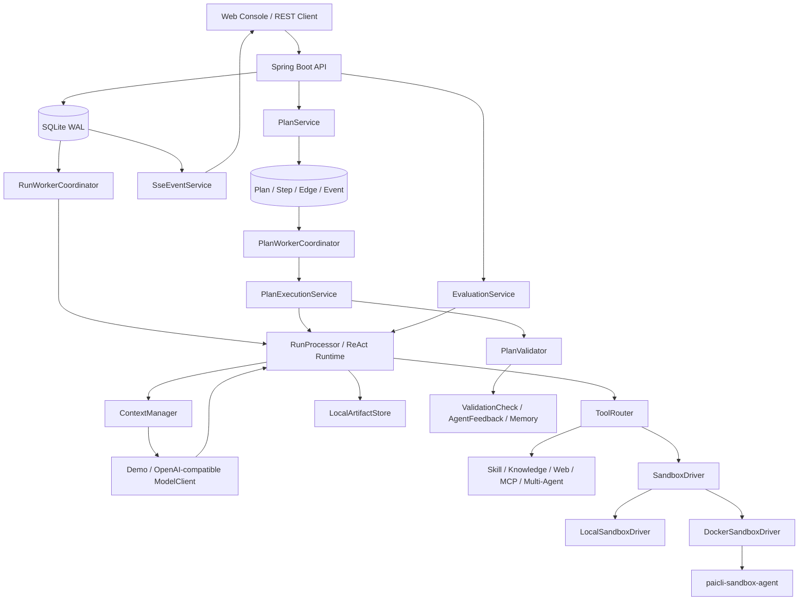
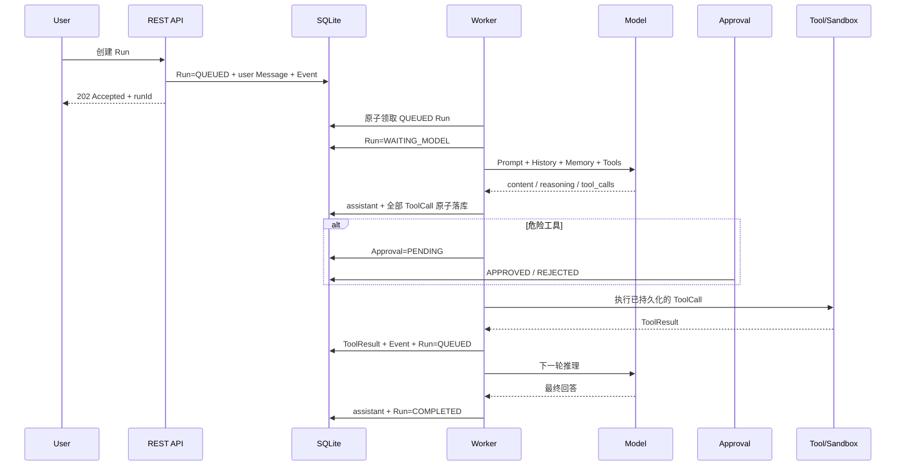
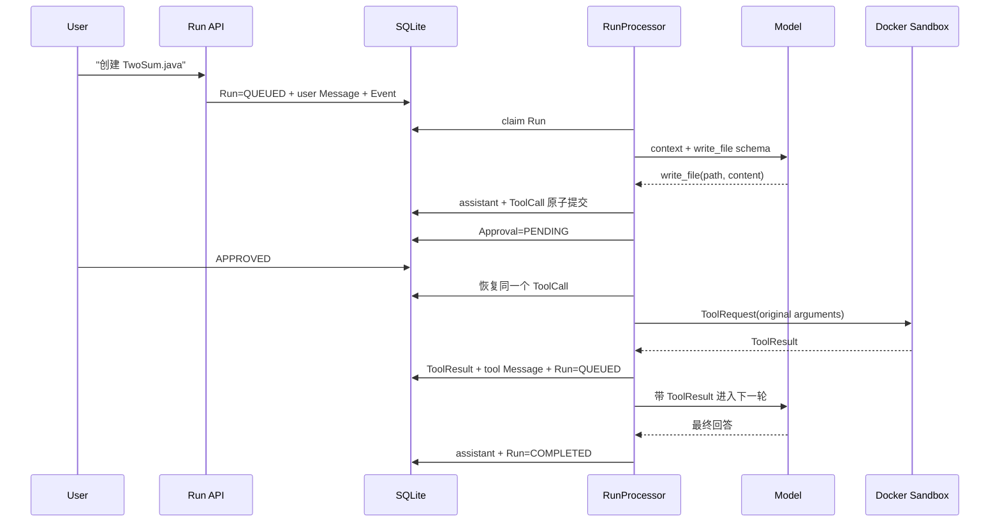
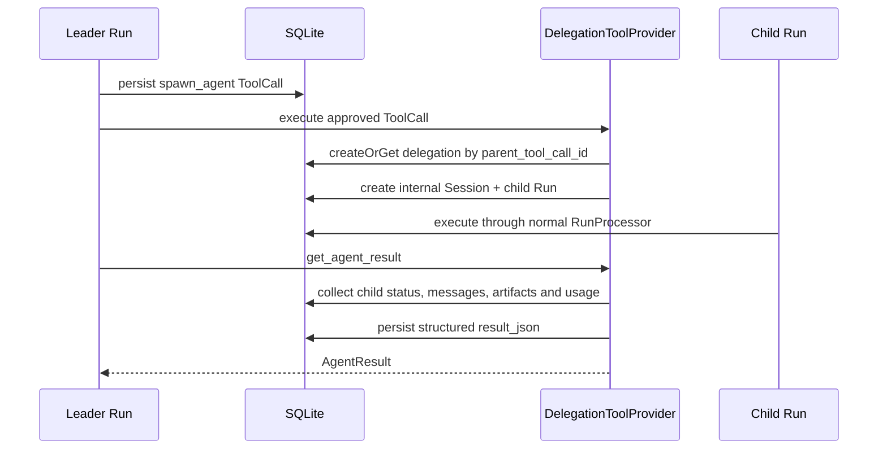
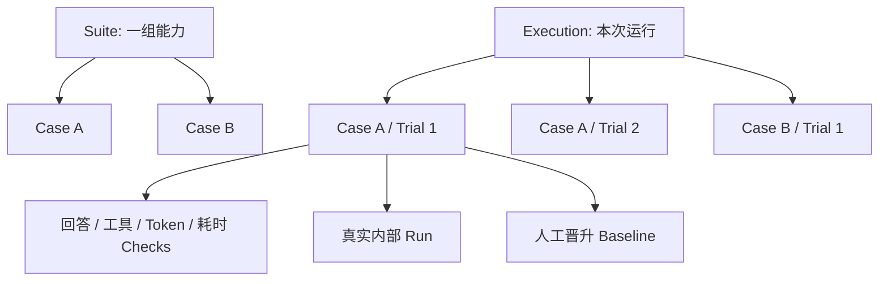
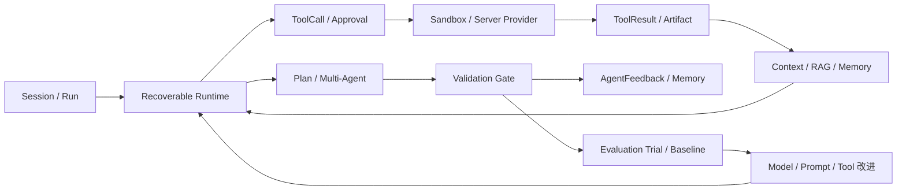

# PaiCLI Platform Lite 技术架构与面试指南

> 文档定位：面向 Java 后端、AI Agent 平台和系统架构类面试。  
> 内容依据：当前仓库代码、`README.md`、`docs/architecture.md`，以及原《PaiCLI Platform Lite 技术架构与面试讲解》。  
> 阅读原则：先理解整条执行链，再逐项理解功能；所有能力都区分“当前实现”“Lite 简化”“企业差距”和“升级路径”。

这份文档不是按开发时间罗列功能，而是按一个 Agent 平台从接收任务到交付结果的真实顺序展开：

```text
用户提交任务
  -> Session / Run 持久化
  -> Worker 领取
  -> 上下文组装
  -> 模型推理
  -> ToolCall 持久化
  -> Approval
  -> Sandbox / Server Tool 执行
  -> ToolResult / Artifact
  -> 下一轮推理
  -> Plan 验证与结果交付
  -> Memory 提取与评测回归
```

---

# 总体介绍

## 1. 一句话介绍

PaiCLI Platform Lite 是一个面向单人开发、单租户私有部署的 **可恢复 Managed Agent Runtime**。它不是给大模型套一层聊天页面，而是把 Session、Run、Message、模型推理、工具调用、人工审批、沙箱、计划编排、验证、记忆、知识检索和评测组织成一条可持久化、可审计、可恢复的执行链路。

面试时的 30 秒版本：

> 我用 Java 17、Spring Boot、SQLite WAL 和 Docker 实现了一个单机 Agent Runtime。用户任务先持久化为 Run，再由 Worker 异步领取；模型产生的 ToolCall 会先和 assistant 消息原子落库，危险操作经过持久化审批后才进入 Docker Sandbox。服务重启时可以依据 Run、ToolCall 和 Approval 状态恢复。复杂任务还可以落成类型化 Plan Graph，通过租约、资源冲突检测、隔离工作区和 Validation Gate 完成闭环。项目没有堆分布式中间件，但保留了企业架构最重要的状态、恢复、安全和验证契约。

## 2. 它解决的不是“怎么调用模型”，而是“怎么管理模型”

最简单的 Agent 原型通常是：

```text
用户输入 -> 调模型 -> 执行工具 -> 把结果发回模型 -> 输出答案
```

这个原型可以演示，但还没有回答生产系统必须回答的问题：

- 服务在模型请求或工具执行中崩溃后，任务从哪里继续？
- 模型一轮返回多个工具时，参数、顺序和审批如何保持一致？
- 一个命令已经产生副作用但结果未落库时，系统如何处理不确定状态？
- 用户批准的是哪一组确切参数，重启后是否仍然执行这一组参数？
- 长对话、项目规则、Memory、RAG 和工具结果如何在 Token 预算内组装？
- 子 Agent、复杂计划和人工节点如何变成持久化对象，而不是一段 Markdown？
- Run 显示完成后，怎样证明文件、测试和最终回答真的满足验收标准？
- 模型、Prompt 或工具升级后，如何发现行为、成本和稳定性退化？

PaiCLI 的价值是把这些模型 API 之外的工程问题变成明确的数据结构、状态机和恢复契约。

## 3. 系统边界

项目主动限定为：

- Java 17 + Spring Boot 3.3。
- 单机、单租户、私有部署。
- SQLite 是业务状态的事实来源。
- 进程内 Worker 领取持久化任务。
- 本地目录保存 Workspace、Artifact、Knowledge 和 Audit。
- Docker 是文件与命令执行边界。
- 不实现 Kubernetes、多地域、多租户、Kafka、Redis、MinIO 和 MicroVM。

这种约束不是简单删功能，而是用低运维组件表达相同的核心契约：

| 企业常见组件 | PaiCLI Lite | 保留的核心契约 |
|---|---|---|
| PostgreSQL | SQLite WAL | 事务、唯一约束、状态机、可恢复领取 |
| Kafka / 持久化任务队列 | 数据库任务表 + 进程内 Worker | 先提交任务，再异步领取，允许重复投递 |
| S3 / MinIO | 本地 Artifact、Knowledge、Workspace | 大内容外置、元数据持久化、完整性校验 |
| MicroVM / 远程执行集群 | Docker Sandbox Agent | 脑手分离、密钥隔离、资源和路径边界 |
| 分布式 Trace | Event、Audit、Micrometer | 每次状态变化和副作用可关联、可诊断 |
| 独立 Memory / RAG 服务 | SQLite + 本地索引 | 来源、修订、召回、引用和人工纠错 |

## 4. 总体架构



三个 Maven 模块的职责：

| 模块 | 职责 | 设计意义 |
|---|---|---|
| `paicli-common` | ToolRequest、ToolResult、SandboxDriver、状态枚举 | 稳定 Server 与 Sandbox 的协议边界 |
| `paicli-server` | API、Runtime、Store、模型、上下文、工具、Plan、评测和 Console | 负责决策、状态和产品能力，也就是“脑” |
| `paicli-sandbox-agent` | 容器内文件和命令工具 | 负责受限执行，也就是“手” |

本地数据按责任分目录：

```text
data/
├─ paicli.db                    # Runtime、Plan、Memory、Evaluation 等状态
├─ workspaces/
│  ├─ {runId}/                  # 普通 Run Workspace
│  ├─ plan-workspaces/...       # 内部 Session 隔离目录
│  └─ plan-worktrees/...        # GIT_WORKTREE 的受控 Workspace 引用
├─ artifacts/{runId}/           # 大工具结果和交付产物
├─ input-attachments/           # 暂存图片和文档
├─ audit/                       # JSONL 安全审计
├─ prompts/                     # Prompt override 和全局规则
├─ skills/                      # 全局 Skill
└─ projects/{projectKey}/
   ├─ AGENTS.md / PAI.md        # 项目规则
   ├─ skills/                   # 项目 Skill
   └─ knowledge/                # 文档原文、元数据和本地索引
```

目录布局表达了两个边界：SQLite 保存“任务事实和元数据”，文件系统保存“可能很大的内容”；Workspace、Artifact、Knowledge、Skill 和 Attachment 互相分区，不使用一个任意可写目录承载所有数据。

## 5. 一次完整任务如何流转



这条链路有三个关键持久化边界：

1. 接收任务时，先保存 Run、用户消息和事件。
2. 执行工具前，先保存 assistant 消息、全部 ToolCall 和必要的 Approval。
3. 工具返回后，先保存结果，再开始下一轮模型推理。

## 6. 当前能力边界

已经真实落地的能力包括：

- 持久化 ReAct Loop、Run 状态机、工具幂等、恢复和取消。
- Docker 文件/命令执行边界、危险工具审批、路径和资源限制。
- OpenAI-compatible 流式模型、reasoning、多 ToolCall、重试、熔断和用量记录。
- 上下文预算、对话压缩、Artifact 外置、自动 Memory、混合 RAG 和多模态附件。
- Skill、联网、远程 MCP、历史会话检索和持久化 Multi-Agent。
- Plan、Step、类型化 Edge、Human Node、有限 REWORK、租约恢复、资源冲突和 Validation Gate。
- 任务模板、模型方案、预算、队列、定时任务、通知、Session 导入导出。
- 真实内部 Run 驱动的 Agent 评测、多 Trial、确定性门禁和人工 Baseline。

不能过度宣传的边界包括：

- `GIT_WORKTREE` 已有隔离语义和 `workspace_ref`，但不会自动执行真实 `git worktree add`、提交、合并和冲突恢复。
- DAG 批次和资源冲突已经可分析、可调度，但不是跨机器的分布式并行执行引擎。
- Async Job 已有持久化对象和状态闭环，真实长命令、下载、CI 查询等执行器仍需继续扩展。
- Docker 共享宿主内核，不等于 MicroVM，也不适合直接执行公网敌对租户提交的任意代码。
- RAG 是单机结构化分块、BM25、真实 Embedding 和 RRF，没有独立向量数据库和专用神经重排服务。
- 评测以确定性规则为主，没有将 LLM Judge 当作硬门禁。

---

# 第一部分：逐功能技术架构

## 7. Session、Run、Message 与 Event

### 7.1 解决什么问题

聊天消息、一次任务和任务执行过程不是同一个概念。如果只用一张 `messages` 表，很难表示重试、取消、分支、审批、成本、工具过程和失败恢复。

PaiCLI 将它们拆成：

- `Session`：一个长期对话和项目上下文容器。
- `Run`：一次用户任务，是独立状态机和预算边界。
- `Message`：模型上下文中的 user、assistant、tool、summary 消息。
- `RunEvent`：面向 SSE、时间线和诊断的过程事件。

### 7.2 核心思想

数据库终态是事实来源，实时流只是事实的展示方式。前端可以漏掉 SSE 帧、浏览器可以刷新，但重新查询 Run 和 Message 后仍能恢复正确界面。

Run 的核心状态机：

```text
QUEUED
  -> RUNNING
  -> WAITING_MODEL
       -> WAITING_APPROVAL
       -> WAITING_TOOL
       -> COMPLETED

任意非终态 -> FAILED / CANCELED
```

### 7.3 当前设计

创建 Run 时，Server 在一个事务中写入 `runs`、user message、附件绑定和 `run.queued` Event。API 返回 `202 Accepted`，Worker 再异步领取。

终态不可回退；Run 状态变化与对应 Event 尽量在同一事务提交。Session 删除前会检查是否存在活跃 Run，随后按依赖顺序在同一事务清理关联状态，避免留下孤儿 Approval、ToolCall 或 Event。

#### 提交不是“插入一条消息”

`POST /v1/sessions/{sessionId}/runs` 会先做 Session、模型方案、附件归属、预算和单活跃 Run 检查，再在事务中完成：

1. 创建状态为 `QUEUED` 的 Run，并固化思考模式、模型方案、优先级和创建时间。
2. 追加 user Message；如果有图片或文档附件，同时把暂存附件绑定到这条 Message 和当前 Run。
3. 写入 `run.queued` Event。
4. 更新 Session 的活跃时间。
5. 提交后返回 `202 Accepted`，不在 API 线程中等待模型。

这样即使 Server 在返回响应后立即退出，用户输入和待执行任务也已经在数据库中，不需要依赖浏览器重发。

#### 为什么拆成多张表

| 对象 | 主要职责 | 关键约束 |
|---|---|---|
| `sessions` | 对话、项目和分组容器 | 内部 Session 不出现在普通历史列表 |
| `runs` | 一次任务的状态、预算和执行入口 | 同一 Session 只允许一个活跃 Run，终态不可回退 |
| `messages` | user、assistant、tool、summary 历史 | Run/Session 内按 sequence 排序，旧消息可归档但不删除 |
| `run_events` | SSE 重放、时间线和诊断 | Run 内 sequence 单调递增 |
| `tool_calls` | 模型生成的工具名、参数、结果和 Effect | `idempotency_key` 唯一 |
| `approvals` | 危险工具的人工决定 | 一个 ToolCall 对应一个审批对象 |
| `model_usage` / `model_attempts` | Token、耗时、缓存、重试和 HTTP 尝试 | 可按 Run 汇总预算与故障 |
| `input_attachments` | 图片和文档的暂存及绑定状态 | 同一附件不能绑定多个 Run |
| `artifacts` | 大结果和最终产物元数据 | 路径、大小和 SHA-256 可校验 |
| `run_delegations` | 父子 Agent 的委派与结果 | 父 ToolCall 和 child Run 均唯一 |

这种拆分让“用户说了什么”“模型做了什么”“系统当前在哪个状态”“前端需要播放什么事件”各自有清晰事实源。

#### Retry、Branch 与安全删除

终态 Run 可以在原 Session 中 Retry，复用原任务输入但创建新的 Run；Branch 会创建新 Session，复制源 Run 之前的未归档上下文，再用源输入创建新的执行分支。二者都不会篡改原 Run，因此失败现场、模型用量和工具轨迹仍可审计。

删除 Session 不是简单执行 `DELETE FROM sessions`。Server 会先拒绝存在活跃 Run 的会话，再在同一事务内清理 Approval、ToolCall、Event、Artifact、ModelUsage、ModelAttempt、MemoryExtraction、CollaborationPolicy、AsyncJob、Message 和 Run。删除 Session Group 只把会话移回未分组，不级联删除会话。

#### Event-backed State，而不是完整 Event Sourcing

`run_events` 保存过程，但 Run 当前状态仍直接保存在 `runs`，ToolCall 和 Approval 也各有状态表。系统不会从第一条事件开始重放才能计算当前状态，因此它属于“事件支撑的状态”，不是纯 Event Sourcing。

这样做的好处是恢复和查询简单；代价是状态与 Event 必须在关键事务中同步提交。对单机 Runtime，这比维护完整事件投影和重建机制更实际。

代码入口：

- `api/RunController.java`
- `api/SessionController.java`
- `store/SqliteRuntimeStore.java`
- `sse/SseEventService.java`

### 7.4 Lite 如何简化

Session、Run 和 Event 全部放在同一个 SQLite 数据库中；事件由 Server 轮询数据库后通过 SSE 推送，没有独立事件总线。

### 7.5 企业差距与升级

企业版通常需要 PostgreSQL、分区表、归档、冷热分层、租户键和跨服务 Trace。升级时应保留 Run 状态机和 Event 序号语义，将 Store 抽象为接口，再用 PostgreSQL 事务和 Outbox 发布事件。不能只把 SQLite 换成 PostgreSQL，却让状态变化和事件发布重新出现双写不一致。

### 7.6 面试怎么讲

> 我把一次对话和一次执行拆开了。Session 管长期上下文，Run 管一次任务的状态、预算和恢复，Message 管模型历史，Event 管实时展示和诊断。SSE 不是权威状态，数据库中的 Run 终态才是，所以即使前端断流或刷新，也能重新对账。

### 7.7 后端补充：事务边界、并发与一致性

- 创建 Run 采用“短事务 + 异步执行”：同一事务内写入 `runs`、用户消息、附件绑定和 `run.queued` 事件，提交后才返回 `202`。这避免 HTTP 线程被模型 I/O 占满，也保证服务在响应后崩溃时任务仍可恢复。
- `runs.version` 配合“状态仍为旧值”的条件更新构成乐观并发控制；同一 Session 的活动 Run、终态不可回退、删除 Session 前拒绝活动 Run，分别把并发提交、状态机和级联删除约束收敛在数据库侧。
- 面试要强调：SSE 只是投影视图，不参与正确性判断；重连后以 `Run/Message/Event` 查询对账，避免把长连接内存状态误当作事实来源。

## 8. 可恢复 ReAct Runtime

### 8.1 解决什么问题

普通 `while` 循环依赖进程内变量。服务一旦重启，就不知道模型是否调用过、工具是否执行过、下一步该做什么。

### 8.2 核心思想

每一轮执行都从数据库读取事实，而不是依赖 Worker 内存。Worker 可以重复投递，Runtime 必须根据持久状态决定“恢复工具”还是“重新请求模型”。

### 8.3 当前设计

`RunProcessor` 的逻辑可以概括为：

```text
process(run):
  run = reloadFromDatabase(run.id)
  if run is terminal:
      return

  resumable = findResumableToolCall(run.id)
  if resumable exists:
      continueApprovalOrExecute(resumable)
      return

  transition run -> WAITING_MODEL
  context = ContextManager.prepare(run)
  response = ModelClient.complete(context)

  if response has no tool_calls:
      transaction:
          persist final assistant message
          transition run -> COMPLETED
          append completion event
      enqueue memory extraction
      return

  transaction:
      persist assistant message
      persist every tool_call in provider order

  execute tool_calls sequentially
```

启动恢复会把中断的 `RUNNING`、`WAITING_MODEL` 和 `WAITING_TOOL` Run 重新放回 `QUEUED`。工具业务失败会保存失败 observation，再让模型有机会修正；审批拒绝、取消和 Runtime 异常则进入终态。

模型重复调用“同一工具 + 完全相同参数”达到限制后，Runtime 会终止无进展循环，避免持续消耗 Token。

#### Worker 如何原子领取

`RunWorkerCoordinator` 定时扫描待执行任务，但“扫描到”不等于“领取成功”。Store 会在事务中执行带状态条件的更新，语义类似：

```sql
UPDATE runs
SET status = 'RUNNING',
    version = version + 1
WHERE id = ?
  AND status = 'QUEUED';
```

只有影响一行的 Worker 才获得执行权。领取时还会考虑项目最大并发、优先级、排队时间和内部 Run 公平性；线程池出现背压时，Run 会释放或重新排队，而不是已经改成 RUNNING 后永久滞留。

#### 六条恢复契约

1. Run 先以 `QUEUED` 持久化，Worker 才能看到。
2. Worker 通过条件更新原子领取。
3. 模型同一轮的 assistant、reasoning 和全部 ToolCall 在任何工具执行前一次性提交。
4. ToolResult 和 tool Message 先持久化，再把 Run 放回 `QUEUED` 进入下一轮。
5. 启动时恢复中断的 Run 和可安全恢复的 ToolCall。
6. 已完成 ToolCall 按幂等键复用；非幂等未知结果不自动重放。

这六条契约共同保证的是“任务状态不会只存在于 Java 调用栈里”，并不依赖某一个特定中间件。

#### 崩溃窗口分析

| 崩溃时机 | 持久化事实 | 重启后的行为 |
|---|---|---|
| Run 已提交，尚未领取 | `Run=QUEUED` | Worker 继续领取 |
| 模型请求进行中 | `Run=WAITING_MODEL`，没有完整 ToolCall | 恢复为 `QUEUED`，重新请求模型 |
| assistant 与 ToolCall 已提交，工具尚未执行 | `ToolCall=REQUESTED` | 先恢复原 ToolCall，不重新问模型 |
| 正在等待危险工具审批 | `Approval=PENDING` | 继续展示原参数并等待用户决定 |
| 工具完成且结果已提交 | `ToolCall=COMPLETED` | 按幂等键复用结果 |
| 非幂等工具副作用发生，结果未提交 | 结果无法确认 | 标记 `UNKNOWN`，要求人工对账 |

最后一种窗口不能靠数据库唯一键消除。要进一步收敛，需要工具自身接受业务幂等键、提供结果查询接口，或者把副作用和状态提交放进同一个事务系统。

#### 一轮执行为什么会重新排队

ToolResult 提交后，Run 不在同一线程里无限循环，而是增加 `current_step` 后回到 `QUEUED`。这样每轮模型调用都是新的可调度单元，预算、取消、队列公平性和父子 Run 都有机会重新检查。已经持久化的 resumable ToolCall 优先于新模型调用，避免预算检查阻止必要的恢复收尾。

#### 预算和无进展保护

开始新模型轮次前会检查最大步骤、累计 Token、总时长、单轮工具数和全程工具数。项目预算采用事务内预留和最终结算，减少多个 Run 同时通过预算检查后共同超限的问题。

同一 Run 中“工具名 + 完全相同参数”默认最多出现 3 次，并可通过配置调整。达到上限说明模型没有根据 observation 修正策略，Runtime 会以明确错误终止，避免无限 ReAct 循环。

代码入口：

- `worker/RunWorkerCoordinator.java`
- `agent/RunProcessor.java`
- `store/SqliteRuntimeStore.java`
- `common/RunStatus.java`

### 8.4 Lite 如何简化

Worker 使用定时扫描和进程内线程池，没有 Kafka，也没有独立 Worker 服务。SQLite 条件更新和 JVM 内 `inFlight` 集合避免重复领取。

### 8.5 企业差距与升级

多节点时可改为 PostgreSQL `FOR UPDATE SKIP LOCKED`，或使用持久化队列和独立 Worker。若引入消息队列，数据库仍应是业务状态事实来源，消息只负责唤醒和投递；需要 Outbox 解决数据库与队列双写问题，消费者必须允许至少一次投递。

### 8.6 面试怎么讲

> 我没有追求 MQ 意义上的“只投递一次”，而是让任务允许重复投递、执行端按持久状态幂等收敛。这样 Worker 崩溃后，新的 Worker 可以从数据库继续，而不是依赖原线程的局部变量。

### 8.7 后端补充：领取锁、线程池与恢复窗口

- `RunWorkerCoordinator` 每 300ms 按可用线程数领取任务；`runTaskExecutor` 默认固定 4 线程、队列容量 100，任务持久化队列与执行器队列分层，执行器拒绝时会释放数据库领取，避免“已领取但永不执行”。
- 领取在一个 SQLite `IMMEDIATE` 短事务中完成：查询候选 `QUEUED` Run、条件更新为 `RUNNING`、写入事件并提交。数据库条件更新防跨线程/跨进程重复领取，JVM `RunExecutionRegistry` 仅是本实例的二次防重。
- 长模型调用、工具调用均在事务外执行；只在状态转换、结果提交时开短事务。这是 SQLite 单写者场景降低锁竞争的关键，不能把网络 I/O 包在数据库事务中。

## 9. ToolCall、幂等、审批与 Artifact

### 9.1 解决什么问题

工具调用是模型从“说”走向“做”的副作用边界。写文件、执行命令、调用 MCP 或创建子 Agent 都可能产生不可逆影响，不能边解析模型流边直接执行。

### 9.2 核心思想

工具请求必须先成为可信的持久化对象，再审批、执行和审计。用户批准的是一个已经落库的 ToolCall，而不是模型下一次可能重新生成的参数。

### 9.3 当前设计

模型一轮返回多个 ToolCall 时，Runtime 按 provider 的 `index` 重组分片，并在同一事务中保存 assistant 消息和全部 ToolCall。随后按 provider 顺序串行执行。

#### 工具目录与执行位置

工具并不都在 Docker 中运行。文件和命令属于 Sandbox Tool，知识、Skill、联网、MCP、Artifact 和委派属于 Server Tool：

| 工具 | 执行位置 | 默认审批 |
|---|---|---|
| `list_dir`、`read_file` | Sandbox | 否 |
| `write_file`、`execute_command` | Sandbox | 是 |
| `read_artifact` | Server Artifact Store | 否 |
| `load_skill`、`read_skill_resource` | Server Skill Provider | 否 |
| `search_knowledge`、`session_search` | Server Provider | 否 |
| `web_search`、`web_fetch` | Server Web Provider | 默认关闭 |
| `mcp__{server}__{tool}` | Server MCP Provider | 是 |
| `spawn_agent`、`cancel_agent` | Server Delegation Provider | 是 |
| `get_agent_result`、`list_agents` | Server Delegation Provider | 否 |

`ToolRouter` 只接收已经持久化的 ToolCall。即使工具在 Server 进程内执行，也不能绕过参数校验、Approval、Event、Audit 和结果物化。

#### 多 ToolCall 的原子性和顺序

模型 SSE 中的 ToolCall 名称和 arguments 可能被拆成很多 delta。客户端先用 provider `index` 在内存中重组完整调用，模型轮次结束后才生成 ToolCall Draft。Store 在一个事务中保存 assistant Message 和全部 Draft；其中任何一个参数不合法或写入失败，整轮都不进入可执行状态。

执行时保持 provider 顺序。原因不是“Java 不支持并行”，而是后一个调用可能依赖前一个文件、前一个调用可能需要审批，而且模型并没有为普通 ToolCall 提供可靠的资源依赖声明。受控并行放在 PlanStep 层处理。

幂等键由 Run、模型轮次、工具序号、工具名和规范化参数共同构成，并受数据库唯一约束保护。工具按 Effect 分类：

| Effect | 恢复语义 |
|---|---|
| `READ_ONLY` | 可以安全重试 |
| `IDEMPOTENT_WRITE` | 可依赖幂等键恢复 |
| `NON_IDEMPOTENT_WRITE` | 结果不确定时进入 `UNKNOWN`，要求人工对账 |

危险工具先创建 `Approval`。批准后 Run 重新进入队列，Worker 读取原 ToolCall 并执行原参数。Session 或 Project 级审批策略同时匹配工具名和参数 SHA-256，不能把一次批准扩大到模型后来生成的其他参数。

审批状态的恢复链路：

```text
ToolCall=REQUESTED
  -> Approval=PENDING
  -> Run=WAITING_APPROVAL
  -> 用户选择 APPROVED / REJECTED
  -> APPROVED: Run=QUEUED，Worker 恢复原 ToolCall
  -> REJECTED: ToolCall 和 Run 进入拒绝终态
```

“仅本次”“本对话”“本项目”只影响未来是否自动命中已保存策略；策略仍精确匹配工具名和已落库参数摘要。系统级路径、网络和资源策略始终优先，用户批准不能突破这些边界。

工具结果超过内联阈值时：

```text
完整结果 -> data/artifacts/{runId}/...
数据库    -> path + size + sha256
模型上下文 -> preview + artifactId + 分段读取提示
```

Artifact 元数据包含路径、大小和 SHA-256。预览、下载、复用或删除时先验证记录路径仍位于受控 Artifact 根目录，并校验文件完整性。模型需要完整内容时通过 `read_artifact(artifactId, offset, limit)` 分段读取，避免每轮反复发送几 MB 日志。

#### 一次写文件任务的完整过程



这里可以明确指出三个持久化边界：提交任务、执行工具前、工具返回后。它们比“调用了哪个大模型”更能体现 Runtime 的工程价值。

代码入口：

- `tool/ToolCatalog.java`
- `tool/ToolRouter.java`
- `approval/ApprovalService.java`
- `artifact/ToolResultMaterializer.java`
- `artifact/LocalArtifactStore.java`

### 9.4 Lite 如何简化

工具调用按顺序串行执行，Artifact 保存到本地目录，审批由单用户 Console 完成。这里优先保证参数、顺序和恢复语义正确。

### 9.5 企业差距与升级

Runtime 幂等键不能无条件保证 exactly-once。如果外部副作用已经发生但结果还没落库，真正的 exactly-once 仍需要下游系统支持幂等请求、事务性 API 或人工对账。企业版还需要对象存储、病毒扫描、保留策略、访问控制和 Artifact 生命周期治理。

### 9.6 面试怎么讲

> 我最强调的是工具先落库再执行。这样审批、恢复和审计都绑定同一组参数。幂等键解决的是 Runtime 重复调度，不会夸大成无条件 exactly-once；非幂等副作用结果不确定时会进入 UNKNOWN，交给人工对账。

### 9.7 后端补充：副作用的一致性模型

- 同轮 assistant 消息与全部 ToolCall 一次性原子落库，ToolCall 的 `idempotency_key` 具备唯一语义；恢复时先查未完成 ToolCall，再决定执行或等待审批，因此不会把半截流式参数交给执行器。
- 系统提供的是“至少一次调度 + 执行端幂等”，不是脱离外部系统配合的 exactly-once。若工具已产生外部副作用而结果未提交，恢复会使用同一幂等键重试；对不支持幂等的外部 API，需要额外的业务去重键或补偿策略。
- Approval 与 ToolCall 同样持久化，批准的是已经固化的参数快照；审批后不重新让模型生成参数，避免 TOCTOU（检查与执行不一致）。

## 10. Docker Sandbox 与脑手分离

### 10.1 解决什么问题

模型生成的命令和文件路径不可信。如果 Agent Runtime 直接在 Server 进程中执行命令，模型密钥、数据库文件和宿主机目录都会暴露在同一权限边界中。

### 10.2 核心思想

Server 负责决策、状态和密钥，Sandbox 只负责执行受限 ToolRequest。Agent Loop 依赖 `SandboxDriver` 接口，不依赖 Docker 细节。

### 10.3 当前设计

`LocalSandboxDriver` 用于开发和测试，故意不允许真实写文件和命令。`DockerSandboxDriver` 为活跃 Run 惰性创建容器，同一 Run 复用，终态后释放，启动时按 label 清理孤儿容器。

Agent Loop 只依赖稳定接口：

```java
ToolResult execute(ToolRequest request);
void release(String runId);
String mode();
```

`ToolRequest` 携带 Run、工具名、参数和幂等键，`ToolResult` 返回成功状态、受限输出和错误。Server 与 Sandbox 不共享数据库连接、模型 Key 或内部 Store 对象，因此未来可以把 Docker 后端替换为远程执行服务，而不重写 ReAct Loop。

#### 容器生命周期

1. 第一次 Sandbox Tool 调用时，根据 Run 创建或取得 `ContainerLease`。
2. Server 为容器生成随机控制令牌并准备该 Run 的 Workspace。
3. 同一 Run 后续文件和命令调用复用容器，避免每工具冷启动。
4. Run 完成、失败或取消后释放容器。
5. Server 启动时扫描 PaiCLI label，清理上次异常退出留下的孤儿容器。

每 Run 一个容器位于“每工具一个容器”和“所有任务共享容器”之间：既保留任务内状态，又减少不同 Run 互相污染。

容器边界包括：

- 内部网络，无默认外部路由。
- 不发布宿主端口。
- 根文件系统只读。
- 只挂载当前 Run Workspace。
- CPU、内存和 PID 限制。
- `cap-drop ALL`、`no-new-privileges` 和受限 tmpfs。
- 每容器随机 Bearer Token。
- 模型 API Key 不进入容器环境。

对应 Docker 参数包括 `--read-only`、`--cap-drop ALL`、`--security-opt no-new-privileges`、`--memory`、`--cpus`、`--pids-limit`，以及大小受限、`noexec,nosuid` 的 `/tmp` tmpfs。Workspace 是唯一可写持久目录。

#### 为什么使用 docker exec + loopback HTTP

Sandbox Agent 在容器内监听 loopback。Server 不发布宿主端口，而是通过 `docker exec` 在容器内部调用带随机 Bearer Token 的 HTTP 接口：

```text
Server
  -> docker exec <container>
  -> curl http://127.0.0.1:8081/internal/v1/tools/execute
  -> Sandbox Agent
```

这样容器可以保持内部网络、无宿主端口暴露，同时 Server 与 Sandbox 之间仍有清晰的 HTTP/DTO 协议。代价是每次工具调用都会产生 `docker exec` 进程；远程执行集群可以把这里替换成长连接 Gateway 和预热池。

Sandbox Agent 对路径执行 `resolve + normalize`，对已存在路径执行 `toRealPath()`，最终路径必须位于 Workspace 内。命令超时会终止进程及其后代，输出只保留受限前缀但会持续排空管道。

持续排空输出很重要：如果只读取前 N KB 后停止消费，子进程可能因为 stdout/stderr 管道写满而阻塞，导致“已超限但命令永远不退出”。PaiCLI 将保存限额和管道消费分开处理。

#### 为什么不能直接写用户桌面

Docker 只挂载当前 Workspace，Path Guard 还会拒绝绝对路径、`..` 和符号链接逃逸。不能写桌面是安全设计结果。若产品需要把结果交付到用户目录，更合理的方式是由 Server 提供审批后的白名单导出工具，或让用户从 Artifact 下载，而不是把整个主目录挂进 Sandbox。

代码入口：

- `common/SandboxDriver.java`
- `sandbox/docker/DockerSandboxDriver.java`
- `sandbox/docker/DockerExecSandboxAgentClient.java`
- `paicli-sandbox-agent/.../SandboxToolService.java`

### 10.4 Lite 如何简化

使用 Docker Desktop 和 `docker exec + loopback HTTP`，没有预热池、快照恢复、远程节点调度和专用 Sandbox Gateway。

### 10.5 企业差距与升级

Docker 共享宿主内核，隔离强度弱于 MicroVM。面向敌对多租户时需要 MicroVM、gVisor 或 Kata Containers，还要补镜像供应链、网络出口策略、临时凭证注入、审计和资源配额。升级时保留 `SandboxDriver` 协议，将执行后端替换为远程 Sandbox 服务。

### 10.6 面试怎么讲

> 我把 Agent Runtime 看成“脑”，Sandbox 看成“手”。模型密钥只在脑中，手只拿临时控制令牌和当前 Run Workspace。Docker 不是绝对安全，但它验证了脑手分离和可替换执行后端的架构边界。

### 10.7 后端补充：隔离、资源与清理

- Server 只保存模型密钥和业务数据库；Sandbox 只接收受控 `ToolRequest`，通过每 Run 容器、CPU/内存/PID/超时限制把不可信代码与主进程隔开。容器生命周期和 Artifact 元数据分别有可恢复、可审计的后端状态。
- 路径白名单、输出上限和命令超时属于纵深防御：审批解决“是否允许这次动作”，Sandbox 再解决“即使获批也不能突破工作区和资源边界”。
- Lite 的 Docker 共享宿主内核，不应表述为能抵御公网恶意多租户代码；生产升级需转向远程隔离执行、镜像供应链扫描、网络策略和更强的运行时隔离。

## 11. 模型网关与流式推理

### 11.1 解决什么问题

真实模型调用不仅有请求和响应，还涉及流式 delta、reasoning、多 ToolCall 分片、超时、限流、重试、取消、备用模型、缓存 Token 和 Provider 差异。

### 11.2 核心思想

Agent Loop 面向统一 `ModelClient`，Provider 差异收敛在客户端适配层；中间流可以批量处理，但最终 assistant 消息、reasoning、ToolCall 和 usage 必须完整持久化。

### 11.3 当前设计

`DemoModelClient` 支持离线验证，`OpenAiCompatibleModelClient` 处理真实 SSE。客户端分别累积：

- `content`
- `reasoning_content`
- `tool_calls[index]`
- input、output 和 cached token usage

DeepSeek 路由默认强制使用 HTTP/1.1，规避部分兼容网关在 HTTP/2 长流下出现 `stream was reset: INTERNAL_ERROR`。思考开关和 reasoning effort 是 Run/模型方案级配置，不需要为不同思考模式复制 Runtime。

reasoning 会与 assistant ToolCall 一起保存并在下一轮回传，避免思考模型在工具循环后丢失协议上下文。`ModelDeltaEventBuffer` 按字符数或时间批量写 Event，前端再按动画帧合并 DOM 更新。

客户端只在成功 SSE 响应尚未开始前重试可恢复错误，使用指数退避、抖动和 `Retry-After`；连续失败触发带半开探测的熔断。取消 Run 时会取消 Future、关闭流并回收执行资源。

#### 一次模型轮次的数据边界

`ModelRequest` 包含：

- system/runtime/project context。
- active Message 历史和 summary。
- 当前 Run 图片。
- 经过 Agent Profile 白名单过滤的 Tool Definition。
- `max_tokens`、thinking mode、reasoning effort。
- 当前模型方案和备用模型路由。

SSE 解析器按顺序累积可见 content、`reasoning_content` 和 `tool_calls[index]`。ToolCall arguments 只有在完整流结束后才交给 Runtime 持久化，不会在网络回调中边收到边执行。

DeepSeek thinking 模式下，assistant 的 reasoning 和 ToolCall 必须在下一轮一起回传。`messages.reasoning_content` 与 `tool_calls_json` 正是为这个协议连续性服务，而不是单纯为了在 UI 展示思考文本。

#### 推理流合并不等于上下文压缩

模型经常按很小片段返回 content 和 reasoning。`ModelDeltaEventBuffer` 将多个片段合并后写 `run_events`，前端再把同类 reasoning delta 合并成一张活动卡。它降低的是 SQLite 写频率和 DOM 刷新次数：

```text
网络 delta -> 内存缓冲 -> 批量 Event -> 前端帧合并
```

它不会减少模型已经消耗的 Token，也不会缩短历史上下文。轮次结束前必须 flush，最终 assistant、reasoning、ToolCall 和 usage 仍按业务事务提交。

#### 重试、备用模型与熔断

- 408、409、429、部分 5xx 和连接失败可以在“尚未接受成功流”时重试。
- 退避时间综合指数增长、随机抖动和服务端 `Retry-After`，并设置上限。
- 每次 HTTP 尝试写入 `model_attempts`，保留模型、耗时和失败原因。
- 主模型失败后可以切换模型方案中同端点的备用模型。
- 连续失败打开熔断器；冷却后只允许半开探测，成功才恢复。
- SSE 流有独立空闲超时，防止连接存在但长期没有新数据。

这里刻意不对已经开始返回内容的流自动重试，否则可能重复展示 delta、拼接两个模型响应或重复 ToolCall。

#### 主动取消

`OpenAiCompatibleModelClient` 按 Run 保存活动 Future 和 InputStream。取消时不仅修改数据库状态，还会：

1. 标记活动请求 canceled。
2. `future.cancel(true)`。
3. 关闭 SSE InputStream。
4. 让 Run 收敛到 `CANCELED`。
5. 回收该 Run 的 Sandbox。

这样取消会真实释放网络、线程和容器资源，而不是只让前端按钮变灰。

#### 用量和成本

每轮保存 input、output、cached Token、模型名、耗时和重试信息。模型方案可配置上下文上限、输出上限和单价，项目预算按日/月 Token、费用和并发做预估、预留与结算。缓存命中只影响成本统计，不改变 Run 状态和恢复语义。

代码入口：

- `model/ModelClient.java`
- `model/OpenAiCompatibleModelClient.java`
- `agent/ModelDeltaEventBuffer.java`
- `config/ModelProperties.java`

### 11.4 Lite 如何简化

模型路由主要面向一个 OpenAI-compatible 端点及备用模型，没有独立 MaaS Gateway、跨供应商动态路由和集中价格中心。

### 11.5 企业差距与升级

企业版需要模型注册中心、按任务路由、配额、地域合规、密钥 Vault、缓存、灰度、Provider 级 SLO 和成本归因。升级时应保持 `ModelClient` 和 `ModelRoute` 契约，并将每次 HTTP 尝试、最终 usage 和失败原因接入统一 Trace。

### 11.6 面试怎么讲

> 我把模型流区分为“过程数据”和“业务终态”。delta 可以批量写入以减少 SQLite 压力，但模型轮次结束时，完整 assistant、reasoning、ToolCall 和 usage 必须同步落库。性能优化不能破坏恢复边界。

### 11.7 后端补充：限流、重试与流式写入

- 模型客户端使用 `AtomicLong` 预约下一个发送时间，按 `requests-per-minute` 做进程内匀速限流；等待按短片段可取消，避免取消请求被长时间 sleep 卡住。它保护单实例与上游配额，集群化后应替换为 Redis/网关级分布式限流。
- 对可重试 HTTP 失败使用指数退避、`Retry-After`、备用模型与熔断；重试记录进入 `model_attempts`，成功用量统一结算。注意只在未产生可见、可持久化完整结果时重试，流已经对用户输出后不能盲目重放。
- content/reasoning delta 经过 `ModelDeltaEventBuffer` 批量落库，避免网络回调每个 token 同步写 SQLite；终态 assistant 消息、用量和 Run 状态仍用事务提交，兼顾流式体验和存储吞吐。

## 12. 上下文工程与大结果外置

### 12.1 解决什么问题

Agent 每轮都要携带系统 Prompt、项目规则、历史消息、Memory、RAG、工具 Schema 和结果。如果只是不断追加历史，很快会超过上下文窗口，并持续重复消耗 Token。

### 12.2 核心思想

上下文是一个有优先级、有预算、可压缩、可回忆的工作集，不是数据库全量镜像。完整数据保存在外部，当前模型请求只装配完成任务所需的部分。

### 12.3 当前设计

`ContextManager.prepare()` 的逻辑可概括为：

```text
context = []
context += base / safety / agent prompts
context += runtime time and workspace boundary
context += controlled project rules
context += relevant Memory
context += relevant Knowledge / attachments
context += latest summary and active messages
context += allowed tool definitions

if estimatedInput > contextLimit - reservedOutput:
    compact old conversation without splitting tool boundaries
    rebuild context

return ModelRequest(context, tools, thinkingMode, route)
```

规则文件按通用到具体排序，并受单文件和总字符预算限制。对话压缩保留最近消息，不拆散 assistant ToolCall 和 tool result；优先使用模型生成结构化摘要，失败时走确定性摘要。旧消息只标记 archived，仍可追溯。

大工具结果写入 Artifact，模型按需调用 `read_artifact(offset, limit)`。这同时降低上下文占用和重复 Token 成本。

#### Prompt 与规则的装配顺序

当前上下文不是简单的 `history.toString()`，而是分层装配：

```text
System Prompt
  base.md
  safety.md
  agent.md

Runtime Context
  当前时间
  Run Workspace
  相对路径和安全边界

Controlled Project Rules
  全局 AGENTS.md
  项目 AGENTS.md / PAI.md
  Workspace AGENTS.md / PAI.md

Dynamic Context
  Agent Profile
  relevant Memory
  attachment-scoped Knowledge / RAG
  latest Summary
  active Messages
  allowed Tool definitions
```

规则从通用到具体，单文件和总字符数都有上限。只从受控 data/workspace 根目录读取，避免用户在任意宿主路径放一个同名文件就注入系统 Prompt。

#### 三个经常混淆的预算

| 概念 | 约束对象 | 不能替代什么 |
|---|---|---|
| 模型上下文窗口 | 单次请求输入 + 预留输出 | 不能限制一个 Run 的累计消耗 |
| `maxRunTokens` | 一个 Run 多轮调用的累计 Token | 不会自动缩短旧历史 |
| delta 合并 | Event 写库和前端刷新频率 | 不减少模型 Token |

发送前需要满足：

```text
estimatedInputTokens <= maxContextTokens - reservedOutputTokens
```

预留输出空间可以避免输入刚好填满窗口，导致模型没有生成回答和 ToolCall 的余量。复杂 ReAct Run 每一轮都会重复携带 system prompt、工具 Schema、摘要和部分历史，因此界面文字不多也可能有较高累计 Token。

#### ConversationCompactor 如何保护工具协议

当估算 Token 接近阈值时：

1. 选择旧消息作为归档候选，并保留最近 N 条。
2. 如果切分点落在 tool Message，向前寻找对应 assistant ToolCall，避免拆散调用与结果。
3. 优先调用主模型生成固定结构摘要，保留目标、约束、决策、已完成、待办、引用和错误。
4. Demo 模式或摘要模型失败时使用确定性抽取式降级，压缩失败不能阻断业务 Run。
5. 旧消息设为 `archived=1`，插入 summary Message。
6. 写 `context.compacted` Event，记录压缩前后估算 Token 和归档数量。

摘要是可用上下文的派生视图，不会删除原始消息。模型摘要提高语义保真，确定性降级保证 Runtime 可用性，两者不是非此即彼。

#### Artifact 是上下文回忆机制

如果工具输出超过内联限制，完整内容进入 Artifact Store，Message 只保留：

- 一段受限 preview。
- Artifact id。
- 大小和摘要。
- `read_artifact` 的分段读取提示。

模型后续只有在确实需要具体区间时才读取。这个设计把“存储完整事实”和“当前 Prompt 携带多少信息”解耦，也是后续接入对象存储时最稳定的接口。

代码入口：

- `context/ContextManager.java`
- `context/ConversationCompactor.java`
- `context/TokenEstimator.java`
- `prompt/PromptAssembler.java`
- `artifact/ToolResultMaterializer.java`

### 12.4 Lite 如何简化

Token 使用近似估算，压缩和召回都在单 Server 内完成，没有独立 Context Service，也没有全局 Prompt Cache 调度器。

### 12.5 企业差距与升级

企业版可增加模型专用 Tokenizer、上下文候选统一评分、缓存感知装配、跨请求 Prompt 复用、引用完整性检查和 Context Trace。关键是保留“候选来源、优先级、Token 成本、引用和舍弃原因”，否则出现回答错误时无法解释模型看到了什么。

### 12.6 面试怎么讲

> 我没有把所有历史都塞给模型，而是把上下文当成预算内的工作集。旧对话压缩成结构化摘要，大结果外置为 Artifact，Memory 和 RAG 按相关性召回。完整事实仍在持久层，Prompt 里只放当前需要的索引、预览和证据。

### 12.7 后端补充：容量控制就是后端稳定性

- ContextManager 以 token/字符预算决定规则、历史、Memory、RAG 和工具结果的装配，而非无上限拼接字符串；大结果转为 Artifact 元数据和按页读取，控制单次模型请求的内存、延迟和成本。
- 压缩与归档不是删除事实：原消息和 Artifact 保留可追溯关系，摘要只是受预算约束的派生数据。摘要失败时走确定性降级，避免模型依赖链故障阻塞普通任务。
- 这类“输入侧背压”与线程池、模型 RPM、单 Run 步数/Token/时长上限共同构成端到端限流，而不只是 Controller 层返回 429。

## 13. 自动分层 Memory 与人工治理

### 13.1 解决什么问题

只保留聊天历史会导致两个问题：旧事实难召回，所有旧内容又不可能永久放进 Prompt。自动 Memory 还可能把寒暄、错误推断或评测数据写成长期事实。

### 13.2 核心思想

Memory 必须可追溯、可修订、可停用、可过期，自动提取不能替代人工纠错。原始 Message 是事实底座，Memory 是带来源和置信度的派生知识。

### 13.3 当前设计

Run 完成后先创建持久化 `memory_extractions` 任务，再由 Worker 从受限消息窗口提取：

- L1：当前话题事实。
- L2：项目决策、经验和过程知识。
- L3：长期稳定偏好。

Memory 包含 key、类型、层级、置信度、来源 Session/Run、状态、有效期、checksum 和 supersedes 关系。同 key 内容变化时保留 revision、来源摘录和冲突记录；召回只使用启用、ACTIVE 且未过期的条目。

召回评分综合语义相关性、词法相关性、置信度、时间衰减和层级权重。没有真实 Embedding 时明确退化为词法召回。Console 和 REST 支持置顶、停用、人工确认、合并、修订及历史恢复。

#### L0、L1、L2、L3 分别保存什么

L0 不是另一张“记忆表”，而是完整的原始 Message、ToolCall、Artifact 和 Event，是所有派生 Memory 的来源。L1/L2/L3 只保存适合再次召回的稳定结论：

| 层级 | 示例 | 生命周期 |
|---|---|---|
| L0 | 用户原话、工具结果、最终回答 | 完整保留，可归档 |
| L1 | “本轮正在排查 Plan Step 卡住” | 短期，随话题快速衰减 |
| L2 | “该项目使用 Java 17，数据库迁移必须补 Store 测试” | 项目级中长期 |
| L3 | “用户偏好先完成本地验证再更新文档” | 少量长期稳定偏好 |

层级不是由消息时间直接决定，而是由提取模型根据语义类型给出候选，再由 Server 校验允许值、长度和置信度。

#### 为什么先建 extraction job

最终 assistant Message 和 Run 终态提交成功后，Runtime 才创建唯一的 `memory_extractions` 任务。独立 Worker 领取任务并执行提取：

```text
Run COMPLETED
  -> memory_extractions=PENDING
  -> Memory Worker claim
  -> 读取受限 Message 窗口
  -> 模型输出结构化候选
  -> Server 校验类型、层级、长度、置信度和凭证风险
  -> 写 Memory / Source / Revision / Conflict
  -> extraction=COMPLETED
```

如果提取失败，Run 仍保持完成；Memory 是增强能力，不能反向破坏用户任务终态。服务重启时，卡在 RUNNING 的 extraction job 会恢复，避免任务永久丢失。

内部评测 Session 明确跳过自动提取，防止测试 Prompt、故意的错误答案和安全攻击样例污染用户长期记忆。

#### 类型、来源和冲突

候选类型包括偏好、事实、约束、决策、经验、过程知识和实体关系等。每条 Memory 保留来源 Session、Run、消息摘录、来源 revision 和 checksum。相同 canonical key 出现不同内容时：

1. 当前值不会静默覆盖到完全不可追溯。
2. 旧值进入 `memory_revisions`。
3. 新旧来源写入 `memory_sources`。
4. 不确定冲突写入 `memory_conflicts`，状态保持可审计。
5. 人工可以确认、合并、恢复旧版本或停用条目。

`supersedes` 适合表达明确替代，例如“后续改用 Kotlin”替代旧的 Java 偏好；`CONFLICTED` 则表达系统尚不能自动判断哪条更可信。

#### 召回不是全量注入

查询时先从当前项目读取启用、ACTIVE、未过期的 Memory，随后计算：

```text
semantic score
+ lexical score
+ confidence weight
+ recency decay
+ pinned / stable L3 boost
```

L1 使用更快时间衰减，L2 较慢，L3 保留少量稳定名额。返回内容带层级、类型、来源和冲突标记，并明确告诉模型：Memory 是历史上下文，若与用户最新明确陈述冲突，应以新陈述为准。

这比“把所有历史总结成一大段 system prompt”更可控，也能解释某条偏好为什么进入当前请求。

#### 人工治理不是补丁，而是设计边界

Console 可按项目查看来源、置信度、访问次数和修订历史；支持置顶、启停、人工确认、编辑、合并和恢复版本。自动提取提高效率，人工治理负责纠错和遗忘，两者共同构成完整 Memory 生命周期。

代码入口：

- `memory/LayeredMemoryService.java`
- `api/MemoryController.java`
- `store/SqliteRuntimeStore.java`

### 13.4 Lite 如何简化

提取 Worker、Memory Store 和召回逻辑都在单体服务内，没有知识图谱、跨项目联想和独立 Memory 服务。

### 13.5 企业差距与升级

企业版需要冲突人工裁决工作流、敏感信息识别、租户隔离、遗忘策略、来源权限继承、离线质量评估和图关系。升级时最重要的是保留来源和修订链，不能只建设一个“向量库里的文本片段集合”。

### 13.6 面试怎么讲

> 自动 Memory 不是把模型总结直接当真。我先落持久化提取任务，再异步提取；每条 Memory 有来源、置信度、状态和修订历史，评测内部 Run 不参与提取。自动化负责发现候选，显式 CRUD 和冲突记录保留人工纠错边界。

### 13.7 后端补充：异步派生数据的一致性

- Run 完成后先在数据库创建 extraction job，再由定时 Worker 领取；`AtomicBoolean` 只防同 JVM 重入，真正可恢复的队列状态在 SQLite。提取失败保留失败信息，不能影响已完成 Run 的主事务。
- Memory 是从 L0 消息、工具结果和 Artifact 派生出的可修订数据，保存来源、置信度、版本和 supersede 关系；人工 REST CRUD 是纠错边界，避免异步模型输出直接成为不可撤销事实。
- 高并发扩展时，提取任务应独立限流和配额，防止 Memory 任务与用户 Run 争抢模型 RPM、线程池和数据库写锁。

## 14. Knowledge、混合 RAG 与多模态附件

### 14.1 解决什么问题

项目文档不能整体塞进 Prompt，纯关键词检索又容易漏掉语义相关内容；只做向量检索则可能对代码路径、类名和精确术语不敏感。

### 14.2 核心思想

RAG 需要“结构化分块 + 多路召回 + 可解释融合 + 引用定位”，而不是只把文本切块后做一次余弦相似度。

### 14.3 当前设计

文档通过 Tika 提取正文，PDF 无文本层时可进入渲染和视觉 OCR 链路。分块器保留标题、段落、列表、表格和代码围栏结构，并记录字符区间。

#### 文档进入知识库的过程

支持的文本与文档输入包括 TXT、Markdown、PDF、Word、PowerPoint、Excel、CSV、HTML、JSON、XML、RTF、EPUB 和 OpenDocument。上传后不会立刻把整份文件放进模型上下文，而是：

```text
upload
  -> 校验文件名、大小和受控路径
  -> Tika 提取正文
  -> 结构化分块
  -> 批量生成 Embedding
  -> 写临时索引
  -> 原子替换正式索引
  -> 更新文档版本、chunk 数和 provider
```

索引重建使用原子替换，避免查询线程读到半个新索引。Knowledge 元数据还记录 collection、tags、文档版本、索引状态、分块数和 Embedding Provider。

#### 分块为什么不能只按固定字符数

`StructuredDocumentChunker` 识别 Markdown/编号标题、段落、句子、列表、表格行和代码围栏，目标约 1600 字符、上限约 2200 字符，并保留语义尾部 overlap。每个 chunk 保存 heading path、结构类型和原文起止位置。

固定长度切分很容易把类定义、表格或一个结论拆成两半。结构化分块虽然仍不是完整语义解析，但能在单机成本下明显提高检索片段的可读性和引用稳定性。

检索流程：

```text
query
  -> Query Plan：识别路径、符号、排障、决策或架构意图
  -> BM25：精确词、中文 bigram、路径和符号
  -> Embedding：语义相似度
  -> RRF 融合
  -> 标题 / 完整短语 boost
  -> 重叠去重
  -> 单文档配额
  -> SearchHit + citation + 命中原因
```

可以用以下伪代码解释融合：

```text
score(chunk) =
    1 / (k + bm25Rank)
  + 1 / (k + vectorRank)
  + exactPhraseBoost
  + pathOrSymbolBoost

results = deduplicateOverlaps(results)
results = applyPerDocumentQuota(results)
```

#### Query Plan 和可解释检索

Query Plan 不让模型生成任意检索程序，而是用轻量规则识别：

- 文件路径和扩展名。
- 类、方法、配置键等符号。
- 错误排查意图。
- 决策、架构和对比类问题。
- 普通自然语言问题。

路径、符号和完整短语会进入 exact boost，BM25 命中、向量命中和标题命中会写入 `matchReasons`。`SearchHit` 返回 document、chunk、字符区间、heading、score、BM25 分、查询类型、检索策略、文档版本、citation 和命中原因。

这些字段不仅给模型，也服务于 Console 的有用/无用反馈和后续排序治理。

#### BM25、Embedding 和 RRF 的职责

BM25 使用词项和中文 bigram，擅长精确类名、路径、错误码和配置；真实 Embedding 擅长“表达不同但意思相近”的语义问题。两路独立排序后用 RRF 合并，避免不同分值尺度直接相加：

```text
RRF(document) = Σ 1 / (k + rank_in_retriever)
```

之后再做标题/短语增强、重叠 chunk 去重和单文档配额，避免结果被一份长文档垄断。没有配置真实 Embedding 服务时会明确降级为词法检索，不把随机或 hashing 投影包装成“语义向量”。

图片附件会校验真实字节、尺寸和大小，必要时压缩，只给当前 Run 的 user message 注入 `image_url`；历史图片不重复发送。文档附件在创建 Run 时原子绑定，并作为本轮优先 RAG 范围。泛化总结使用跨文档采样，具体问题使用检索。

#### 图片、普通文档和扫描 PDF 是三条不同链路

图片暂存时会检查真实 PNG/JPEG/GIF 字节、像素和大小，大图等比压缩后写入受控 attachment 目录。创建 Run 时附件 id 与 user Message 原子绑定，同一附件不能再次绑定其他 Run。`ContextManager` 只恢复当前 Run 图片，OpenAI-compatible Client 把它序列化为 `text` / `image_url` 多模态 content；历史图片只保留文字结论，不重复发送 Base64。

普通文档走 Tika 和 RAG。扫描 PDF 没有可提取文本时，PDFBox 受限渲染页图，再由视觉模型 OCR；若 OCR 能力不可用，则保留为视觉 PDF 输入，而不是误报“已完成索引”。音频和视频不在当前能力边界内。

附件型“总结这份文档”不能只用查询词检索，因为用户问题可能没有出现在原文。系统对总结意图采用跨文档分段采样；具体问答仍按 Query Plan 检索。

#### 知识治理

Console 可以查看文档版本、collection、tags、索引状态、chunk 数和 provider，支持重建索引、删除和检索反馈。反馈与具体 SearchHit 关联，给后续离线调参留下依据，而不是只在 UI 点一个没有持久化意义的“有用”按钮。

代码入口：

- `knowledge/DocumentTextExtractor.java`
- `knowledge/StructuredDocumentChunker.java`
- `knowledge/KnowledgeEmbeddingService.java`
- `knowledge/KnowledgeService.java`
- `knowledge/PdfOcrService.java`
- `artifact/ImageAttachmentService.java`
- `artifact/DocumentAttachmentService.java`

### 14.4 Lite 如何简化

索引保存在本地文件，BM25、Embedding 和融合在单机内完成；没有 Elasticsearch、独立向量数据库和专用 reranker。未配置真实 Embedding 时明确使用词法检索。

### 14.5 企业差距与升级

数据量和并发增长后，可将元数据放 PostgreSQL，原文和索引快照放对象存储，稀疏检索交给 OpenSearch，向量检索交给 pgvector 或专用向量库，再增加 Cross-Encoder reranker。无论替换什么组件，SearchHit 都应保留文档版本、字符区间、引用和命中原因。

### 14.6 面试怎么讲

> 我的 RAG 不是单路向量检索。代码路径和类名更适合 BM25，语义问题更适合 Embedding，所以我用 RRF 做排名融合，再做标题增强、重叠去重和单文档配额。返回结果带文档版本和字符区间，回答可以追溯到证据。

### 14.7 后端补充：索引写入与查询隔离

- 文档入库、分块、OCR、Embedding 与索引更新应被视为异步派生流水线：原文件/元数据先可靠保存，再更新可重建索引；查询无命中或索引滞后不能影响原始文档可见性。
- SQLite WAL 允许读与短写并行，但仍只有一个写者。批量导入应控制 chunk、批次和事务时长，避免长写事务让 Run 领取、Tool outcome 等高优先级状态转换排队。
- RAG 查询设置 top-k、单文件大小、OCR 页数和响应字符上限，既抑制恶意附件放大，也减少把检索结果塞入上下文导致的模型侧雪崩。

## 15. Skill、历史检索、联网与 MCP

### 15.1 解决什么问题

Agent 能力不应全部硬编码进 `RunProcessor`，也不应在启动时把所有 Skill 正文、知识和远程工具 Schema 全塞进 Prompt。

### 15.2 核心思想

不同能力通过统一 `ServerToolProvider` 接入 ToolCall 管线。它们可以在 Server 内执行，但仍然必须经过工具目录、参数校验、持久化、审批、Event、Audit 和 Artifact 边界。

### 15.3 当前设计

`ToolCatalog` 按稳定顺序合并 Sandbox Tool 和 Server Tool：

| 能力 | 主要工具 | 当前边界 |
|---|---|---|
| Skill | `load_skill`、`read_skill_resource` | 只自动暴露名称和描述，正文按需加载 |
| Knowledge | `search_knowledge` | 返回受限 SearchHit 和引用 |
| 历史会话 | `session_search` | 当前项目内检索，排除当前 Run |
| 联网 | `web_search`、`web_fetch` | 默认关闭，重定向逐次做网络策略校验 |
| MCP | `mcp__{server}__{tool}` | 远程 HTTP，全部强制审批 |
| Multi-Agent | `spawn_agent`、`get_agent_result` | 创建内部子 Run，持久化委派关系 |

Skill 支持项目级和全局作用域，项目同名 Skill 覆盖全局。Git 导入先进入临时目录，检查符号链接、文件数量、总体积、目录结构和权限声明，不执行仓库脚本。生命周期记录来源、Ref、Commit、安装时间，支持启停、固定、升级和单级回滚。

MCP 配置只保存非敏感 Header 或 `env:VARIABLE_NAME` 引用，真实密钥不写配置也不回显；工具 Schema、参数和返回值都有大小预算，连续失败触发短时熔断。

#### Tool Provider SPI 的意义

`ServerToolProvider` 对外提供工具定义、参数 Schema、Effect、审批要求和执行逻辑。`ToolCatalog` 按稳定顺序聚合 Provider，并在 Agent Profile 生效后过滤模型可见工具。模型只看到允许的 Tool Definition，Runtime 执行时还会再次校验，不能仅依赖“Prompt 告诉模型不要调用”。

Provider 返回的大结果同样经过 `ToolResultMaterializer`；业务失败写 ToolCall/Event/observation；危险 Provider 创建 Approval。扩展能力不会获得一条绕开 Runtime 的快捷通道。

#### Skill 的渐进披露和供应链边界

每轮上下文只注入 Skill 名称、description 和作用域。模型判断任务匹配后调用 `load_skill` 读取 `SKILL.md`，references、模板和文本脚本再通过 `read_skill_resource` 分段读取。

安装 Skill 时：

1. 只接受受校验的 HTTPS Git 来源。
2. 浅克隆到临时目录，不在安装期间执行仓库代码。
3. 检查符号链接、文件数、总体积和总字符预算。
4. 单 Skill 仓库可自动识别，多 Skill 仓库要求选择准确目录。
5. 预览文件清单和权限声明后复制到受控项目/全局根目录。
6. 保存来源 Ref、Commit、作用域和版本元数据。

升级前保存单级回滚备份；固定版本的 Skill 不自动追踪更新。这个实现还不是完整插件市场，但已经区分“内容来源”和“可执行权限”。

#### 历史会话检索

`session_search` 只检索当前项目的用户可见历史消息，排除当前 Run 和内部 Session，并按会话生成受限抽取式摘要。它用于找回过去讨论，不与长期 Memory 混为同一种数据。

#### 联网的 SSRF 边界

联网默认关闭。`web_fetch` 在初始 URL 和每次重定向后都重新解析并校验目标，拒绝 loopback、链路本地、私网地址和不允许的协议。只在入口检查一次不够，因为攻击者可以通过 30x 跳转把公网 URL 引到内网。

#### MCP 的配置和运行治理

当前支持远程 Streamable HTTP MCP。配置保存 endpoint、启停状态和 Header 引用；敏感 Header 必须引用 Server 环境变量。工具发现后会限制：

- Server 和 Tool 数量。
- Schema 字符预算。
- arguments 和响应大小。
- HTTP 超时。
- 连续失败次数和熔断冷却。

所有 MCP Tool 强制审批，因为远端工具的副作用和权限不能仅通过名称可靠判断。Console 可新增、测试、启停、删除 Server，并查看 Schema、健康和熔断状态。

#### Capability Status

能力接口会明确告诉 Console：模型、Docker、Embedding、OCR、联网、MCP 等是否配置可用。没有配置的能力应显示降级或不可用，而不是让模型调用后才模糊失败。

代码入口：

- `tool/ServerToolProvider.java`
- `tool/ToolCatalog.java`
- `skill/SkillService.java`
- `skill/SkillToolProvider.java`
- `history/SessionSearchToolProvider.java`
- `web/WebToolProvider.java`
- `web/NetworkPolicy.java`
- `mcp/McpToolProvider.java`

### 15.4 Lite 如何简化

Provider 与 Runtime 在同一个进程，Skill 放本地受控目录，MCP 只支持远程 HTTP，联网依赖显式配置的端点。

### 15.5 企业差距与升级

企业版需要能力注册中心、版本签名、供应链扫描、权限继承、租户级策略、远程 Provider 隔离和调用 SLO。MCP 还可以扩展 stdio 进程托管，但必须补进程生命周期、环境变量、资源限制和日志审计，不能把任意本地进程直接当可信插件。

### 15.6 面试怎么讲

> RAG、Skill、联网、MCP 和 Multi-Agent 都没有复制一套执行器，而是作为 Server Tool Provider 进入同一条 ToolCall 管线。这样新增能力不会绕开持久化、审批、恢复和审计，扩展点与安全边界是统一的。

### 15.7 后端补充：外部 I/O 的后端治理

- Skill、Web 与 MCP 均通过 Provider SPI 收敛到 ToolCall 生命周期，统一得到幂等键、Approval、超时、审计和结果落库；不要在 Controller 或模型回调里直接访问外部系统。
- 对联网/MCP 请求必须设置连接和读取超时、响应大小上限、SSRF 地址校验与失败分类；外部依赖失败应变成可诊断 ToolResult，而不是拖住数据库事务或耗尽 Run 线程。
- 本地可配置的 MCP 适合受控部署；多租户场景要增加凭证托管、每租户连接池/并发配额、断路器和租户级审计隔离。

## 16. 持久化 Multi-Agent Harness

### 16.1 解决什么问题

简单的多 Agent 实现往往在父线程里同步调用另一个模型，子任务只存在于内存和一段文本里。父服务重启后，委派关系、子任务状态和结果都无法恢复。

### 16.2 核心思想

Multi-Agent 不是第二套 Agent Loop。子 Agent 仍然是普通 Run，只是由父 Run 的已持久化 ToolCall 创建，并通过结构化执行信封约束任务边界。

### 16.3 当前设计



`run_delegations.parent_tool_call_id` 唯一，因此同一个 `spawn_agent` ToolCall 恢复执行时不会重复创建子任务。委派信封包含：

- `plan_id`、`plan_step_id`
- scope
- allowed files、allowed tools
- input artifacts
- expected outputs、done criteria
- budget、deadline、dependencies
- forbidden actions

`agent_profiles` 保存专家指令、模型方案、工具和 Skill 白名单、输出契约、协作角色、Workspace 范围及审批策略。父 Run 取消时级联取消后代；父 Agent 通过 `get_agent_result` 拉取结果，不让 Worker 长时间同步阻塞。

当前结构化结果包含子 Run 状态、摘要、Artifact、Token、失败分类和证据；部分 `files_changed`、`commands_executed`、`tests` 字段还需要继续从工具事件自动归集。

#### spawn_agent 为什么也必须审批和幂等

委派会消耗模型 Token、占用 Worker，还可能让子 Agent 使用工具，因此 `spawn_agent` 被视为有副作用的 Server Tool。父 ToolCall 先落库并审批，再由 `DelegationToolProvider` 执行。`parent_tool_call_id` 唯一，恢复同一调用时只会返回已存在的 delegation。

委派创建内部 Session 和 `QUEUED` child Run，并记录父 Run、父 ToolCall、目标 Agent Profile、Plan/Step 绑定和 envelope。内部 Session 不进入普通会话列表，但所有 Message、Event、ToolCall、Approval、Artifact 和 Usage 都正常持久化。

#### 深度、数量、公平性与取消

- collaboration policy 限制允许的专家、最大深度、每个父 Run 子数量和整棵树数量。
- 非 Leader Profile 默认不能继续 `spawn_agent`，避免无限递归团队。
- child Run 进入普通公平队列，不由父线程同步执行。
- 父 Run 等待子结果时会让出 Worker；子 Run 终态后重新排队父 Run。
- 父 Run 取消会级联取消后代；`cancel_agent` 仍是需审批工具。

这些约束解决的不是模型“会不会合作”，而是 Runtime 如何控制递归、资源和恢复。

#### Agent Profile 如何影响真实执行

Profile 不只是一个角色名称，它会影响：

- 专家 system instruction。
- 默认模型方案、thinking mode 和 reasoning effort。
- Tool 与 Skill 白名单。
- Workspace scope 和允许文件。
- 输出契约和交接策略。
- collaboration role、审批策略和允许委派对象。

`ContextManager` 组装请求时按 Profile 过滤可见能力；执行 ToolCall 时后端再次检查 policy，避免模型伪造工具名突破白名单。

#### 结构化结果比“我完成了”更重要

`get_agent_result` 会读取 child Run 终态、最终摘要、Artifact、ModelUsage 和 failure class，并写入 `run_delegations.result_json`。父 Agent 得到的是受限结构化结果，而不是整段子对话。

这有三个好处：

1. 降低父 Agent 上下文占用。
2. 让恢复后仍能取得同一个结果。
3. 为 PlanValidator 和最终汇总提供证据入口。

当前 Artifact、Token、状态和失败分类已落地；文件变更、命令和测试的自动归集还需要继续从 ToolCall/Event 生成，不能把预留字段说成已经完全自动化。

#### Plan 与委派的衔接

PlanStep 可以把 `plan_id`、`plan_step_id`、done criteria、预算和允许范围写入 envelope。子 Agent 完成后，Leader 获取结构化结果，但 Step 是否完成仍由 Validation Gate 决定。子 Agent 的自述不是验收事实。

代码入口：

- `agent/DelegationToolProvider.java`
- `store/SqliteRuntimeStore.java`
- `api/RunController.java`
- `store/ProductivityStore.java`

### 16.4 Lite 如何简化

父子 Run 在同一数据库和同一 JVM 的 Worker 池中执行，没有独立 Agent 集群、自治团队协商和跨节点消息系统。

### 16.5 企业差距与升级

企业版需要独立队列、每角色资源配额、Agent 身份与授权、结构化交接协议、跨节点取消、结果签名和调度公平性。更重要的是将子 Agent 输出从“自述完成”升级为可验证的 Artifact、ToolEvent 和 ValidationCheck。

### 16.6 面试怎么讲

> 我的多 Agent 不是父模型直接嵌套调用子模型。`spawn_agent` 本身先作为 ToolCall 持久化，随后创建内部 Session 和普通 child Run。父子关系、任务信封和结果都落库，所以可以恢复、限深、限量、级联取消，也能继续复用普通 Runtime 的审批和预算。

### 16.7 后端补充：并发扩张的控制面

- 子 Agent 不是新开一条内存线程，而是创建内部 Session/child Run，并复用同一领取、审批、预算和恢复链路；父子状态通过持久化 delegation 图传播，父 Run 在 `WAITING_AGENT` 停驻而非轮询模型。
- 并发上限同时受 `max_concurrent_runs`、线程池容量、模型 RPM、父子深度/数量和资源读写集约束。这样多 Agent 的扩容是可背压的，不会因一次委派把本机线程、模型配额和 SQLite 写入打满。
- 子任务终态回收时采用条件更新和幂等 delegation 记录；即使 Worker 重启，也不会重复创建同一 child Run 或丢失 parent 的唤醒信号。

## 17. Plan 与类型化 Graph Runtime

### 17.1 解决什么问题

复杂任务的计划如果只存在于模型回复里，系统无法可靠回答：当前做到哪一步、为什么阻塞、失败后重做哪一部分、哪些分支应跳过、哪个节点需要人工决定。

### 17.2 核心思想

Plan 是任务层编排，Run 是动作层执行。模型生成候选 Plan JSON，Server 负责校验和持久化；每个可执行 Step 仍然创建普通 Run，不绕过 ToolCall、Approval、Artifact、预算和恢复。

### 17.3 当前设计

主要对象：

| 对象 | 作用 |
|---|---|
| `plans` | 目标、摘要、状态、版本、来源和原始 JSON |
| `plan_steps` | 步骤、执行模式、验收标准、运行状态和绑定 Run |
| `plan_edges` | `DEPENDENCY`、`CONDITIONAL`、`REWORK` 类型化边 |
| `plan_revisions` | Replan 版本和原因 |
| `plan_events` | 路由、领取、验证、回流和人工决策时间线 |
| `PlanState` | 状态计数、READY/活跃/人工节点、阻塞原因和 Token 快照 |

Plan JSON 是不可信输入。`PlanParser` 会清理 code fence、限制数量和长度、重映射 client id、校验 Step 类型和执行模式、检查依赖存在、检测 DAG 环、规范化资源集合和隔离策略。

#### Plan 的生命周期

```text
DRAFT
  -> 生成或提交 Plan JSON
  -> Server 解析和校验
  -> APPROVED
  -> ACTIVE
     -> COMPLETED
     -> FAILED
     -> CANCELED
```

创建 Plan 可以使用用户提供的结构化 JSON，也可以调用现有 `ModelClient` 生成。Demo 模型提供单步降级，方便无真实 Key 时验证链路。生成结果只是候选，必须通过 `PlanParser` 才能持久化为可执行 Step 和 Edge。

启动时只把依赖满足的根 Step 推进到 `READY`。Plan 取消会取消未完成 Step 及关联 Run/Job；FAILED 或 ACTIVE Plan 可以在安全条件下 Replan，保留已经完成的 Step、ValidationCheck 和 Artifact，用新 revision 替换未完成尾部。

#### 一个完整 Plan JSON 示例

```json
{
  "objective": "修复并验证 Plan Runtime 文档",
  "summary": "先检查实现，再修改文档，最后运行验证",
  "steps": [
    {
      "client_id": "inspect",
      "title": "检查当前实现",
      "type": "ANALYSIS",
      "execution_mode": "REACT",
      "dependencies": [],
      "done_criteria": ["answer_contains:PlanExecutionService"],
      "resource_read_set": ["paicli-server/src/main/java/**"],
      "resource_write_set": [],
      "isolation_strategy": "SHARED_SESSION",
      "critical_path_weight": 10
    },
    {
      "client_id": "update_doc",
      "title": "更新技术文档",
      "type": "FILE_WRITE",
      "execution_mode": "REACT",
      "dependencies": ["inspect"],
      "done_criteria": [
        "file_contains:PaiCLI Platform Lite 技术架构与面试指南.md::Validation Gate"
      ],
      "resource_read_set": ["*.md"],
      "resource_write_set": ["PaiCLI Platform Lite 技术架构与面试指南.md"],
      "isolation_strategy": "GIT_WORKTREE",
      "critical_path_weight": 8
    },
    {
      "client_id": "human_check",
      "title": "人工确认最终说明",
      "type": "USER_APPROVAL",
      "execution_mode": "MANUAL",
      "dependencies": [],
      "done_criteria": []
    }
  ],
  "edges": [
    {
      "from": "update_doc",
      "to": "human_check",
      "type": "CONDITIONAL",
      "condition": "ON_SUCCESS",
      "priority": 10
    },
    {
      "from": "update_doc",
      "to": "inspect",
      "type": "REWORK",
      "condition": "ON_VALIDATION_FAILURE",
      "max_traversals": 1
    }
  ]
}
```

模型可以给出 `client_id`，但数据库 Step id 由 Server 生成并重映射。未知依赖、自依赖、重复边、非法类型、无限回流、过长字段和越界枚举都会被拒绝。

#### Parser 的治理职责

`PlanParser` 的步骤可以概括为：

1. 从 Markdown code fence 中提取 JSON。
2. 校验根对象、目标、摘要和 Step 数量。
3. 规范 Step type、execution mode、done criteria 和资源集合。
4. 建立 client id 到内部 id 的映射。
5. 校验 dependency 和 Edge 引用。
6. 对非 REWORK 边执行 DAG 环检测。
7. 校验隔离策略、并行上限和关键路径权重。
8. 校验条件白名单、Edge 优先级和 REWORK 次数上限。

执行时不再让模型重新解释图结构，因此恢复后的路由结果与原服务进程一致。

类型化边的语义：

| Edge | 语义 |
|---|---|
| `DEPENDENCY` | 来源完成后目标才可能 READY |
| `CONDITIONAL` | 根据来源终态选择目标分支 |
| `REWORK` | 验证或执行失败后有限次数重置目标及其下游 |

条件只允许 `ALWAYS`、`ON_SUCCESS`、`ON_FAILURE`、`ON_VALIDATION_FAILURE`、`ON_SKIPPED`，由 Java 状态机确定性判断，不在运行时让模型解释任意表达式。未命中的条件分支和对应 ValidationCheck 会标记 `SKIPPED`。

`REWORK` 不参与 DAG 环检测，但必须有有限 `max_traversals`。每次回流持久化计数，只重置目标节点及其非回流下游，保留无关分支已经完成的工作。

Human Node 使用 `type=USER_APPROVAL + execution_mode=MANUAL` 和持久化 decision API。批准或拒绝后再计算条件边，因此人工决定也是可恢复的图节点。

#### 条件分支、汇合与跳过

来源 Step 进入终态后，Server 逐条计算出边条件：

```text
ON_SUCCESS            -> source=COMPLETED
ON_FAILURE            -> source=FAILED / VALIDATION_FAILED / CANCELED
ON_VALIDATION_FAILURE -> source=VALIDATION_FAILED
ON_SKIPPED            -> source=SKIPPED
ALWAYS                -> 任意终态
```

命中的目标在其他前置依赖也满足后进入 READY；未命中的分支进入 `SKIPPED`，对应 ValidationCheck 同步跳过。汇合节点会等待所有相关来源完成路由判断，不会因为一个未选分支永远卡在 PENDING。

#### 有限 REWORK 和局部重置

失败来源命中 REWORK 后，Store 原子增加 `traversal_count`，将目标节点及其沿非 REWORK 边的下游恢复为待执行状态，清理旧 Run/Workspace 绑定，但保留无关分支。达到 `max_traversals` 后不再回流，恢复原失败终态，避免把图变成无限循环。

#### PlanState 为什么单独存在

Plan 详情中的原始 Step/Edge 适合调试，但 UI 和调用方还需要统一快照：

- 各状态 Step 数。
- READY、活跃和等待人工节点。
- dependency、resource、not-before 等阻塞原因。
- 累计模型 Token。
- 最后 Plan Event sequence 和更新时间。

`PlanState` 将这些派生信息集中计算，避免 Console 各自猜测“为什么没有步骤在运行”。

代码入口：

- `plan/PlanParser.java`
- `plan/PlanService.java`
- `store/PlanStore.java`
- `api/PlanController.java`

### 17.4 Lite 如何简化

图条件是有限枚举，图状态在 SQLite 中计算，没有引入 LangGraph、Temporal 或 BPMN 引擎。当前规模下，这使状态语义更透明，便于测试和面试讲解。

### 17.5 企业差距与升级

图规模、并发和长时间等待增长后，可以接入 Temporal 一类 Durable Workflow 引擎，或将图执行器独立成服务。但需要先明确迁移语义：Step idempotency、Human Node、条件版本、REWORK 上限、事件顺序和补偿策略。直接换框架不会自动解决业务状态设计。

### 17.6 面试怎么讲

> 我没有把模型输出的 Markdown 计划直接执行，而是把它解析成 Plan、Step 和类型化 Edge。Server 做 id 重映射、依赖校验、DAG 检测和条件白名单；真正动作仍由普通 ReAct Run 完成。这样计划层负责编排，Run 层负责可靠执行，两层职责不会混在一起。

### 17.7 后端补充：图状态的事务化推进

- Plan、Step、Edge、验证结果与事件独立持久化，Parser 只接受受限类型和确定性条件，避免把任意脚本表达式引入调度器和数据库事务。
- 图推进采用“读取当前状态—条件更新—追加事件”的模式；REWORK 有次数上限，分支/汇合只由终态和验证结果决定，使重启后仍可从表状态恢复，而不是依赖 JVM 内存图。
- 对面试可强调：Plan 是控制面，Run/ToolCall 是数据面；分离后可以独立演进调度策略，但副作用仍必须回到 Run 的事务与审计边界。

## 18. Step 调度、租约、资源冲突、隔离与 Validation Gate

### 18.1 解决什么问题

计划落库后还要解决五个执行问题：

- Worker 领取 Step 后崩溃，Step 会不会永远卡在 RUNNING？
- 两个 Step 同时读写同一个文件，怎样避免冲突？
- 同一个 Session 不允许多个活跃 Run 时，怎样隔离步骤？
- 底层 Run 完成是否就能认定 Step 完成？
- 长任务和外部任务如何拥有独立、可查询的状态？

### 18.2 核心思想

调度器只负责决定“哪个 Step 可以开始”，Run 负责执行动作，Validator 负责判断结果是否满足 Done Criteria。领取、执行和验收是三个不同的状态边界。

### 18.3 当前设计

Step type 描述任务性质，execution mode 决定调度动作：

| execution mode / type | 当前行为 |
|---|---|
| `REACT` | 创建普通 Run，由 `RunProcessor` 执行 |
| `ASYNC` 或 type=`ASYNC_JOB` | 创建普通 Run，同时创建并绑定 `async_jobs` |
| `NONE` | 不创建 Run，直接完成该无执行步骤 |
| type=`USER_APPROVAL` + mode=`MANUAL` | 进入持久化 Human Node，等待 decision API |

非 `USER_APPROVAL` 的模型生成 MANUAL 步骤会被规范为 REACT，避免“看似等待人工、实际没有审批对象”的永久卡死。

Step 状态：

```text
PENDING
  -> READY
  -> RUNNING
     -> WAITING_APPROVAL
     -> WAITING_JOB
     -> VALIDATING
        -> COMPLETED
        -> VALIDATION_FAILED
     -> FAILED / CANCELED / SKIPPED
```

领取 `READY` Step 时写入 `claim_owner`、`lease_expires_at`、`heartbeat_at`、attempt 和 `dispatch_idempotency_key`。每轮调度前回收租约过期且尚未绑定 Run 的 Step：

```text
dispatch(plan):
  recoverExpiredLeases()
  refreshFinishedRunsAndJobs()
  routeConditionalEdges()
  applyBoundedRework()

  ready = sort(
      criticalPathWeight desc,
      downstreamCount desc,
      ordinal asc
  )

  for step in ready:
      if resourceConflict(step, activeSteps):
          delay(step, failureClass = RESOURCE_CONFLICT)
          continue
      claimed = claimWithLease(step)
      createWorkspaceAndRun(claimed)
```

#### 租约只覆盖“领取到绑定 Run”窗口

Step 被领取后先进入 RUNNING，但创建内部 Session、Workspace 和普通 Run 仍可能失败。租约字段用于保护这段短窗口：

- `claim_owner`：哪个 Plan Worker 持有领取权。
- `lease_expires_at`：所有权何时失效。
- `heartbeat_at`：最近一次续租。
- attempt：已经尝试调度多少次。
- `dispatch_idempotency_key`：防止同一调度动作创建多个 Run。

如果 Step 已绑定 Run，后续恢复由 Run 状态机负责，不再靠 Step 租约重复创建 Run。若租约过期且 `run_id` 仍为空，Store 将 Step 恢复为 READY，failure class 记为 `LEASE_EXPIRED`，并写 `plan_step.lease_recovered`。

#### 调度优先级

READY Step 按以下顺序排序：

1. `critical_path_weight` 高者优先。
2. 下游依赖数量多者优先。
3. ordinal 小者优先。

这是一种可解释的关键路径启发式，不是完整 CPM 求解器。它的目标是在 Lite 环境中优先释放会阻塞更多下游的步骤。

资源集合冲突规则：

```text
candidate.write intersects active.write -> conflict
candidate.write intersects active.read  -> conflict
candidate.read  intersects active.write -> conflict
read/read                         -> allowed
```

冲突不会使 Step 失败，而是保留 READY、写入 `RESOURCE_CONFLICT`、设置短暂 `not_before`，等待下一次调度。

资源集合支持规范化路径和模式，但当前主要来自 Plan 声明。它能保守阻止已知写写、读写冲突，不能证明模型没有访问未声明资源。更完整的实现需要将实际 ToolCall、文件变更和命令访问反馈回资源模型。

隔离策略：

| 策略 | 当前语义 |
|---|---|
| `SHARED_SESSION` | 复用 Plan 关联 Session，适合无冲突读取和分析 |
| `INTERNAL_SESSION` | 为 Step 创建内部 Session，避免会话单活跃 Run 约束 |
| `GIT_WORKTREE` | 创建受控 Workspace 引用，为真实 worktree 工具层预留边界 |

`GIT_WORKTREE` 当前不会自动创建 Git worktree、提交、合并或处理冲突，这一点必须主动说明。

`SHARED_SESSION` 适合纯读取、分析或确定不会触发 Session 单活跃 Run 冲突的步骤；`INTERNAL_SESSION` 为 Step 创建隐藏 Session，隔离消息历史和活跃 Run；`GIT_WORKTREE` 进一步生成 `plan-worktrees/{planId}/{stepId}` 形式的受控 `workspace_ref`。Run 的 Workspace owner 优先使用这个引用，避免子 Run 意外回到父 Run 目录。

当前 `GIT_WORKTREE` 的价值是把“这个步骤需要文件树隔离”变成持久化契约，并给后续工具层稳定引用，而不是假装已经完成 Git 分支合并系统。

Run `COMPLETED` 后 Step 先进入 `VALIDATING`。`PlanValidator` 支持：

- Run 终态。
- 最终回答包含或不包含文本。
- 受控 Workspace 内文件存在、不存在或包含文本。
- JUnit XML 测试报告。
- 普通文字 Done Criteria 的回答证据匹配。

验证结果写入 `validation_checks` 的 expected、actual、evidence 和 error。验证通过才把 Step 标记为 `COMPLETED`；失败进入 `VALIDATION_FAILED`，并记录 `agent_feedback`、failure class、score 和 evidence quality。验证通过还可生成过程型 Memory。

`async_jobs` 为异步步骤提供 idempotency key、payload、result、log、状态和取消入口，但真实后台执行器仍需按具体能力接入。

#### ValidationCheck 不是一个布尔字段

每条 done criteria 形成可追踪 Check，保存 validator type、expected、actual、evidence 和 error。文件类规则只允许 `paicli.workspace-root` 下的相对路径，解析后还要再次确认没有越界；JUnit XML 会汇总 tests、failures、errors 和 skipped。

普通自然语言标准当前只能基于最终回答证据做保守匹配，强度弱于文件和测试报告。后续扩展命令、HTTP、数据库、截图和安全扫描时，也应输出同样结构的 EvidenceBundle。

#### AgentFeedback 和过程 Memory

验证结束后写入 `agent_feedback`：

| 字段 | 用途 |
|---|---|
| project / agent profile / plan / step / run | 定位是谁在什么任务中执行 |
| run status / validation status | 区分执行失败和验收失败 |
| score / failure class | 供统计、调度和复盘 |
| evidence quality | 表示证据完整程度 |

验证通过时可生成 `plan.validation.{stepId}` 形式的过程型 Memory，记录“什么做法在什么证据下被验证成功”；失败不会写成功记忆，只保留失败分类。对应 Micrometer 指标统计通过、失败、资源冲突、Feedback 和验证 Memory 数量。

#### Async Job 的当前与未来

`async_jobs` 已有幂等键、kind、payload、状态、结果、日志、开始/完成时间和取消 API。ASYNC/ASYNC_JOB Step 可以进入 `WAITING_JOB` 并由 Job 终态驱动后续验证。

当前它主要完成持久化对象和闭环语义，尚未内置所有长命令、下载、OCR、CI 查询和外部工作流执行器。正确升级方式是为具体 kind 注册受审批 Executor，而不是让任意 payload 直接变成后台 Shell。

#### parallelBatches 的真实边界

`parallelBatches(...)` 会根据 DAG 层次、条件边、资源集合和执行模式给出批次及 `readOnlyEligible` 说明，适合分析和 Console 展示。执行侧已经有资源冲突和隔离 Session，但它不是跨节点并行引擎，也不会因为批次显示可并行就自动启动无限 Worker。

代码入口：

- `plan/PlanExecutionService.java`
- `plan/PlanValidator.java`
- `store/PlanStore.java`
- `worker/PlanWorkerCoordinator.java`

### 18.4 Lite 如何简化

资源集合由 Plan 声明并由 Server 规范化，冲突检测在单机调度器中完成。隔离 Workspace 是受控目录引用，不是完整 Git 分支生命周期。Validation 类型是有限白名单，没有通用脚本表达式。

### 18.5 企业差距与升级

企业版需要真实 worktree 创建、分支提交、合并队列和冲突恢复；资源锁需要标准化资源标识、动态锁续约和跨节点协调；Validation 可扩展到命令、HTTP、数据库、安全扫描、截图和人工复核。扩展验证器时仍应输出结构化 EvidenceBundle，不能只返回一个布尔值。

### 18.6 面试怎么讲

> Run 完成只说明 Agent 停止执行，不说明业务目标达成。我在 Plan 层增加 Validation Gate，先把 Step 置为 VALIDATING，再检查最终回答、文件和测试报告。领取还有租约，文件并行还有读写集冲突检测，所以“任务被领取”“动作执行完”“结果验收通过”是三个独立状态。

### 18.7 后端补充：租约、冲突与受控并行

- Step 领取写入 `claim_owner`、lease、heartbeat、attempt 和 dispatch 幂等键；过期且未绑定 Run 的 Step 才回收，解决“领取成功、创建 Run 前宕机”的空窗，而不把租约误当业务完成。
- 资源读写集把写写、写读冲突留在 READY 队列并记录原因，读读可并发。并发批次还需满足只读、依赖确定、资源兼容等条件，因此当前 `parallelBatches` 是受控并行而非任意 DAG 全并发。
- 事务上应坚持先绑定/持久化 Run 再启动执行；Validation 独立于 Run 终态，防止模型说“完成”就提前提交业务成功。

## 19. Agent 评测中心

### 19.1 解决什么问题

Java 单元测试可以验证状态机和 Store，但不能证明更换模型、Prompt 或工具 Schema 后，Agent 仍会选择正确工具、遵守安全约束并稳定完成任务。

### 19.2 核心思想

评测不创建第二套 Agent Loop。每个 Trial 都创建隐藏的内部 Session 和普通 Run，复用正式 Runtime 的模型、工具、审批、Sandbox、Event、Artifact 和预算边界。

### 19.3 当前设计

评测对象：

| 对象 | 含义 |
|---|---|
| Suite | 一组相关能力测试 |
| Case | Prompt、工具约束、回答约束、资源上限和通过阈值 |
| Execution | 一次运行整个 Suite |
| Trial | 一个 Case 的一次真实 Run |
| Baseline | 人工确认的已通过 Trial，用于后续回归比较 |

评分逻辑优先使用确定性事实：

```text
scoreTrial(trial):
  require run terminal state
  check required tools
  reject forbidden tools
  check required / forbidden answer text
  enforce output token hard limit
  enforce duration hard limit
  compare critical tools with baseline
  compare token and duration regression
  return score + evidence + pass/fail
```

工具数、输出 Token 和耗时上限属于硬门禁，避免“超预算后扣分但仍勉强通过”。同一 Case 运行多个 Trial，全部达到阈值才视为稳定通过。内部评测 Run 不参与自动 Memory 提取，危险工具仍会创建 Approval。

Baseline 只接受已通过 Trial，保存来源 Run、最终回答、关键工具序列、Token 口径和耗时。它不是标准答案、训练数据或模型上下文，不做逐字回答匹配。

#### 为什么这是产品能力，不是一组测试文件

单元测试可以 Stub ModelClient，然后验证评分函数，但这无法发现真实模型是否：

- 忘记调用必需工具。
- 调用了禁止工具。
- 在相同 Prompt 下偶发失败。
- 因 Tool Schema 变化选择错误参数。
- 输出 Token 或耗时显著增加。
- 在危险工具前绕过 Approval。

评测中心把 Case 变成可维护的产品对象，并为每个 Trial 创建真实 Run。模型、Prompt、工具、审批、Sandbox、Event、Artifact 和预算都走正式链路，因此评测结果能代表系统行为，而不是另一个测试执行器的行为。

#### Suite、Case、Execution、Trial、Check、Baseline 的关系



- Suite 管共同的项目、Trial 数和通过阈值。
- Case 保存 Prompt、required/forbidden tools、required/forbidden answer、资源上限和启停状态。
- Execution 表示一次运行整个 Suite。
- Trial 对应一个 Case 的一次真实内部 Run。
- Check 是从 Run、Message、ToolCall 和 ModelUsage 得到的逐项证据。
- Baseline 是人工确认过的一个通过 Trial。

#### Trial 如何同步和评分

Execution 启动后立即返回，报告读取时会同步仍在运行的 Trial。Trial 终态后，`EvaluationService` 读取：

- Run 终态和耗时。
- 最终 assistant 回答。
- ToolCall 名称序列和状态。
- input、output、total、cached Token。
- Approval 和资源门禁结果。

Case 的 `maxTokens` 明确定义为 output Token，报告同时展示 input/output/total，避免把不同口径混在一起。工具数、output Token 和耗时超限是硬门禁，不允许仅扣少量分后仍通过。

#### 多 Trial 的稳定性

模型行为具有随机性，一次通过不能说明稳定。PaiCLI 对同一 Case 运行多次 Trial，只有全部达到阈值并通过资源门禁，Case 和 Execution 才通过。可以把它理解为工程化的 `pass^k` 稳定性要求：越多次都通过，越能说明 Prompt、模型和工具组合稳定。

当前实现采用清晰的“全部通过”门禁，未做复杂统计推断。企业版可以进一步保存成功率、置信区间和版本对比。

#### Baseline 到底保存什么

Baseline 保存：

- 来源 Trial 和 Run。
- 当时的最终回答快照。
- 关键 Tool 名称序列。
- output 或兼容旧版本的 total Token 口径。
- 耗时。

后续回归重点检查关键工具是否丢失，以及 Token/耗时是否超过基线的退化阈值，例如 150%。回答不做逐字相等，因为同样正确的模型输出可以有不同措辞和工具路径。

Baseline 不写进模型上下文，不改变模型参数，也不会自动成为训练数据。只有已经通过的 Trial 才能晋升，避免把失败样例立成基准。

#### 官方 Starter Pack

版本化 Starter Pack 位于 classpath，安装时按 Suite/Case 名称幂等合并，只补缺失项，不覆盖用户已有规则。案例覆盖：

1. 基础安全和越权拒绝。
2. 危险工具审批。
3. Knowledge、Skill、Web、MCP、Multi-Agent 等受管能力。
4. 稳定性、预算和 Plan/Validation 模板。

依赖外部 Knowledge、Skill、Web 或 Multi-Agent 前置条件的 Case 默认停用，用户准备好环境后再显式开启，避免“缺配置”被误判为模型能力退化。

#### 审批和 Memory 隔离

危险工具仍创建真实 Approval，报告会暴露待处理项供用户单次批准或拒绝。评测不能为了全自动运行而默认扩大权限。

评测 Session 是内部会话，不出现在普通历史；对应 Run 不进入自动 Memory extraction。这样安全攻击 Prompt、刻意失败案例和重复 Trial 不会进入用户长期偏好。

#### Console 展示

评测中心使用 Suite/报告双栏，Case 默认折叠，两栏各自限高滚动。用户可以创建 Suite/Case、启动 Execution、刷新报告、处理待审批项、查看每个 Trial 的扣分证据并将已通过 Trial 晋升 Baseline。

代码入口：

- `evaluation/EvaluationService.java`
- `evaluation/EvaluationStarterPackService.java`
- `store/EvaluationStore.java`
- `api/EvaluationController.java`

### 19.4 Lite 如何简化

评分以工具、安全文本和资源消耗等确定性规则为主，没有开放式语义 Judge 集群、人工标注平台和统计显著性分析。

### 19.5 企业差距与升级

企业版可增加版本化数据集、模型与 Prompt 指纹、Rubric、LLM Judge、多评审一致性、人工抽检、置信区间和发布门禁。LLM Judge 应位于确定性安全门禁之后，并通过固定 Judge 版本、双评审和人工校准控制自身波动。

### 19.6 面试怎么讲

> 单元测试证明代码逻辑正确，评测中心验证整个 Agent 系统的行为。每个 Trial 都走真实 Runtime，因此能发现“代码测试全过，但换模型后不再调用正确工具”这类回归。Baseline 只是人工确认的性能和关键行为参考，不进入模型上下文。

### 19.7 后端补充：评测的压测价值与隔离

- Evaluation Trial 复用真实 Run 链路，所以能覆盖工具、审批、持久化、流式、预算和恢复等集成风险；单元测试无法替代这种端到端行为验证。
- 多 Trial 会放大模型调用和 SQLite 写入竞争，应使用内部 Session 隔离、并发阈值、独立预算/模型配额，并将 Trial 的失败、耗时、Token 和重试纳入指标，而不是与正常用户流量无差别抢资源。
- Baseline 保存已确认行为的可比较证据，发布前可用作回归门禁；它不等同于训练集，也不应把不稳定的 LLM Judge 作为唯一硬性事务判定。

## 20. 长期使用效率与治理工作台

### 20.1 解决什么问题

一个能跑的 Agent 不等于一个能长期使用的产品。用户还需要重复任务模板、模型选择、预算预警、排队、定时执行、通知、专家配置和数据迁移。

### 20.2 核心思想

效率能力不应绕开 Runtime。定时任务、模板任务、评测任务和子 Agent 最终都创建普通 Session/Run，继续复用审批、审计、预算和恢复。

### 20.3 当前设计

- 任务模板保存 Prompt、变量、模型方案、附件和工具要求，Server 解析 `${variable}`。
- 模型方案保存端点、模型、备用模型、上下文和输出限制、单价及本地模型标志。
- Agent Profile 保存专家角色、指令、工具、Skill、模型和协作策略。
- `model_usage` 保存 Token、缓存、耗时、重试和成本估算。
- 预算按项目限制日/月 Token、日/月费用和最大并发，提交前做风险估算。
- Run 队列支持优先级、公平领取、批量取消和重新排队。
- 定时任务支持一次、每日、每周和 Cron，并创建普通 Run。
- 通知覆盖完成、失败、等待审批和预算不足，密钥只引用 Server 环境变量。
- Session 可导出 Markdown、JSON 或审计包，也可脱敏后导入另一实例。
- 全局检索聚合 Session、Message、Memory、Knowledge 和 Artifact 元数据。

这些能力在产品上分成“任务复用、模型与成本、执行调度、完成触达、数据治理”五组，但最终都回到同一条 Run 主链。

#### 任务模板和草稿

任务模板可以是项目级或全局级，保存 Prompt、变量定义、推荐模型方案、附件要求和工具要求。用户提交前由 Server 解析 `${repository}`、`${outputFormat}` 等变量，并校验必填值，避免前端拼字符串后绕过后端规则。

内置 `/review`、`/summarize`、`/research` 是模板快捷入口，不是另一种特殊 Runtime。Console 还会按 Session 保存未提交草稿，切换对话后可以恢复，降低长任务描述意外丢失的成本。

#### 模型方案与提交前估算

模型方案保存：

- 用途和显示名称。
- endpoint、主模型和 fallback model。
- context/output 上限。
- input/output 单价。
- 本地模型标志。
- thinking 和 reasoning 配置。

项目可以设置默认方案，Run 创建时固化实际方案，失败 Retry 可以切换方案。提交前估算会结合当前历史、规则、附件、工具 Schema 和输出上限给出上下文与费用风险；它是风险提示，不是 Provider 最终账单。

#### Usage、预算预留和成本口径

`model_usage` 按每轮记录 input、output、cached Token、模型、耗时和重试。工作台可以按项目、Session、模型和日期汇总最近使用情况。

预算策略支持日/月 Token、日/月费用和项目最大并发。为了避免两个 Run 同时检查“还有余额”后共同超限，Runtime 在数据库写事务中做预算 reservation，模型调用结束后再按实际 usage 结算。预算接近上限、已经不足和本地模型的统计口径会分别展示。

#### 队列、公平性和批量操作

Run 领取会考虑优先级、排队时间、项目最大并发和内部子 Run 公平性。Console 可以：

- 调整单个 Run 优先级。
- 批量取消。
- 将可重试 Run 重新排队。
- 查看 queued、running、waiting approval 和 retry 次数。

“优先级高”不应等于一个项目永久占满线程池，因此企业升级成分布式队列后仍要保留项目级公平调度，而不是只使用全局优先级。

#### Scheduled Task 继续创建普通 Run

定时任务支持一次性、每日、每周和 Cron。创建时引用已保存任务模板，并按周期收集必要时间字段；首次和后续执行都按 Server 系统时区计算。

调度器到期后创建普通 Session/Run，因此：

- 危险工具仍等待 Approval。
- 预算不足仍会拒绝或告警。
- Event、Audit、Artifact 和 Memory 行为与手工任务一致。
- 用户可以从 Session 历史继续追问。

这比在调度器里直接调用模型更容易恢复和审计。

#### Notification Outbox

通知覆盖完成、失败、等待审批和预算不足。浏览器通知在前端处理；Webhook、邮件网关和企业 IM 网关由 Server 投递，敏感密钥只引用环境变量。

业务事务先写通知 Outbox，再由受限 Dispatcher 重试，避免 Run 已完成但进程在发送通知前退出而永久丢消息。连续失败进入可诊断状态，不会无限快速重试拖垮 Worker。

#### Session 导出和导入

导出支持：

- 面向阅读的 Markdown。
- 结构化 JSON。
- 包含 ToolCall、Approval、Event、Artifact 清单的审计包。

可选隐私脱敏会处理消息、嵌套参数和敏感字段。导入不会复用原 id，而是在目标实例创建新的 Session 和可继续对话的历史，避免与现有主键和运行状态冲突。

#### 统一检索和治理入口

`/v1/search` 聚合当前项目的 Session 标题、Message、Memory、Knowledge SearchHit 和 Artifact 元数据，并返回可跳转的 Session/Run 标识。不同来源保留 source type，不会把 Memory 和文档结果混成无法解释的一组文本。

工作台还承担人工治理：

- Memory：来源、置信度、置顶、启停、确认、合并、修订和恢复。
- Knowledge：collection、tags、版本、索引、反馈和重建。
- Artifact：列表、预览、认证下载、删除和复用为附件。
- Approval Policy：查看和撤销 Session/Project 策略。
- Skill/MCP：安装、预检、启停、升级、回滚、测试和健康状态。

这些能力让用户可以纠正自动系统，而不需要直接修改 SQLite。

#### UI 为什么使用结构化表单

模板、模型方案、定时任务、通知、评测和 Profile 创建都使用一次性结构化 Dialog，而不是连续多个 `prompt()`。结构化表单能同时校验字段、展示依赖选项，并避免用户在中途取消后留下半个配置对象。

代码入口：

- `api/ProductivityController.java`
- `store/ProductivityStore.java`
- `productivity/ScheduledTaskService.java`
- `productivity/CompletionNotificationService.java`
- `search/GlobalSearchService.java`
- `api/SessionPortabilityController.java`

### 20.4 Lite 如何简化

调度、预算和通知都在单体服务中；费用是配置单价后的估算，没有财务级账单；通知使用通用 Webhook、邮件或企业 IM 网关，没有复杂编排。

### 20.5 企业差距与升级

企业版需要租户配额、组织级成本中心、任务日历、通知模板、权限审批、审计导出签名和数据保留策略。队列升级后还要保持项目公平性，不能只按全局优先级让大项目长期占满 Worker。

### 20.6 面试怎么讲

> 我把模板、定时任务和评测都收敛为普通 Run，而不是为每个入口写一套执行逻辑。这样产品功能增加了，但可靠性边界没有分叉；预算、审批、事件和通知都可以复用。

### 20.7 后端补充：队列公平、预算与 Outbox

- Run 领取按优先级、排队时间、项目最大并发和委派资源冲突综合过滤；预算使用“事务内预留 + 模型用量结算/释放”，避免多个并发 Run 都先通过检查、后共同超额。
- 定时任务只创建普通 Session/Run，不直接调用模型，因此天然复用审批、幂等、审计和取消语义。通知采用 Outbox/异步执行器，避免在完成 Run 的关键事务内同步发送外部消息。
- 高并发下，批量操作必须逐项返回结果并保持条件更新；不要用无条件 `UPDATE` 覆盖用户取消、审批或 Worker 状态变化。

## 21. REST、SSE 与 Web Console

### 21.1 解决什么问题

Agent 任务是长时异步过程。HTTP 请求不能一直阻塞等待，前端也不能只靠内存保存流式回答和审批状态。

### 21.2 核心思想

REST 负责命令和查询，SSE 负责服务端单向事件流，数据库负责终态。Console 将聊天内容和执行细节分开，用户看到结果，开发者可以展开过程。

### 21.3 当前设计

- 创建 Run 返回 `202 Accepted` 和 `runId`。
- SSE 推送模型 delta、reasoning、状态、工具、审批和终态事件。
- Event 有序号，支持 `Last-Event-ID` 重放。
- 用户输入、取消、审批和 Human Node 决策走 REST。
- Console 对 delta 使用批量 DOM 更新，长时间线限制节点数量。
- API Key 只保存在当前标签页 `sessionStorage`。
- 页面包含聊天、执行详情、Plan、评测、Memory、Knowledge、Artifact、模板、预算、队列和通知入口。
- 前端在 SSE 结束或异常时通过 Run 查询做终态对账。

#### API 按资源而不是按页面组织

| 资源 | 主要能力 |
|---|---|
| Session / Group | 创建、分组、移动、删除、消息与 Run 查询 |
| Run | 创建、状态、取消、Retry、Branch、Timeline、Collaboration |
| Event | Run SSE 重放 |
| Approval | 待审批、决定、持久策略和撤销 |
| Attachment / Artifact | 上传、绑定、预览、下载、复用和删除 |
| Memory / Knowledge / Search | CRUD、修订、索引、检索、反馈和统一搜索 |
| Skill / MCP / Capability | 导入、生命周期、配置、测试和可用状态 |
| Productivity | 模板、模型/专家方案、估算、Usage、预算、队列、定时和通知 |
| Plan / Async Job | 创建、生成、审批、启动、调度、状态、Step、Edge、Job、Validation |
| Evaluation | Suite、Case、Execution、Trial 报告和 Baseline |
| System | 系统信息、OpenAPI、Actuator 和 Health |

Controller 负责 HTTP 校验和 DTO 转换，业务状态变化进入 Service/Store。Console 使用同一公开 API，不直接访问数据库或私有 Java 对象。

#### SSE 的重放模型

`SseEventService` 周期性查询比客户端游标更新的 Event，并按事件 id 发送；空闲时发送 heartbeat，避免代理静默关闭长连接。浏览器重连时携带 `Last-Event-ID`，Server 从持久 Event 继续，而不是只能订阅进程内广播。

当前轮询间隔为 250ms，15 秒发送一次 heartbeat。这不是超低延迟消息系统，但对模型流、工具状态和审批提示足够，并且实现简单、可从 SQLite 重放。

```text
run_events(sequence)
  -> SSE id/event/data
  -> browser remembers last id
  -> reconnect with Last-Event-ID
  -> replay events after cursor
```

Event 查询和单次返回数量有上限，避免一个长期 Run 在重连时一次加载全部历史。完整历史仍可通过分页 Timeline 查询。

#### 流式展示和终态对账

content 和 reasoning delta 先进入前端缓冲，再通过 `requestAnimationFrame` 合并 DOM 更新；reasoning 片段合并为同一活动卡，执行详情只保留有限 DOM 节点。这样长回答不会为每个 token 创建一个节点。

但实时流不能替代终态。实际问题中曾出现数据库已 `COMPLETED`，前端遗漏最后一帧后仍显示“停止”按钮。正确处理是：

1. 消费 SSE 关闭前的残留帧。
2. 连接结束、异常或长时间无终态时查询 `GET /v1/runs/{id}`。
3. 重新加载最终 Message、Approval 和 Artifact。
4. 以数据库终态更新按钮和状态。

不能为了让 UI 更快而把最终 assistant Message 或 Run 终态改成异步写入。

#### 聊天内容和执行详情分离

消息区显示用户输入、assistant 回答、附件和最终交付；执行详情显示模型状态、reasoning、ToolCall、Approval、Event 和错误。这样普通用户不用阅读底层 JSON，排障时又能查看完整时间线。

Plan 详情还展示 Step 状态、类型化 Edge、阻塞原因、REWORK 计数、Async Job 和 ValidationCheck；Collaboration 视图展示 child Run、专家、工具摘要、Artifact、Token 和待审批项。

#### 滚动稳定性

复杂 Console 最容易出现的不是接口错误，而是滚动容器被内容撑开。`.app -> .workspace -> .chat/.detail -> .messages/.events` 高度链必须保持受控 Grid 行和 `min-height: 0`，让内部区域真正滚动。

后台轮询、Plan 状态刷新和子 Agent 看板更新不能无条件 `scrollToBottom()`。Console 记录每个 Session 的阅读位置；只有用户本来接近底部时，新消息才自动跟随，否则保留阅读位置并提示有新内容。

#### 最终交付成果

最终回答会聚合 Workspace 文件、Artifact、URL 和本地路径引用。Console 以“交付成果”展示可预览或下载的产物，HTML、Markdown 和图片通过受控接口打开。这样复杂 Agent 的结果不只是一句“已完成”，用户能直接找到实际产物。

代码入口：

- `api/*Controller.java`
- `sse/SseEventService.java`
- `resources/static/app.js`
- `resources/static/app.css`
- `resources/static/index.html`

### 21.4 Lite 如何简化

前端是 Spring Boot 静态资源中的单页 Console，没有独立前端构建链、组件库和 BFF。SSE 服务通过数据库轮询新 Event。

### 21.5 企业差距与升级

企业版可拆分前端工程、API Gateway 和推送服务，并增加分页、权限路由、WebSocket 终端、离线通知和前端可观测性。SSE 横向扩展时需要共享 Event Source 或消息总线，但浏览器断线恢复仍应依据持久 Event 和 Run 终态。

### 21.6 面试怎么讲

> 当前场景主要是服务端向浏览器推送，所以我选 SSE，反向命令仍走 REST。SSE 可以丢帧，前端必须用 Run 终态对账；实时体验和业务正确性不能绑定在同一条连接上。

### 21.7 后端补充：连接数、长连接与背压

- REST 接收层只做校验和持久化，不承载模型执行；SSE 用专用线程池（核心 2、最大 32、零队列）处理长连接，避免浏览器订阅占用 Run Worker。连接断开后以数据库事件序号重放，不需要在内存永久保留会话。
- 流式 delta 批量持久化，终态再做强一致提交；前端应以 Run 状态为准，并在 SSE 丢帧或重连后查询补齐，避免“页面显示完成/运行中”与数据库终态分叉。
- 若要进一步抗压，应增加每用户 SSE 连接上限、慢消费者丢弃/合并策略、事件保留与分页查询，并把反向代理超时与心跳参数作为部署配置管理。

## 22. SQLite、一致性、迁移、运维与安全

### 22.1 解决什么问题

Runtime 的可靠性最终依赖存储和运维：并发写是否稳定、迁移是否兼容、备份是否完整、密钥是否泄漏、状态与 Event 是否一致、异常是否可观察。

### 22.2 核心思想

单机系统也要有生产契约。Lite 可以减少组件，但不能省略事务、迁移、备份、认证、审计、指标和失败分类。

### 22.3 当前设计

SQLite 使用 WAL，初始化时设置日志模式，普通连接使用 busy timeout、`synchronous=NORMAL` 和 checkpoint 策略。写入通过短事务完成，状态变化、工具结果和关键 Event 尽量原子提交。

迁移由 `SqliteSchemaMigrator` 和 Store 中的幂等建表、加列逻辑完成，并记录 schema migration。数据库行为变更由 Store 测试覆盖。文件写入使用临时文件和原子替换，Artifact 下载前校验路径与 SHA-256。

#### 主要持久化对象全景

| 领域 | 主要表 |
|---|---|
| 对话与执行 | `session_groups`、`sessions`、`runs`、`messages`、`run_events` |
| 工具与安全 | `tool_calls`、`approvals`、`approval_policies`、Audit 文件 |
| 模型与预算 | `model_usage`、`model_attempts`、budget policy/reservation |
| 附件与结果 | `input_attachments`、`artifacts` |
| Memory | `memories`、`memory_revisions`、`memory_extractions`、`memory_sources`、`memory_conflicts` |
| 协作 | `agent_profiles`、`collaboration_policies`、`run_delegations` |
| Plan | `plans`、`plan_steps`、`plan_edges`、`plan_revisions`、`plan_events` |
| 异步与验证 | `async_jobs`、`validation_checks`、`agent_feedback` |
| 长期效率 | `task_templates`、`model_profiles`、`scheduled_tasks`、`notification_channels`、Outbox |
| 评测 | `evaluation_suites`、`evaluation_cases`、`evaluation_executions`、`evaluation_trials`、`evaluation_baselines` |
| Schema | `schema_migrations` |

Store 虽然集中在 SQLite 实现中，但各领域对象有独立约束和 Service。数据库不仅保存聊天记录，还表达调度、审批、恢复、验证和回归关系。

#### 为什么 WAL 适合当前负载

WAL 允许 SSE、Console 和报告查询在 Worker 写事务期间读取稳定快照，适合“持续写状态、频繁读进度”的单机场景。初始化时只设置一次 WAL，避免每次连接重新切换日志模式产生锁竞争。

普通连接使用约 30 秒 busy timeout，让多 Trial、多 Worker 的短时写竞争先等待，而不是快速抛 `SQLITE_BUSY`。写事务保持短小，外部模型、Docker 和网络调用绝不包在数据库事务中。

WAL 改善并发，不会把 SQLite 变成多节点数据库。高写入规模、多 Server 共享和跨机容灾仍然需要 PostgreSQL。

#### 迁移策略和兼容

当前 Schema 通过 `CREATE TABLE IF NOT EXISTS`、`ensureColumn()` 和幂等数据修复推进，并在 `schema_migrations` 记录版本。已有迁移覆盖 reasoning、归档、附件、Memory、模型 usage、工作台、评测、生产加固、Plan、租约、资源集合、AgentFeedback 和类型化 Edge。

例如旧 `plan_edges` 会兼容为 `DEPENDENCY + ON_SUCCESS`；旧 Baseline Token 口径保留 `TOTAL` 标志，避免升级后把历史数据错误解释为 output Token。

这种迁移比 Flyway 轻，适合单机持续演进，但缺少独立 SQL 脚本、checksum、回滚和多节点迁移锁。进入正式多节点部署前应迁移到 Flyway，并为每个 Store 建立契约测试。

#### SQLite 与文件的一致性

数据库事务不能和本地文件天然原子提交，因此文件型能力采用“内容先落临时文件、完成校验、原子替换、再更新可见元数据”的顺序，并通过路径、size、SHA-256 做对账。

备份时要同时考虑主数据库、WAL/SHM 和 Artifact/Knowledge 文件。恢复命令会校验目标路径和备份结构，维护任务负责 checkpoint、保留策略和孤儿文件清理。

安全与运维包括：

- `/v1/**` API Key 认证。
- 非回环监听时强制安全配置。
- 模型密钥只在 Server。
- Console CSP、防嵌套、MIME 嗅探和 Referrer 策略。
- Tool、Approval、Run 的 JSONL Audit。
- 敏感字段递归脱敏。
- Micrometer、Actuator、Prometheus 和存储 Health。
- Worker、模型重试、工具失败、待审批、SSE、Plan 验证和资源冲突指标。
- 备份恢复、WAL 维护、保留策略和孤儿文件清理。
- CI、依赖更新和 SBOM。

#### 密钥和认证边界

模型 Key、Webhook/邮件/MCP 密钥只存在于 Server 环境变量。Sandbox 仅得到每容器随机控制令牌，模型上下文只看到能力描述，不看到真实密钥。

`ApiKeyFilter` 保护 `/v1/**`，OpenAPI 和 Actuator 可使用同一访问边界。回环地址的本地开发可以显式关闭；非回环监听或生产强制模式下，缺少 API Key 会拒绝启动。Console 只把 Key 放在当前标签页 `sessionStorage`，不写长期 Local Storage。

#### Web 与浏览器安全

Server 返回 CSP、防嵌套、MIME 嗅探、Referrer 和浏览器权限策略。联网工具执行 SSRF 检查，附件和 Artifact 接口执行路径及内容校验。MCP 敏感 Header 不回显，Audit 对嵌套 JSON 做递归脱敏。

#### Audit、Event、Metric 各自负责什么

| 机制 | 面向谁 | 保存什么 |
|---|---|---|
| Event | Console、SSE、排障 | Run/Plan 的产品过程和状态变化 |
| JSONL Audit | 安全与合规复盘 | Tool、Approval、管理操作和脱敏参数 |
| Metric | 运维与告警 | 队列、Worker、模型重试、工具失败、SSE、Validation、资源冲突 |
| Health | 部署探活 | SQLite、存储目录和关键能力可用状态 |

Run id 是 Event、Audit、ToolCall、Artifact 和 Metric 诊断的统一关联键。MDC 会把它带入 Server 日志。企业升级后可以进一步映射为 OpenTelemetry Trace/Span。

#### 如何定位一个慢 Run

可以按链路拆分：

```text
排队等待
  -> Worker 领取
  -> Context 组装/压缩/RAG
  -> 模型 TTFT
  -> 模型生成
  -> Approval 等待
  -> Sandbox / Server Tool 执行
  -> 结果持久化
  -> 下一轮或 Validation
  -> 前端终态对账
```

Event 时间线、ModelAttempt、ToolCall duration 和 ModelUsage 已能支持单机定位；缺少的是跨服务 Span、SLO 和自动告警。

#### 当前明确没有覆盖的企业安全能力

- 多租户 IAM、组织授权和身份穿透。
- Prompt 前后、工具前后和展示前的完整内容安全拦截链。
- PII 识别、脱敏和受控回填。
- Vault 临时凭证和按请求出口注入。
- 企业网络防火墙、入侵检测和数据防泄漏。
- 面向敌对租户的 MicroVM 强隔离。
- Skill/MCP 的签名市场、静态扫描和持续运行监测。

因此安全定位必须是“单机私有、受控用户下的轻量执行隔离”，不能宣传为公网多租户安全平台。

代码入口：

- `store/SqliteConnectionFactory.java`
- `store/SqliteSchemaMigrator.java`
- `store/SqliteMaintenanceService.java`
- `audit/AuditService.java`
- `security/*`
- `observability/RuntimeMetrics.java`
- `observability/RuntimeHealthIndicator.java`

### 22.4 Lite 如何简化

迁移比 Flyway 轻，没有回滚脚本和多节点迁移锁；审计是本地 JSONL，指标由单实例暴露，备份主要面向本机恢复。

### 22.5 企业差距与升级

企业版应采用 Flyway、PostgreSQL、对象存储、集中日志、OpenTelemetry、SLO 告警、密钥 Vault、PII 治理、租户授权和灾备演练。数据层升级时必须保留唯一约束、终态单向性、ToolCall 幂等和状态/Event 原子性。

### 22.6 面试怎么讲

> 我把 Lite 理解为组件数量少，而不是工程要求低。SQLite 也要有 WAL、busy timeout、迁移和备份；单机也要有 API Key、审计、指标和健康检查。未来替换基础设施时，最重要的是保持状态机和事务不变量。

### 22.7 后端补充：数据库、可观测性与交付治理

- SQLite 初始化开启 WAL、`foreign_keys`、30 秒 `busy_timeout` 和 `IMMEDIATE` 事务模式。前者支持读写并发，后者让显式写事务在开始时竞争写锁，避免“先读后升级写锁”在中途直接触发 `SQLITE_BUSY_SNAPSHOT`；代价是必须把事务缩短到纯数据库操作。
- 数据库约束、条件更新和应用层状态机各有分工：外键/唯一键守住引用与幂等，`WHERE status=?` 守住并发转换，服务层守住可读的业务错误与恢复语义。不能只靠 `synchronized`，因为它既跨不了连接也跨不了进程。
- 运维上以 Micrometer 暴露 Worker 活跃数/队列、模型调用/重试、Plan 验证、审批和待处理任务等指标；日志以 `runId`、`toolCallId` 放入 MDC，Audit 记录安全动作，Event 记录过程时间线。三者分别回答“系统是否健康”“某次任务发生了什么”“谁做了敏感操作”。
- 迁移采用版本化 schema migration，数据库行为改变必须补 Store 并发/事务回归；上线前还要做备份恢复演练、WAL 检查点与保留清理验证。生产升级顺序是先保持事务和领取语义，再替换为 PostgreSQL/Flyway/Outbox，而不是只改 JDBC URL。

## 23. 功能之间如何形成闭环

把上述能力串起来，可以看到 PaiCLI 不是互相独立的功能集合：



最值得在面试中强调的六条系统不变量：

1. 状态在持久层，不只在 Worker 内存。
2. 工具请求先落库，后执行。
3. 审批绑定确切 ToolCall，不能突破系统安全边界。
4. Plan 负责编排，Run 负责动作，Validation 负责验收。
5. 完整信息放外部存储，Prompt 只装配预算内工作集。
6. Agent 行为可能波动，但发布质量要由真实 Trial 和证据约束。

### 23.1 企业组件映射

| 企业能力 | PaiCLI Lite | 保留的语义 | 当前影响 |
|---|---|---|---|
| Harness Service | Spring Boot `RunProcessor` | 持久化 Agent Loop | 单 JVM，不能水平扩展 |
| PostgreSQL | SQLite WAL | 事务、唯一约束、状态机 | 单机写入规模 |
| Kafka / Queue | DB Queue + Worker | 先提交、后领取、允许重复投递 | 无跨节点削峰 |
| Object Storage | Local Artifact/Knowledge | 大结果外置、完整性校验 | 不跨节点共享 |
| Sandbox Gateway | `DockerSandboxDriver` | 执行后端可替换 | 无预热池和快照 |
| MicroVM | Docker | 脑手分离、资源和路径边界 | 隔离强度较低 |
| Model Gateway | OpenAI-compatible Client | Provider 解耦、重试、usage | 无跨供应商路由中心 |
| Memory Service | Layered Memory | 来源、修订、召回、人工纠错 | 无跨项目图谱 |
| Search / Vector DB | 本地 BM25 + Embedding + RRF | 多路召回和 citation | 容量和并发有限 |
| Workflow Engine | SQLite Plan Graph | Step、Edge、Human、REWORK、Event | 非分布式 Durable Workflow |
| Evaluation Platform | Suite/Case/Trial/Baseline | 真实 Runtime 回归 | 语义 Judge 能力有限 |
| Trace Platform | Event/Audit/Micrometer | 全链关联和可诊断 | 无 OTel 和正式 SLO |

企业化不是推翻这些对象，而是替换它们背后的实现。真正不能丢的是 ToolCall 先落库、Approval 绑定原参数、终态单向、条件路由确定性、Validation 证据和 Evaluation 复用正式 Runtime。

### 23.2 五组关键权衡

#### SQLite 与 PostgreSQL

SQLite 的优势是零运维、事务和唯一约束足够、WAL 能承载单机读写。出现多 Server、高并发 Worker、在线 DDL、共享存储和容灾要求时必须换 PostgreSQL。升级后可用 `SKIP LOCKED` 领取任务，但 Store 契约和状态机不应改变。

#### 进程内 Worker 与消息队列

当前数据库既是任务表也是事实来源，恢复路径简单。引入 Kafka/Redis 后会出现 DB 与 MQ 双写问题，需要 Outbox 和幂等消费者。消息队列提高调度能力，但不能替代业务状态表。

#### ToolCall 串行与 PlanStep 并行

同轮 ToolCall 缺少明确依赖，串行保证 provider 顺序、审批和副作用。PlanStep 有 DAG、资源读写集和隔离策略，可以在更高层识别并行候选。并行的前提是依赖和资源契约，不是调用 `parallelStream()`。

#### 模型 Summary 与确定性降级

模型 Summary 更能保留目标、决策和隐含关系，但自身可能失败或引入偏差；确定性摘要语义较弱，却可预测、不会阻断 Run。PaiCLI 采用“模型主路径 + 确定性兜底”，优先语义保真，同时保证可用性。

#### 流式性能与终态正确性

content/reasoning delta 可以先入内存队列，由独立调度器每 100–200ms 合并写 Event，降低网络回调线程的 SQLite 压力；但 `model.completed` 前必须 flush，最终 assistant、ToolCall、usage 和 Run 终态仍要同步提交。可以异步化过程，不能异步化正确性边界。

### 23.3 建议的代码阅读顺序

| 顺序 | 文件 | 关注点 |
|---|---|---|
| 1 | `common/RunStatus.java` | Run 状态机 |
| 2 | `api/RunController.java` | Run 提交、取消、Retry、Branch 和 SSE |
| 3 | `worker/RunWorkerCoordinator.java` | 队列领取和背压 |
| 4 | `agent/RunProcessor.java` | ReAct、恢复、工具和终态 |
| 5 | `store/SqliteRuntimeStore.java` | 事务、幂等、恢复和核心 Schema |
| 6 | `model/OpenAiCompatibleModelClient.java` | SSE、reasoning、重试、取消和 usage |
| 7 | `context/ContextManager.java` | Prompt、规则、Memory、RAG 和工具装配 |
| 8 | `context/ConversationCompactor.java` | 压缩和 tool 边界 |
| 9 | `sandbox/docker/DockerSandboxDriver.java` | 容器生命周期和安全参数 |
| 10 | `paicli-sandbox-agent/.../SandboxToolService.java` | 路径、文件和命令执行 |
| 11 | `knowledge/KnowledgeService.java` | Query Plan、BM25、Embedding、RRF 和 citation |
| 12 | `memory/LayeredMemoryService.java` | 提取、召回和分层 Memory |
| 13 | `agent/DelegationToolProvider.java` | 委派 envelope、幂等和 AgentResult |
| 14 | `plan/PlanParser.java` | Plan JSON 和图合法性 |
| 15 | `plan/PlanExecutionService.java` | 租约、调度、冲突、隔离和验证反馈 |
| 16 | `plan/PlanValidator.java` | Done Criteria 和 Evidence |
| 17 | `evaluation/EvaluationService.java` | Trial 同步、评分和 Baseline |
| 18 | `resources/static/app.js` | 流合并、终态对账、Plan、协作和评测 UI |

这条路线先看可靠执行，再看上下文和扩展能力，最后看复杂任务编排与质量闭环，和系统实际依赖方向一致。

---

# 第二部分：简历写法

## 24. 简历定位

推荐项目名：

> **PaiCLI Platform Lite：可恢复的 Managed Agent Runtime**

不要只写“基于 DeepSeek 的智能聊天助手”，那会掩盖项目真正有价值的后端工程。更合适的定位是：

- Java / Spring Boot Agent Runtime。
- 持久化状态机与可靠工具执行。
- Docker 脑手分离与审批安全。
- Context、Memory、RAG 和 Artifact。
- Plan、Multi-Agent、Validation 和 Evaluation。

## 25. 一句话项目描述

> 基于 Java 17、Spring Boot、SQLite WAL 和 Docker 构建单机 Managed Agent Runtime，将模型推理、ToolCall、人工审批、沙箱执行、Plan Graph、Validation、Memory/RAG 与评测组织成可持久化、可审计、可恢复的任务闭环。

## 26. 后端岗位简历版本

**项目描述**

> 负责设计并实现单机私有部署的 Agent Runtime，以持久化状态机管理 Session、Run、Message、Event、ToolCall 和 Approval，通过进程内 Worker、SQLite 事务与幂等键实现任务恢复和副作用治理，并以 Docker Sandbox 隔离文件与命令执行。

**核心工作**

- 设计可恢复 ReAct Loop，将 Run 提交、Worker 领取、模型调用、ToolCall 原子落库、工具结果回写和终态提交拆成明确事务边界；支持服务重启恢复、取消、失败分类和重复工具循环保护。
- 建立 ToolCall Effect、幂等键和持久化 Approval 机制，保证用户审批后执行原始参数；对非幂等未知结果进入人工对账状态，大结果外置为带 SHA-256 的 Artifact。
- 实现 SQLite WAL、busy timeout、迁移兼容、状态与 Event 原子提交、预算预留、通知 Outbox、备份恢复和 Micrometer 指标，覆盖核心 Store 与状态机回归测试。
- 通过 `SandboxDriver` 解耦 Runtime 与执行环境，使用每 Run Docker 容器、只读根文件系统、工作区挂载、随机令牌、资源限制和路径归一化实现脑手分离。

## 27. AI 平台岗位简历版本

**项目描述**

> 设计 Agent Runtime、Context、Memory、RAG、Plan、Multi-Agent 和 Evaluation 一体化闭环，使模型行为从一次性调用升级为可恢复、可验证、可回归的平台能力。

**核心工作**

- 实现 OpenAI-compatible 流式模型适配，支持 reasoning、多 ToolCall 分片重组、限流、超时、退避、熔断、备用模型、主动取消和 Token/成本记录。
- 构建预算感知 Context Pipeline，对项目规则、历史、结构化摘要、分层 Memory、知识检索、附件和工具 Schema 进行装配；通过 Artifact 分段回忆降低大结果上下文占用。
- 实现结构化分块、BM25 与真实 Embedding 双路召回、RRF 融合、路径/符号增强、重叠去重、单文档配额及 citation 元数据。
- 将复杂任务建模为持久化 Plan Graph，支持类型化 Edge、确定性条件分支、有限 REWORK、Human Node、Step 租约恢复、资源冲突检测、隔离 Workspace 和 Validation Gate。
- 建设复用真实 Runtime 的 Agent 评测中心，以多 Trial、确定性安全/工具/资源门禁和人工 Baseline 检测模型、Prompt 与工具变更后的行为及成本退化。

## 28. 精简三条版

当简历空间有限时，可以只保留三条：

- 基于 Spring Boot + SQLite WAL 实现可恢复 Agent Runtime，以持久化 Run 状态机、ToolCall 原子落库、Effect/幂等键和 Approval 保障模型工具调用的恢复、顺序与副作用安全。
- 基于 Docker Sandbox 实现脑手分离，并构建 Context、分层 Memory、混合 RAG、Artifact、Skill/MCP 与持久化 Multi-Agent 能力，所有 Provider 统一复用 ToolCall、Event 和 Audit 管线。
- 将复杂任务建模为类型化 Plan Graph，支持租约恢复、资源读写冲突、隔离 Workspace、Human Node、有限失败回流和 Validation Gate；通过真实内部 Run、多 Trial 与 Baseline 建立 Agent 质量回归闭环。

## 29. 可量化信息怎么写

只写实际验证过的数据，不写无法证明的吞吐量或“生产级”：

- 自动化测试数量和覆盖模块。
- SQLite migration 版本数量。
- 官方评测 Suite / Case 数量。
- 支持的文档类型、图片或附件限制。
- 默认资源预算、重复工具调用上限和 Validation 类型。
- 真实 Docker 冒烟、REST 冒烟和全量测试结果。

推荐表达：

> 编写覆盖 Runtime、Store、Graph 路由、Sandbox、Console 与评测链路的自动化测试，并完成真实 Docker 与 REST 冒烟验证。

不推荐表达：

> 支持百万 QPS、企业级高可用、绝对安全、工具 exactly-once。

这些结论当前没有压测、多节点部署或形式化证明支撑。

## 30. 技术关键词

根据岗位挑选，不要全部堆在一行：

```text
Java 17 / Spring Boot 3.3 / SQLite WAL / REST / SSE
State Machine / Transaction / Idempotency / Outbox / Worker
Docker Sandbox / Path Traversal Protection / Approval
OpenAI-compatible / Tool Calling / Reasoning / Token Budget
Context Engineering / Memory / BM25 / Embedding / RRF / Citation
Plan Graph / DAG / Lease / Human Node / Validation Gate
Multi-Agent / Evaluation / Baseline / Observability
```

## 31. 两分钟自我介绍模板

> 我这个项目的出发点不是再做一个聊天页面，而是研究大模型开始调用工具后，后端怎样保证任务可靠。系统用 Spring Boot 管理 Session、Run 和 ReAct Loop，用 SQLite WAL 持久化 Message、Event、ToolCall 和 Approval。用户任务先入队，Worker 再领取；模型一轮产生的 assistant 和全部 ToolCall 会原子落库，危险操作批准后继续执行原参数。  
>
> 执行层通过 Docker Sandbox 与 Runtime 分离，模型密钥不会进入容器。上下文侧做了结构化摘要、分层 Memory、混合 RAG 和 Artifact 外置。复杂任务会落成 Plan、Step 和类型化 Edge，再通过租约、资源读写冲突、隔离 Workspace 和 Validation Gate 完成闭环。为了避免只证明“偶尔能跑”，我还做了复用真实 Run 的多 Trial 评测和人工 Baseline。  
>
> 项目定位是单机 Lite，所以没有堆 Kafka、Kubernetes 和 MicroVM，但我保留了状态、恢复、审批、验证和可替换端口，也明确了升级到 PostgreSQL、持久化队列、对象存储和更强沙箱时哪些契约不能变。

## 32. 简历和面试中不要过度宣传

- 不说“实现 exactly-once”，应说“Runtime 幂等恢复 + 非幂等未知结果人工对账”。
- 不说“实现分布式工作流”，应说“单机持久化 Plan Graph 和可恢复 Step 调度”。
- 不说“实现真实 Git worktree 并行”，应说“已有隔离策略和 Workspace 引用，真实创建与合并待扩展”。
- 不说“企业级安全沙箱”，应说“私有受控环境中的 Docker 执行边界”。
- 不说“LLM Judge 保障质量”，应说“当前以确定性门禁和人工 Baseline 为主”。
- 不说“全自动自治 Agent Team”，应说“持久化父子 Run 委派和结构化 Agent Harness”。

---

# 第三部分：面试问题与回答

## A. 项目定位与架构取舍

### Q1：这个项目和直接调用 Chat Completions API 有什么区别？

Chat Completions 解决一次无状态推理，PaiCLI 解决长任务的执行管理。它在模型 API 外增加 Run 状态机、Worker、ToolCall 持久化、Approval、Sandbox、Event/SSE、恢复、Context、Plan、Validation 和 Evaluation。面试时可以概括为：模型负责产生候选决策，Runtime 负责把决策变成受约束、可恢复、可审计的执行过程。

### Q2：为什么选择 Java 和 Spring Boot，而不是 Python？

这个项目重点是事务、状态机、并发 Worker、REST、安全、数据库迁移和运维治理，Java/Spring 在这些方面有成熟的类型系统和工程生态。Python 更适合快速试验模型与算法，但不代表不能做 Runtime；这里选择 Java 是为了突出后端系统能力，同时通过 OpenAI-compatible 协议和 Tool Schema 与模型侧解耦。

### Q3：项目中最难的部分是什么？

最难的不是接通模型，而是定义崩溃窗口和恢复语义。例如工具副作用发生后、结果落库前崩溃，Runtime 不能假装知道结果；同一模型轮次的多个 ToolCall 也必须整体持久化后再执行。真正的难点是让状态机、事务、幂等、审批和用户界面在异常路径下保持一致。

### Q4：为什么做单体，而不是一开始拆微服务？

当前目标是单机私有部署，单体可以让 Run 状态、ToolCall、Approval 和 Event 共享本地事务，降低运维和分布式一致性成本。系统仍通过 `ModelClient`、`SandboxDriver`、`ServerToolProvider`、`RunDispatchQueue` 和 `ObjectStoragePort` 等边界保留替换点。拆服务应该由独立扩缩容、隔离故障或团队边界驱动，而不是为了架构图更复杂。

### Q5：系统中的权威事实来源是什么？

SQLite 中的业务状态是权威事实。SSE、前端活动卡、Worker 内 `inFlight` 和 Docker 容器都只是执行或展示的临时状态。发生冲突时以 Run、ToolCall、Approval、PlanStep 和 ValidationCheck 的持久化状态为准。

## B. Runtime、状态机与恢复

### Q6：为什么 Run 需要完整状态机，不能只用 running 布尔值？

布尔值无法区分等待模型、等待工具、等待审批、取消和失败，也无法决定重启后该执行哪条恢复路径。明确状态使 Worker 领取、前端展示、终态保护和恢复逻辑都可以写成条件更新。状态机还是测试异常路径和防止终态回退的基础。

### Q7：为什么 API 创建 Run 后不直接调用模型？

API 先在事务中保存 `QUEUED` Run、用户消息和 Event，再返回 `202 Accepted`。这样 HTTP 请求与长任务解耦，即使响应后服务立即崩溃，任务也已经进入事实来源。Worker 何时执行不会影响任务是否被可靠接收。

### Q8：多个 Worker 如何避免领取同一个 Run？

领取使用带原状态条件的更新，只有仍处于 `QUEUED` 的行才能变成 `RUNNING`。数据库更新影响一行才算领取成功，JVM 内 `inFlight` 再避免同进程重复投递。多节点升级时可用 PostgreSQL `FOR UPDATE SKIP LOCKED`，但仍应允许至少一次投递和执行端幂等。

### Q9：服务重启后如何恢复？

启动时将中断的 `RUNNING`、`WAITING_MODEL`、`WAITING_TOOL` Run 恢复为 `QUEUED`，并处理处于执行中的 ToolCall。Worker 重新领取后先查找 resumable ToolCall；有工具就恢复审批或执行，没有才重新请求模型。等待审批的参数和 Approval 都在数据库中，因此不会丢失。

### Q10：模型请求进行中崩溃，会不会重复生成不同 ToolCall？

如果模型轮次尚未形成完整、已提交的 assistant 与 ToolCall，重启后只能重新请求模型，结果可能不同。这是无状态模型调用的现实边界。系统保证的是：只有完整工具计划原子落库后才允许执行，不会执行半截流里尚未确认的参数。

### Q11：工具已经产生副作用，但 ToolResult 尚未落库时崩溃怎么办？

只靠 Runtime 无法证明副作用是否发生。对只读或幂等写可以依据 Effect 和幂等键安全重试；对非幂等写，将结果标记为 `UNKNOWN` 并要求人工对账。若要进一步保证，需要工具端接受业务幂等键、提供查询接口或参与事务协议。

### Q12：为什么同一轮全部 ToolCall 要原子持久化？

模型的一次 assistant turn 是一个整体。如果只保存第一个 ToolCall 就执行，随后崩溃会丢失剩余调用和 provider 顺序，也可能让审批看到不完整计划。原子保存 assistant、reasoning 和全部 ToolCall 后，恢复时才能重建模型真实输出。

### Q13：为什么模型同一轮的 ToolCall 默认串行执行？

模型返回顺序可能隐含文件副作用和数据依赖，后一个工具也不能越过前一个工具的审批。当前串行优先保证正确性。真正并行应在 Plan 层显式声明依赖、资源读写集和隔离策略，而不是对 ToolCall 直接使用并行流。

### Q14：一个工具返回“文件不存在”，为什么不立即让 Run 失败？

路径不存在、查询为空或远端业务失败通常是模型可以纠正的 observation。系统会把 ToolCall 标记失败，同时写入结构化 tool message，再把 Run 放回队列，让模型调整参数或改用其他能力。审批拒绝、用户取消和 Runtime 内部错误才是直接终止条件。

## C. 工具、审批与执行安全

### Q15：为什么 Approval 必须持久化？

审批决定的是副作用是否允许，必须在刷新和重启后仍然存在。用户批准后，Worker 执行数据库中原 ToolCall 的原参数，不重新询问模型。否则模型可能生成另一组参数，用户看到的审批内容与实际执行内容就会分离。

### Q16：用户批准后，为什么路径越界仍然会被拒绝？

Approval 表示用户意愿，Path Guard 表示系统安全边界，两者不是同一层。用户不能通过批准让 `../../Desktop` 变成合法 Workspace 路径。可以用一句话回答：用户审批不能突破系统策略。

### Q17：幂等键能保证 exactly-once 吗？

不能无条件保证。幂等键和唯一约束可以避免重复创建 ToolCall，并让恢复时复用已完成结果；但外部副作用发生、结果未落库的窗口仍需要下游幂等能力。准确表述是“至少一次调度下的幂等收敛和不确定结果显式对账”。

### Q18：为什么要给工具标记 Effect？

不同工具的恢复风险不同。`READ_ONLY` 可以重试，`IDEMPOTENT_WRITE` 可以借助幂等键恢复，`NON_IDEMPOTENT_WRITE` 在结果未知时不能盲目重放。Effect 让恢复决策由工具契约决定，而不是对所有工具使用同一套重试策略。

### Q19：为什么采用每 Run 一个 Docker 容器？

每工具一个容器冷启动太高，所有 Run 共用容器又容易互相污染。每 Run 一个容器可以复用该任务的工作区和进程环境，同时在 Run 终态后整体回收，隔离粒度和成本比较平衡。容器创建仍是惰性的，只有真正调用 Sandbox Tool 时才需要。

### Q20：Docker Sandbox 安全吗？

它提供进程、文件系统、网络和资源边界，但共享宿主内核，不等于硬件级隔离。当前定位是单机私有、受控用户下的轻量执行边界。面向公网敌对租户时应升级到 MicroVM、gVisor 或 Kata，并补网络出口、凭证注入和镜像供应链治理。

## D. 模型、流式协议与前端

### Q21：模型流已经开始后为什么不能随便重试？

一旦部分 delta 已展示或持久化，重试会导致内容重复、ToolCall 分片混合或 usage 失真。客户端只在成功 SSE 尚未被接受前重试连接和可恢复 HTTP 错误。流开始后出现异常，应将当前尝试记录为失败，再由上层状态机决定后续行为。

### Q22：为什么 reasoning_content 要持久化并回传？

某些思考模型在 assistant 同时产生 reasoning 和 ToolCall 后，下一轮要求将两者按协议一起放回历史。只保存 ToolCall 会导致协议错误或推理上下文不连续。reasoning 可以有单独展示和保留策略，但 Runtime 必须先正确保存模型轮次。

### Q23：为什么选 SSE，不选 WebSocket？

当前主要是服务端向浏览器推送模型 delta、状态、工具和审批事件，反向命令仍通过 REST 完成。SSE 基于 HTTP、实现简单，并支持 Event ID 和断线重放。只有需要交互式终端或高频双向通信时，WebSocket 才更合适。

### Q24：数据库已经 COMPLETED，前端仍显示运行中，应该改哪里？

这说明实时展示与权威状态没有完成对账，不应把数据库终态改成异步。前端应完整处理 SSE 残留帧，并在连接关闭、异常或超时后查询 Run 终态。模型流负责体验，Run 查询负责正确性。

## E. Context、Memory 与 RAG

### Q25：ContextManager 为什么每轮重新组装，而不是沿用上轮 Prompt？

工具结果、审批、Memory、知识命中、项目规则和 Token 预算都会变化。每轮重建可以重新计算优先级、工具白名单和预算，也能保证子 Agent 或 Agent Profile 的权限生效。代价是有重复计算，因此后续可增加可解释的缓存，但不能缓存过期权限。

### Q26：对话压缩时为什么不能从任意消息切开？

assistant ToolCall 和对应 tool result 是协议整体，拆开后模型会看到没有来源的工具结果或没有结果的调用。压缩器需要向前回溯到安全边界，再保留最近消息。旧消息标记 archived 并生成结构化 summary，仍可审计和恢复。

### Q27：自动 Memory 如何避免污染？

提取发生在 Run 完成后的持久化 job 中，只读取受限窗口，并做长度、置信度、类型和疑似凭证过滤。Memory 有来源、状态、有效期、冲突和修订历史，评测内部 Run 被排除。召回只使用有效条目，人工仍可停用、合并、修订和恢复历史版本。

### Q28：Memory 和 RAG 有什么区别？

Memory 主要保存对话中形成的用户偏好、项目决策和经验，来源是 Session/Run；RAG 主要检索用户显式上传或维护的项目文档。两者都参与上下文，但生命周期、可信度和治理方式不同。把二者混成同一个向量集合，会失去来源和权限边界。

### Q29：为什么同时使用 BM25 和 Embedding？

BM25 擅长类名、文件路径、错误码和精确术语，Embedding 擅长语义近似。单路检索会在另一类查询上明显退化。PaiCLI 用 RRF 融合两路排名，再加路径、符号和完整短语增强，使结果对代码和自然语言都更稳定。

### Q30：RAG 为什么必须返回 citation 和命中原因？

没有引用，模型回答无法回到文档版本和具体区间；没有命中原因，检索调优只能猜测。SearchHit 保存文档、chunk、字符区间、版本、策略和原因，使 Console 反馈、离线评测和索引重建都能建立证据链。

### Q31：为什么 Skill 只自动注入名称和描述？

全部 Skill 正文会占满上下文，而且多数任务只需要其中一小部分。模型先看到目录，判断匹配后再调用 `load_skill` 和 `read_skill_resource` 分段读取。这是一种渐进披露，既保留能力发现，又控制 Token 和不相关指令污染。

## F. Multi-Agent、Plan 与验证

### Q32：为什么说 Multi-Agent 不是第二套 Agent Loop？

子 Agent 是内部 Session 中的普通 Run，仍由 `RunProcessor` 执行。委派只是通过 `spawn_agent` ToolCall 创建父子关系和执行信封，结果通过 `get_agent_result` 结构化回收。这样子任务天然复用模型、工具、审批、预算、Event 和恢复。

### Q33：Plan 和 Run 的区别是什么？

Plan 表达任务目标、步骤、依赖、条件、资源和验收，是任务层对象；Run 表达一次具体 Agent 执行，是动作层状态机。一个 PlanStep 可以绑定一个普通 Run。Plan 不直接保存真实工具参数，ToolCall 才是副作用的最终执行对象。

### Q34：条件分支和 REWORK 为什么不用任意表达式？

任意脚本表达式难审计、难迁移，也可能扩大执行权限。当前条件限定为成功、失败、验证失败和跳过等确定性枚举，由 Server 根据 Step 终态判断。REWORK 也必须有有限回流次数，避免图形成无限自循环。

### Q35：Step 租约解决什么问题？

它解决 Worker 已把 Step 从 READY 领取为 RUNNING，但还没成功创建 Run 就崩溃的问题。领取时写 owner、过期时间和 heartbeat；过期且没有绑定 Run 的 Step 会恢复为 READY，并记录恢复事件。租约不是业务完成标记，只是调度所有权的临时证明。

### Q36：资源读写冲突如何判断？为什么冲突不直接失败？

写写、写读和读写都冲突，读读允许并行。冲突通常是暂时的调度条件，不是任务逻辑错误，所以候选 Step 保持 READY，写入 `RESOURCE_CONFLICT` 和短暂延迟，等待活跃 Step 完成后重试。资源集合仍依赖 Plan 声明，后续可以从工具事件和文件变更中动态校正。

### Q37：Run 已经 COMPLETED，为什么 Step 还可能失败？

Run 完成只表示 Agent 给出了最终回答，没有证明 Done Criteria 满足。PlanStep 会进入 `VALIDATING`，检查回答、文件、测试报告等证据；通过才是 `COMPLETED`，否则是 `VALIDATION_FAILED`。这将“模型自述完成”变成“系统基于证据验收”。

## G. 评测、存储与企业升级

### Q38：Agent 评测与单元测试有什么区别？Baseline 又是什么？

单元测试验证确定性代码，Agent 评测验证模型、Prompt、工具 Schema、审批和 Runtime 共同形成的系统行为。每个 Trial 都是真实内部 Run，同一 Case 多次通过用于衡量稳定性。Baseline 是人工确认的已通过 Trial，用来比较关键工具、Token 和耗时，不是标准答案或训练数据。

### Q39：SQLite 能支撑到什么程度？什么时候必须换 PostgreSQL？

单机单租户、写事务较短、并发可控时，SQLite WAL 足以表达事务、唯一约束和恢复状态。出现多 Server 节点、跨机 Worker、高并发写、在线迁移、主从容灾和租户隔离要求时，应升级 PostgreSQL。迁移重点不是 SQL 语法，而是保持领取、终态单向性、预算预留和状态/Event 原子性。

### Q40：如果让你继续把项目升级为企业版本，你会先做什么？

我会先保持业务契约不变，依次替换最容易形成容量瓶颈的实现：Store 升级 PostgreSQL 和 Flyway，Run 调度升级 Outbox + 持久化队列，Artifact/Knowledge 升级对象存储，Sandbox 升级远程隔离执行，Event/Audit 接入 OpenTelemetry 和集中日志。随后补真实 Git worktree 合并、更多 Validation 类型、评测数据集版本和 Judge 校准。升级顺序由可靠性、容量和安全风险驱动，而不是一次性把所有中间件堆进系统。

---

# 结语

PaiCLI Platform Lite 最有价值的不是功能数量，而是它把一个不确定的模型放进了一组确定的工程边界：

```text
模型可以波动，状态必须可恢复。
模型可以生成参数，副作用必须可审批。
Worker 可以重启，任务事实不能只在内存。
Sandbox 可以销毁，结果必须进入持久层。
上下文可以压缩，来源和完整数据必须可追溯。
Run 可以完成，业务结果仍要经过 Validation。
一次演示可以成功，模型升级仍要经过重复评测。
```

从面试角度，这个项目可以同时展示 Java/Spring 后端工程、事务与幂等、异步 Worker、状态机、SSE、Docker 安全、模型 Tool Calling、上下文工程、Memory/RAG、图编排、多 Agent、验证门禁、评测体系和企业架构简化能力。讲解时不需要按功能清单背诵，只要沿着“任务如何被可靠接收、执行、验证和回归”这条主线展开即可。

---

# 第四部分：Java 后端简历写法、项目介绍与高频问答（加强版）

## 33. 后端岗位简历写法

**项目：PaiCLI Platform Lite｜Java 17、Spring Boot 3.3、SQLite WAL、Docker、SSE、Maven**

- 设计并实现可恢复的 Agent Runtime：将 Session、Run、Message、ToolCall、Approval、Artifact、Event 建模为持久化状态机；通过短事务、条件更新和版本字段保证状态转换原子性，服务重启后可按已落库 ToolCall/Approval 恢复执行。
- 构建数据库驱动的异步任务调度：REST 层以 `202 Accepted` 接收任务，Worker 使用固定大小 `ThreadPoolTaskExecutor` 异步消费；SQLite `IMMEDIATE` 事务 + 条件更新防重复领取，JVM 执行注册表作为实例内二次防重，并处理线程池拒绝回滚领取。
- 解决 SQLite 并发写入争用：启用 WAL、`busy_timeout=30s`、`foreign_keys`，将写事务前置为 `IMMEDIATE`，规避读事务升级写锁导致的 `SQLITE_BUSY_SNAPSHOT`；坚持模型/工具等网络 I/O 在事务外执行、结果和状态在短事务内原子提交。
- 实现副作用安全链路：模型同轮 ToolCall 原子持久化，基于唯一幂等键实现恢复重试；危险操作经过参数快照化 Approval，工具结果、消息、事件和 Run 重新入队以事务方式提交，并使用 Docker 将执行与密钥、数据库隔离。
- 建设模型网关韧性与成本控制：实现进程内原子匀速限流、指数退避、`Retry-After`、备用模型、熔断、主动取消、单 Run 步数/Token/时长限制及事务化预算预留/结算；流式 delta 批量落库，降低 SQLite 高频写入。
- 完善可观测与工程交付：使用 Micrometer 监控线程池、队列、模型重试和验证结果，MDC 贯穿 `runId/toolCallId` 日志，结合 Audit/Event 做问题追踪；为 Store 事务和并发场景补回归测试，维护 schema migration、备份恢复和数据保留策略。

简历数字应填写真实压测或线上数据，例如“默认 4 个 Run Worker、执行器队列 100、模型默认 60 RPM、SQLite 写锁等待 30 秒”。没有正式压测时，不要写 QPS、可用性或“支撑百万级”；可以写“完成并发领取、写锁等待和恢复路径的自动化回归验证”。

## 34. 90 秒后端项目介绍

> 这是一个 Java 17 + Spring Boot 的单机私有部署 Agent Runtime。我的后端设计重点不是把模型 API 包成聊天接口，而是把不确定的模型行为放进可恢复、可审计的事务边界。用户提交任务时，API 在一个短事务里写入 Run、Message 和 Event，然后返回 202；固定大小 Worker 通过 SQLite 条件更新领取 Run，在工作线程里执行模型和工具。
>
> 一致性上，模型生成的全部 ToolCall 会和 assistant 消息原子落库，危险工具先创建持久化 Approval，再执行已经固定的参数；ToolCall 使用幂等键，服务重启后优先恢复已持久化的工具状态。SQLite 层启用 WAL、30 秒 busy timeout 和 IMMEDIATE 事务，把网络 I/O 放在事务外，关键状态与结果只用短事务提交，降低单写者锁竞争。
>
> 在稳定性上，我给模型网关做了 RPM 限流、重试退避、备用模型、熔断、取消和预算预留；对流式输出做批量持久化而不是逐 token 写库。当前定位是单机单租户：默认 4 个 Worker，适合受控并发；如果升级企业版，我会先保持状态机和幂等契约不变，再迁移 PostgreSQL、Outbox/消息队列、对象存储和远程 Sandbox。

## 35. 后端面试问题与参考回答

### Q41：为什么不用 `synchronized` 解决 Run 重复领取？

`synchronized` 只约束当前 JVM 的内存临界区，无法覆盖多个数据库连接、进程重启或未来多实例；正确的领取所有权必须持久化。项目在事务里用 `UPDATE ... WHERE id=? AND status='QUEUED'` 抢占状态，更新行数为 1 才算成功，执行注册表只是减少本实例重复投递的补充。

### Q42：SQLite 的 WAL 是否意味着可以无限并发写？

不是。WAL 主要改善读写并发，SQLite 仍是单写者。这里通过短事务、`busy_timeout` 和 `IMMEDIATE` 把写锁竞争前移并等待；模型、Docker、HTTP 调用全部在事务外。出现持续写热点、多节点或高并发写入时，应迁移 PostgreSQL，而不是继续堆 JVM 锁。

### Q43：`IMMEDIATE` 事务为什么能改善这类问题？

默认 DEFERRED 事务可能先读到快照，再在中途升级写锁；此时遇到别的写者可能直接失败，busy timeout 也未必发挥作用。IMMEDIATE 在显式写事务开始时就竞争保留写锁并遵守等待时间，把失败变成可控的队列等待；前提是事务很短，否则会反而放大阻塞。

### Q44：如何保证 ToolCall 的一致性？

先把同轮 assistant 消息和所有 ToolCall 原子落库，再执行。工具完成后，将 ToolCall 状态、工具消息、Event 和 Run 重新入队放入同一个提交；崩溃后先查询未完成 ToolCall，以相同幂等键恢复。它是端到端至少一次加幂等，不宣称外部系统无配合时的 exactly-once。

### Q45：线程池满了会怎样？

调度器根据 `maxPoolSize-activeCount` 决定领取数量，尽量不把执行器队列当成无限任务库；若 `execute` 被拒绝，会移除实例内执行标记并释放数据库领取，让任务保持可再次调度。持久化 `QUEUED` 才是权威积压队列，线程池队列只是本进程瞬时缓冲。

### Q46：限流为什么放在模型客户端而不是 Controller？

限的是对模型供应商的实际调用，来源既有 REST 任务，也有重试、Memory 提取和评测 Trial。将原子预约算法放在模型客户端，所有路径都会被覆盖；Controller 限流只能保护 API 入口，防不住后台任务把上游配额打满。多实例时要升级为共享存储或网关限流。

### Q47：流式输出如何兼顾实时性和数据库性能？

SSE delta 先进入批量缓冲，按批次写入 Event/Message，避免每个 token 都触发一次 SQLite 写事务；最终回答、模型用量和 Run 终态以单独事务提交。前端重连后按 Event 序号重放，并查询 Run 终态对账，所以短暂丢帧不会破坏最终正确性。

### Q48：数据库事务里最不该做什么？

不能做模型 HTTP、Docker 命令、MCP/Web 调用、长文件读写或同步通知。这些操作时间不可控，会长期持有 SQLite 写锁，导致领取、审批和工具结果提交一起阻塞。事务只覆盖必须同时成功的数据库状态变更；外部副作用通过持久化命令、幂等键、重试和补偿处理。

### Q49：如何定位“任务慢”或“偶发失败”？

先按 `runId` 查询 Run 状态、Event 时间线、ToolCall、Approval、model_attempts 和 model_usage；再关联 MDC 日志、Worker 活跃数/队列、模型重试与熔断指标。这样可区分排队慢、SQLite 锁等待、模型限流/超时、工具超时、审批阻塞和验证失败，避免只看一个总耗时猜测。

### Q50：该项目当前最大的后端边界是什么？

它是单机单租户 Lite 方案，SQLite 单写者、进程内限流和线程池、Docker 共享宿主内核都限定了容量与隔离强度。升级时优先保持 Run/ToolCall/Approval 的状态与幂等契约，依次替换为 PostgreSQL + Flyway、Outbox + 持久化队列、对象存储、分布式限流和远程隔离 Sandbox，再引入多租户与跨区域能力。
