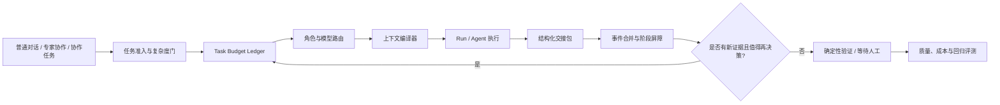

# 外部 Harness Token 成本优化方案

> 状态：设计基线，尚未实现。
> 观测时间：2026-08-02。
> 范围：普通对话、专家协作和 CollaborationTask 的模型调用编排；不改变 Run、ToolCall、Approval、Sandbox 的既有审计边界。

## 1. 结论

PaiCLI 已具备较成熟的**单 Run 上下文 Harness**：稳定前缀、摘要、统一输入预算、按需工具 Schema、`context.prepared` Manifest、模型用量和项目级预算都已落库。当前主要缺口不在“能否少传一点上下文”，而在 Run 之外没有一个统一的**任务级外部编排 Harness**。

因此，多个 Agent、Leader 回唤、评论、失败重试和工具执行会各自创建或继续 Run；每个 Run 都重新进入完整的模型循环。现有 `collaboration_triggers` 的幂等只能阻止同一事件重复建 Run，不能判断“这次唤醒是否带来了值得再调用模型的新证据”，也不能为整项工作设定并消耗总 Token 信封。

降本应优先减少不必要的模型回合和重复上下文，其次才是换更便宜的模型。目标 Harness 的职责是：在模型调用之前做确定性判断、在 Agent 之间传递小而可验证的交接包、只在关键决策点使用强模型，并以任务级预算和评测闭环约束所有模式。

## 2. 本次“写一个推箱子小游戏”的事实复盘

### 2.1 可审计数据

以下数据来自本机 `data/paicli.db` 的 `collaboration_task_runs`、`runs` 与 `model_usage`，任务创建于 `2026-08-01T17:11:37Z`，最后由人工取消。这里的输入 Token 是供应商实际返回值；缓存 Token 是输入 Token 的已缓存部分，不应再与输入 Token 相加。

该任务有调用记录的 Run 的实际模型均为 `openai-compatible/kimi-k3`。与此同时，8 个 Task-Run 持久化的 `model_profile_id` 均为空；三位专家档案虽保存了 `DeepSeek V4 Flash` 方案引用，但在创建这些 Run 时没有解析为可用方案，因而回退到服务端默认模型。这个结论来自持久化 Run 与 `model_usage`，不应归因于首页临时模型选择。后续 Harness 应把“绑定方案未解析、回退原因、最终模型”作为每次路由决策的必填审计字段，避免仅在用量页事后发现路由偏差。

| 指标 | 数值 |
|---|---:|
| 关联 Run | 8 |
| 有实际模型调用的 Run | 6 |
| 模型调用 | 53 |
| 输入 Token | 1,379,337 |
| 其中 cached input Token | 1,093,376 |
| 输出 Token | 51,075 |
| 模型重试 | 14 |
| 终态 | 4 `COMPLETED`、3 `FAILED`、1 `CANCELED` |

| 时间 (UTC) | 执行者 | 关系 / 触发 | 状态 | 调用 | 输入 / 输出 Token | 说明 |
|---|---|---|---|---:|---:|---|
| 17:11:53 | Leader 任务队长 | `HUMAN_ACTION: START` | 完成 | 5 | 95,646 / 1,532 | 初始评估与委派 |
| 17:12:55 | 代码实现专家 | `DELEGATION` | 完成 | 9 | 304,037 / 32,125 | 包含 14 次请求重试 |
| 17:49:27 | Leader 任务队长 | 实现专家终态 `RUN_EVENT` | 完成 | 11 | 291,451 / 8,844 | 对实现结果再次评估 |
| 18:17:46 | 代码审查专家 | `DELEGATION` | 完成 | 18 | 476,175 / 5,333 | 审查与工具循环最多 |
| 18:23:10 | Leader 任务队长 | 评论 `REPLY` | 失败 | 5 | 114,812 / 2,378 | 供应商 TPD 限流后失败 |
| 18:24:00 | Leader 任务队长 | 审查专家终态 `RUN_EVENT` | 取消 | 5 | 97,216 / 863 | 在完成前被取消 |
| 18:25:10 | 代码实现专家 | `DELEGATION` | 失败 | 0 | 0 / 0 | 供应商 TPD 限流，未进入模型调用 |
| 18:34:36 | Leader 任务队长 | 实现专家终态 `RUN_EVENT` | 失败 | 0 | 0 / 0 | 同样受 TPD 限流影响 |

### 2.2 为什么会有这么多调用

1. **多 Agent 是多条 ReAct 循环，不是一条调用。** 初始 Leader、实现专家、审查专家和后续 Leader 都独立执行工具调用后的“模型 -> 工具 -> 模型”回合。53 次是 6 个有效 Run 的累加，不是 UI 刷新或一次对话被重复计费。
2. **终态自动回唤是放大器。** 当前 `CollaborationService.onRunTerminal` 对 Team 成员的每个终态都创建一个 `RUN_EVENT`，并唤醒 Leader；本任务至少发生了实现专家完成、审查专家完成和后续实现专家失败三次。每个 Leader 回合都会重新建立 Session、Run 和上下文。
3. **评论回复也能直接唤醒 Leader。** 18:23 的 `REPLY` 再次创建了 Leader Run。评论本身可能只是进展说明，但当前没有“新证据阈值、合并窗口或同一 Leader 正在工作”的抑制逻辑。
4. **失败重试叠加了工具循环。** 实现专家 Run 记录了 14 次模型重试。之后供应商报出 Token-per-day 限流，两个待执行 Run 甚至在首个模型调用前失败。Harness 目前没有把供应商余量、队列中的预估输入和任务优先级联合起来做准入控制。
5. **缓存已经有效，但不能解决调用次数。** 约 79.3% 的输入 Token 被供应商报告为缓存命中。缓存降低了同一前缀的单价，却没有减少 53 次调用、工具回合、输出和动态尾部 Token；并且不同 Run 使用新 Session，会削弱跨 Run 的共同前缀复用。

这不是“协作一定浪费”的结论。实现与审查本身是合理分工；问题是每一次结果、回复或失败都直接升级为一个新的完整模型决策，且没有任务级成本上限与价值判断。

## 3. 当前能力与缺口

### 已有能力

- `ContextManager` 将系统指令、专家指令、项目规则、Skill 索引、摘要、历史、运行时信息、Plan、RAG、Memory 与工具 Schema 放入统一预算；稳定内容位于可复用前缀。
- `ConversationCompactor` 以结构化工作摘要控制长对话；每轮的 `context.prepared` Manifest 记录区块 Token、可复用前缀 SHA、工具和裁剪原因。
- `ToolCatalog` 只常驻核心工具与 `tool_search`，扩展工具的完整 Schema 延迟到真正需要时注入。
- `RunProcessor` 有 Run 级步骤、Token、工具次数和时长上限，并持久化每一轮真实输入、输出、缓存、耗时和重试次数。
- `CollaborationTask` 已把长期工作、Trigger、Route Decision、评论、阶段屏障和 Task-Run 关联持久化，避免靠聊天文本猜测状态。

### 仍缺少的外部编排能力

| 缺口 | 现状 | 结果 |
|---|---|---|
| 预算层级 | 仅项目预算和单 Run 预算 | 一个任务可由多个 Run 分别消耗额度，无法提前停止低价值后续工作 |
| 触发裁决 | 幂等键只按事件去重 | 完成、失败、评论都可能立即唤醒 Leader |
| Agent 交接 | 通过评论、Session、工具结果和新 Run 上下文传递 | 结果未被压缩为机器可判定的交接包，Leader 需要重新阅读大量上下文 |
| 模型路由 | Agent Profile 优先，否则继承 / 默认模型 | 没有按阶段、证据质量、剩余预算和供应商压力作模型分层 |
| 工具回合 | 每次工具结果通常回到模型判断 | 对确定性的筛选、聚合、验证仍花费模型回合 |
| 限流保护 | Provider 失败后记录失败 | 没有基于预估 Token 的准入、退避、合并或降级策略 |
| 成本质量评测 | 有 Run/项目用量和团队评测 | 尚无“任务成功质量 / Token / 回合”联合评分及回归门禁 |

## 4. 可借鉴的公开实践

不能从公开资料推断 Claude Code 或 Codex 的内部 Harness 实现；以下仅是它们公开、可验证的产品或 API 能力，适合作为 PaiCLI 的设计参照。

| 参照 | 可借鉴点 | PaiCLI 的落点 |
|---|---|---|
| Claude Code 项目记忆 | `CLAUDE.md` 可作为项目共享指令，且子目录指令按需纳入，不要求启动时加载整棵仓库 | 把项目规则继续维持为受控、可预算、按工作区选择的上下文，而非把所有文档固定塞进每个 Run |
| Claude Code 非交互运行 | 公开 CLI 提供 `--max-turns`、模型选择及 JSON/stream 输出，便于外部自动化给 Agent 设置回合边界 | 将每类任务的最大模型回合、最大工具回合和预算信封提升到 Task / Stage 层，并记录 Harness 决策 |
| Anthropic LLM Gateway | 官方文档把用量追踪、预算、限流、审计和模型路由列为网关职责 | PaiCLI 可在自己的 Server 侧实现同等的“任务 Harness 网关”，无需改变 Sandbox 或暴露密钥 |
| OpenAI 模型指南 | 明确建议精简 Prompt 与工具集合；对于可确定处理的大量工具结果，采用程序化工具调用 / 聚合而非每一步回到模型 | 增加确定性工具结果归并器；以角色上下文配置控制工具和输出契约 |
| OpenAI Prompt Caching | 提供显式稳定前缀与缓存控制的方向 | 已有稳定前缀基础，下一步是将团队共享的任务基线、只读仓库摘要做内容寻址缓存，并监控跨 Run 命中 |
| OpenAI 多 Agent | 公开说明多 Agent 适合可清晰拆分的独立工作流 | 路由器须先判断“并发独立性”；顺序性强或改同一文件的工作应单 Agent / 单工作区执行 |

官方资料：

- [Anthropic：管理 Claude Code 内存](https://docs.anthropic.com/zh-CN/docs/claude-code/memory)
- [Anthropic：Claude Code CLI 参考](https://docs.anthropic.com/en/docs/claude-code/cli-usage)
- [Anthropic：LLM Gateway 配置](https://docs.anthropic.com/en/docs/claude-code/llm-gateway)
- [OpenAI：模型指南](https://developers.openai.com/api/docs/guides/latest-model)
- [OpenAI：GPT-5-Codex 模型与缓存价格](https://developers.openai.com/api/docs/models/gpt-5-codex)

## 5. 目标架构：任务外部 Harness



### 5.1 统一的任务信封

所有模式都先形成 `TaskEnvelope`，普通对话可仅在本轮内存活，专家协作和 CollaborationTask 则持久化。它至少包含：

- `objective`、风险、完成条件和允许的副作用；
- `budgetTokens`、`budgetCost`、`maxModelCalls`、`maxActiveRuns`、`deadline`；
- `phase`、`decisionVersion`、`evidenceVersion` 与 `lastLeaderDecisionAt`；
- `modelTierPolicy`、可用专家、工具范围和共享工作区冲突策略；
- 累计实际用量、预留用量、缓存命中、抑制次数、失败/重试和人工覆盖记录。

在创建 Run 前，Harness 必须原子预留“预估输入 + 最大输出”。预留不能满足时，不发起请求，而是选择延迟、合并、降级模型、要求人工确认或把任务标为成本阻塞。Run 完成后用真实 `model_usage` 结算差额。

### 5.2 事件合并，而不是事件即调用

`RUN_EVENT`、`REPLY`、`MENTION`、`STAGE_BARRIER` 先写入现有审计表，再交给 `TriggerArbiter`。它按下列顺序处理：

1. 对同一任务、同一 Leader、同一 `evidenceVersion` 去重。
2. 在短合并窗口内聚合多个成员终态和评论，生成一份“证据增量”。
3. 若 Leader 已在运行，只标记 `leaderDirty`，不并发创建第二个 Leader Run。
4. 用确定性规则判断是否达到决策阈值：阶段屏障完成、出现阻塞/失败、验收证据变化、人工指令，或超过最长等待时间。
5. 阈值未达到则记录 `TRIGGER_SUPPRESSED` 或 `TRIGGER_COALESCED` 活动，不调用模型；达到才创建一个携带增量交接包的 Leader Run。

这样会保留“谁在什么时候报告了什么”的审计事实，但不会把每一条事实都等价成一次昂贵的模型重新规划。

### 5.3 结构化交接包

成员 Run 的结束不应只留下自然语言评论和完整历史。Harness 在 Run 终态后生成并校验 `HandoffEnvelope`：

```json
{
  "taskId": "...",
  "phase": 1,
  "role": "IMPLEMENTER",
  "outcome": "DELIVERED | BLOCKED | NEEDS_REVIEW | FAILED",
  "facts": ["已验证的短事实"],
  "changedArtifacts": [{"path": "sokoban/index.html", "digest": "sha256:..."}],
  "checks": [{"name": "browser-smoke", "status": "PASSED", "evidence": "artifact:..."}],
  "openRisks": ["..."],
  "nextDecision": "REVIEW | REWORK | COMPLETE | WAIT",
  "evidenceRefs": ["message:...", "toolCall:..."],
  "tokenCount": 0
}
```

它由规则校验字段、引用和最大长度；必要的浓缩可由小模型完成，但必须有确定性降级摘要。Leader 的下一轮优先读取交接包、变更摘要和验收证据，只有需要追溯时才按引用读取原始 Artifact 或消息。

### 5.4 分层模型与确定性工作

模型路由不可只按“哪个 Agent 绑定什么模型”静态决定，还要按阶段和证据做约束：

| 场景 | 默认方式 | 升级条件 |
|---|---|---|
| 简短普通对话、分类、状态提取 | 低成本模型或规则 | 低置信度、用户要求深度推理 |
| 实现、复杂定位、最终整合 | 强模型 | 无 |
| Leader 规划 | 强模型，仅在新证据达到阈值时 | 阶段屏障、阻塞、人工介入 |
| 结果归并、去重、JSON 校验、文件 diff、测试汇总 | Server 代码 / 程序化工具调用 | 需要解释矛盾或生成方案时 |
| 审查 | 先运行确定性检查，再由审查模型处理失败项和高风险差异 | 关键文件或检查失败 |

对共享工作区的改动默认顺序执行；只有文件集合、环境和验收项互不冲突时才并发。并发首先用来缩短墙钟时间，不应默认提高 Agent 数量。

## 6. 为什么可以降低 Token 与费用

可以把一次任务的近似成本拆为：

```text
总费用 ~= sum(每次模型调用的未缓存输入 * 输入单价
             + 缓存输入 * 缓存输入单价
             + 输出 * 输出单价)

总 Token ~= 模型调用次数 * 每回合上下文 + 输出 + 重试带来的重复请求
```

外部 Harness 分别降低这几个乘数：

| 措施 | 减少什么 | 对本次任务的直接对应 |
|---|---|---|
| Trigger 合并与单 Leader 飞行锁 | 模型调用次数 | 避免将成员完成、评论回复、后续失败拆成多个紧邻的 Leader Run |
| Task 预算预留与限流准入 | 无法完成的请求、重试与级联失败 | 在接近 TPD 上限时不再继续创建会立即 429 的委派 / Leader Run |
| 交接包与证据索引 | 每次 Leader 的动态输入 | Leader 不必重新读实现过程、完整工具输出和旧评论 |
| 角色上下文与最小工具集 | 稳定 Prompt / Schema Token | 审查者只获得审查需要的工具和文件摘要 |
| 确定性聚合、验证和 diff | 工具后的模型回合 | 测试结果、文件列表、重复结果无需逐项交给模型解释 |
| 分层模型与输出上限 | 高单价输入、输出和 reasoning Token | 只把难的规划/整合交给强模型，进度和格式转换走低成本路径 |
| 内容寻址缓存 | 重复的只读项目上下文成本 | 共享任务基线、规则和稳定历史可跨相关 Run 复用 |

不应在没有基线评测前承诺固定百分比。以本次任务为例，18:23 的 `REPLY` 与 18:24 的审查专家终态 `RUN_EVENT` 可以合并为一次 Leader 评估；供应商进入限流后，后续委派和 Leader 唤醒则应被冷却准入拦截。再通过交接包缩小保留的 Leader 评估输入，才构成可验证的节省。最终是否减少 30% 或 60%，应由相同任务集上的“质量不降、Token 下降”评测证明。

## 7. 实施顺序

### P0：先让成本可控、可解释

1. 增加 `task_budgets`、`task_budget_reservations`、`harness_decisions` 三张表，记录任务信封、原子预留/结算和允许/抑制/降级理由。
2. 在创建协作 Trigger 和普通/专家 Run 前经过同一个 `HarnessAdmissionService`；现有项目和 Run 级预算继续保留，形成三层硬上限。
3. 增加 `TriggerArbiter`：Leader 单飞、事件合并窗口、`evidenceVersion`、抑制活动和最长等待唤醒。
4. Provider 429/限流时持久化冷却时间和下一次可尝试时间，冻结低优先级新 Run，避免无 Token 的失败 Run 链。
5. Console 增加“本任务已用 / 预留 / 剩余 Token、调用数、被合并事件、最近一次 Harness 决策”，使用户能判断协作是否值得继续。

### P1：减少每次调用的上下文与回合

1. 引入版本化 `HandoffEnvelope` 和 `handoff_envelopes` 表；将任务关联 Artifact、测试结论、阻塞和下一步固化为短引用包。
2. 给每个协作角色配置 Context Profile：可读取的摘要、最大 Artifact 摘要、工具集、输出 JSON Schema 和最大输出 Token。
3. 新增 Server 侧工具结果归并器，对列表、diff、测试、日志、静态检查进行过滤、去重、聚合和截断；模型只看到需要判断的异常和摘要。
4. 为稳定的任务基线和仓库摘要建立内容哈希，观测跨 Run 的可复用前缀与真实 cache read。

### P2：优化质量 / 成本比，而不是只压 Token

1. Route Preview 增加“是否值得并发、预估 Token、模型分层、预期证据”字段，并让用户在任务创建时看到预算建议。
2. 增加成本感知路由：轻量模型默认处理分类、摘要、格式和低风险检查；低置信度、关键验证失败或高风险变更才升级强模型。
3. 给团队评测新增 `cost_per_accepted_task`、`model_calls_per_task`、`input_tokens_per_verified_artifact`、`rework_rate` 指标；同一 Case 同时跑当前策略和候选 Harness。
4. 将“Token 下降但验收失败率上升”的配置判定为回归，不能上线。

## 8. 验收指标与测试

每个优化都应在固定的普通对话、专家协作和 CollaborationTask 样本上对比基线。建议的发布门槛：

- 功能：任务终态、审批、恢复、取消、阶段屏障和人工干预与当前语义一致。
- 质量：验收通过率、测试通过率、审查有效率不低于基线；关键任务保留人工最终验收。
- 效率：`model_calls/task`、输入 Token/task、输出 Token/task、重试次数/task、Leader 唤醒次数/task 都可按任务查看。
- 缓存：区分 `cachedInputTokens / inputTokens` 与绝对输入 Token，不能用缓存命中率掩盖调用次数增长。
- 稳定性：429 后不产生无意义的快速重试链；恢复与重复事件不会重复记账或重复执行副作用。
- 可解释性：每次“派发、合并、抑制、降级、超预算阻止”都有持久化决策和 UI 可读原因。

对应测试至少覆盖 Store 迁移、预算并发预留、Trigger 合并/幂等、Leader 单飞、429 冷却、交接包大小与引用校验、路由降级和三种入口的一致性。API 或持久化行为落地时，同步更新 OpenAPI、README、架构和阶段文档。

## 9. 不应采取的做法

- 只把 `maxRunTokens` 调低：会把长任务变成更多失败/重试，不会解决多 Run 叠加。
- 只依赖供应商 Prompt Cache：缓存降低单价，不能避免没有新证据的 Leader 回合，也不能减少输出与工具循环。
- 对每条活动都让 Leader“思考一下”：审计事件应完整，模型决策应稀疏。
- 为了省钱取消审查或人工验收：应先用确定性检查过滤，再把有限的模型预算投入高风险差异。
- 把所有工作都并发给更多 Agent：对共享工作区和强依赖任务，冲突、返工和上下文传递成本通常会抵消并行收益。
