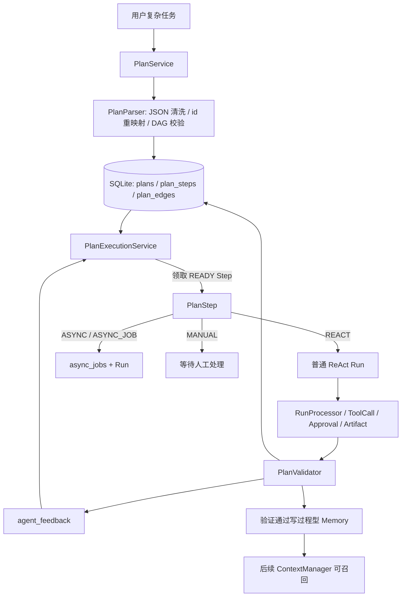
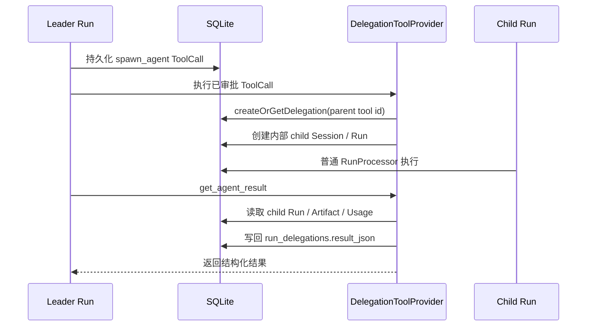

# Plan Runtime、Multi-Agent 与 Agent Harness 深度说明

本文专门解释 PaiCLI Platform Lite 中复杂任务编排、子 Agent 委派、Plan 绑定 Agent 结果、受控并行和验证反馈闭环。README 负责入口说明，`docs/architecture.md` 负责全局架构，本文件负责把 Plan 与 Multi-Agent 的运行语义讲清楚。

## 1. 设计目标

普通 ReAct Loop 适合单轮或短链路任务，但复杂研发任务通常需要先拆解，再分阶段执行、验证和修订。如果计划只存在于模型回复里，会出现几个问题：

- 服务重启后不知道计划执行到哪一步。
- 用户刷新页面后只能看到对话文本，看不到计划状态。
- 子 Agent 做了什么、产物在哪、是否满足验收标准，缺少结构化结果。
- 多个步骤能否并行、是否写同一个文件，只能靠模型自觉判断。
- Run 完成不等于目标达成，需要独立验证闸口。

因此 PaiCLI 把复杂任务拆成两层：

- **Run 层**：普通 ReAct 执行链，负责模型调用、ToolCall、Approval、Artifact、Event、预算和恢复。
- **Plan 层**：任务编排层，负责目标、Step、DAG 依赖、资源读写集、调度策略、验证和闭环反馈。

Plan 不直接执行工具，也不绕过审批。每个可执行 Step 仍会创建普通 Run，让现有的可靠 Runtime 承担真正动作。

## 2. 总体链路



关键点是：Plan 只决定“下一步该做什么、什么时候做、怎样验收”，真正执行仍通过普通 Run 完成。

## 3. 数据模型

### 3.1 Plan 相关表

| 表 | 作用 | 关键字段 |
|---|---|---|
| `plans` | 一个可审批、可启动、可 Replan 的任务计划 | `objective`、`summary`、`status`、`version`、`raw_plan_json`、`failure_reason` |
| `plan_steps` | 任务级步骤 | `title`、`description`、`type`、`execution_mode`、`done_criteria_json`、`status`、`run_id` |
| `plan_edges` | Step DAG 依赖 | `from_step_id`、`to_step_id` |
| `plan_revisions` | Replan 历史 | `version`、`reason`、`raw_plan_json` |
| `plan_events` | Plan/Step 审计事件 | `event_type`、`event_data`、`sequence` |
| `async_jobs` | 外部长任务或异步 Step 状态 | `idempotency_key`、`payload_json`、`result_json`、`status` |
| `validation_checks` | Step Done Criteria 的验证证据 | `expected`、`actual`、`evidence`、`error` |
| `agent_feedback` | Step/Run 验证后的反馈闭环 | `validation_status`、`score`、`failure_class`、`evidence_quality` |

### 3.2 阶段 5/6 新增字段

`plan_steps` 新增以下字段，用于受控并行和隔离调度：

| 字段 | 含义 |
|---|---|
| `resource_read_set_json` | Step 预计读取的资源集合，例如 `["README.md", "src/**"]` |
| `resource_write_set_json` | Step 预计写入的资源集合，例如 `["src/App.java"]` |
| `isolation_strategy` | `SHARED_SESSION`、`INTERNAL_SESSION` 或 `GIT_WORKTREE` |
| `max_parallelism` | 为后续更细粒度并行度控制预留，当前限制在 1–16 |
| `critical_path_weight` | 关键路径优先级，值越大越优先调度 |
| `workspace_ref` | 隔离 Step 对应的受控 workspace 引用 |

这些字段来自模型生成的 Plan JSON，但会在 Server 侧规范化和限制，不能由模型随意扩大执行权限。

## 4. Plan JSON 契约

模型生成的 Plan 是候选输入，不是可信执行指令。当前 Step 支持以下字段：

```json
{
  "client_id": "patch_readme",
  "title": "Patch README",
  "description": "Update the architecture section",
  "type": "ANALYSIS",
  "execution_mode": "REACT",
  "dependencies": ["inspect_docs"],
  "done_criteria": [
    "file_contains:README.md::Plan Runtime"
  ],
  "resource_read_set": ["README.md", "docs/architecture.md"],
  "resource_write_set": ["README.md"],
  "isolation_strategy": "GIT_WORKTREE",
  "max_parallelism": 1,
  "critical_path_weight": 10
}
```

解析与校验流程：

1. 清理 Markdown code fence。
2. 限制步骤数量和字段长度。
3. 重映射模型给出的 `client_id`，生成内部稳定 Step id。
4. 校验 Step 类型和执行模式。
5. 校验依赖是否存在。
6. 检测 DAG 循环。
7. 将资源读写集保存为 JSON 数组。
8. 将未知隔离策略降为受控枚举校验错误，而不是直接执行。

## 5. Step 状态机

```text
PENDING
  -> READY
  -> RUNNING
     -> WAITING_APPROVAL
     -> WAITING_JOB
     -> VALIDATING
        -> COMPLETED
        -> VALIDATION_FAILED
     -> FAILED
     -> CANCELED
     -> SKIPPED
```

状态含义：

- `PENDING`：依赖未满足。
- `READY`：依赖已完成，可被调度器领取。
- `RUNNING`：Step 已领取或已绑定 Run。
- `WAITING_APPROVAL`：人工步骤或底层 Run 等待审批。
- `WAITING_JOB`：异步 Job 已创建，等待外部结果或 Run 终态。
- `VALIDATING`：底层 Run 已完成，正在执行 Done Criteria 验证。
- `COMPLETED`：验证通过。
- `VALIDATION_FAILED`：Run 完成但验收失败。

Plan 的状态由 Step 汇总驱动。所有 Step 完成时 Plan 完成；任一 Step 验证失败或执行失败时 Plan 失败，之后可在安全条件下执行局部 Replan。

## 6. 调度与恢复

### 6.1 领取租约

`PlanExecutionService` 调度前会回收过期租约。领取 `READY` Step 时写入：

- `claim_owner`
- `lease_expires_at`
- `heartbeat_at`
- `attempt`
- `dispatch_idempotency_key`

如果 Worker 在领取后、创建 Run 前崩溃，下一轮调度会把过期且尚未绑定 Run 的 Step 恢复为 `READY`，并记录 `plan_step.lease_recovered`。

### 6.2 优先级

Ready Step 的排序规则是：

1. `critical_path_weight` 越大越优先。
2. 下游依赖数量越多越优先。
3. `ordinal` 越小越优先。

这让关键路径和高扇出步骤优先执行，减少后续步骤等待时间。

### 6.3 资源读写集冲突

调度器会收集同一 Plan 内活跃 Step 的资源读写集，再判断候选 Step 是否冲突：

- 候选写集命中活跃读集：冲突。
- 候选写集命中活跃写集：冲突。
- 候选读集命中活跃写集：冲突。
- 纯读读不冲突。

冲突 Step 不会直接失败，而是：

1. 保持 `READY`。
2. 写入 `last_failure_class = RESOURCE_CONFLICT`。
3. 设置短暂 `not_before`。
4. 等下一轮调度自动重试。

这是一种“保守并行”策略：优先保证不会让两个 Step 同时写同一资源。

## 7. 隔离策略

| 策略 | 当前语义 | 适用场景 |
|---|---|---|
| `SHARED_SESSION` | 可复用 Plan 关联 Session；无写集的只读/分析步骤可用 | 读取、分析、轻量总结 |
| `INTERNAL_SESSION` | 为 Step 创建内部 Session，避免同一 Session 活跃 Run 冲突 | 独立执行但不要求独立文件树 |
| `GIT_WORKTREE` | 创建受控 `plan-worktrees/{planId}/{stepId}` workspace 引用 | 预留后续真实 worktree add/merge |

当前 Lite 版不会自动执行真实 `git worktree add`、分支提交、merge 或冲突恢复。`GIT_WORKTREE` 的当前价值是：

- 明确这个 Step 需要文件级隔离。
- 给 Run 和后续工具层一个可追踪 workspace 引用。
- 让 `workspaceOwnerRunId()` 优先返回 workspace 引用，避免子 Run 误用父工作区。
- 为后续真实 Git worktree 工具层留稳定数据结构。

## 8. Validation Gate

Run 进入 `COMPLETED` 不代表 Step 完成。Plan 会先进入 `VALIDATING`，再由 `PlanValidator` 检查 `done_criteria_json`。

当前支持：

- `run_status:COMPLETED`
- `answer_contains:<text>`
- `answer_not_contains:<text>`
- `file_exists:<path>`
- `file_not_exists:<path>`
- `file_contains:<path>::<text>`
- `test_report:<path>`
- 普通文字验收标准的最终回答证据匹配

文件和测试报告验证只读取 `paicli.workspace-root` 下的相对路径，拒绝绝对路径和越界路径。验证结果会写入 `validation_checks`，包括实际结果、证据包和错误原因。

## 9. Agent Feedback 与 Memory 闭环

阶段 5/6 新增的闭环是：

```text
Run terminal
  -> PlanValidator
  -> validation_checks
  -> agent_feedback
  -> passed 时写入过程型 Memory
  -> Micrometer 指标
```

`agent_feedback` 保存：

- project key
- agent profile id
- plan id
- step id
- run id
- Run 终态
- validation status
- score
- failure class
- evidence quality

验证通过时，还会生成类似 `plan.validation.{stepId}` 的过程型 Memory，内容描述该 Step 验证通过的事实和实际结果。这样后续任务可以召回“哪些步骤曾经如何完成并验证”，而不是只依赖聊天历史。

失败时不写成功 Memory，但保留 failure class，例如：

- `VALIDATION_FAILED`
- `CANCELED`
- `RETRYABLE_INFRA`
- `BUDGET_EXHAUSTED`

这些数据为后续专家评分、调度策略和人工复盘提供事实源。

## 10. Multi-Agent Harness

Multi-Agent 不是第二套 Agent Loop。PaiCLI 的设计是：子 Agent 仍然是普通 Run，只是由父 Run 的 `spawn_agent` ToolCall 创建。



### 10.1 专家 Profile

`agent_profiles` 保存可复用专家：

- 专家名称和描述。
- 专家系统指令。
- 默认模型方案。
- 工具白名单。
- Skill 白名单。
- 输出契约。
- 协作角色：Leader、Expert、Reviewer、Runner。
- 交接策略、工作区范围、审批策略。

创建 Run 时指定 `agentProfileId`，ContextManager 会注入专家指令，并按白名单过滤可见工具和 Skill。

### 10.2 Delegation Envelope

阶段 2/3/4 已把 `spawn_agent` 从简单“开一个子任务”升级为结构化执行信封：

| 字段 | 说明 |
|---|---|
| `plan_id` / `plan_step_id` | 子 Agent 绑定哪个计划步骤 |
| `scope` | 子 Agent 的任务边界 |
| `allowed_files` | 允许关注或修改的文件范围 |
| `allowed_tools` | 工具白名单 |
| `input_artifacts` | 父 Run 提供的输入产物 |
| `expected_outputs` | 期望输出契约 |
| `done_criteria` | 验收标准 |
| `budget` | Token、时间或工具预算 |
| `deadline` | 截止时间 |
| `dependencies` | 依赖的 Step 或 Agent |
| `forbidden_actions` | 禁止操作 |

这些字段进入 `run_delegations.envelope_json`，用于恢复、审计和后续 Reviewer 聚合。

### 10.3 幂等与限制

为了防止恢复时重复创建子任务，`run_delegations.parent_tool_call_id` 唯一。重复执行同一个 `spawn_agent` ToolCall 会复用原委派。

当前限制：

- 子 Agent 是内部 Session，不出现在普通 Session 列表。
- 默认深度和子 Run 数量有限制，避免无限递归。
- 非 Leader 是否允许继续派生由协作策略控制。
- 父 Run 取消会级联取消后代。
- 子 Agent 结果通过 `get_agent_result` 拉取，不让父 Worker 长时间同步阻塞。

## 11. Plan 与 Multi-Agent 如何协作

Plan 和 Multi-Agent 的关系是：

- Plan 定义任务步骤和验收标准。
- Leader 或调度器决定某个 Step 是否需要子 Agent。
- `spawn_agent` 把 `plan_id`、`plan_step_id` 和 envelope 持久化。
- 子 Agent 作为普通 Run 执行。
- `get_agent_result` 把子 Run 摘要、Artifact、Token、失败分类和证据写回委派结果。
- Plan Step 最终仍由 `PlanValidator` 验证。

这避免了一个常见问题：子 Agent 说“我完成了”，但 Plan 没有证据。PaiCLI 的闭环要求结果必须进入结构化 `result_json`、`validation_checks` 和必要的 Artifact/Memory，才能作为后续步骤事实源。

## 12. 典型执行场景

### 12.1 两个 Step 写同一个文件

1. Plan 生成两个 READY Step。
2. 两个 Step 都声明 `resource_write_set=["README.md"]`。
3. 调度器优先领取关键路径权重更高的 Step。
4. 第二个 Step 检测到写写冲突，设置 `RESOURCE_CONFLICT` 和 `not_before`。
5. 第一个 Step 完成并验证后，第二个 Step 在下一轮被调度。

### 12.2 子 Agent 执行验证任务

1. Leader 调用 `spawn_agent`，绑定 `plan_id` 和 `plan_step_id`。
2. DelegationToolProvider 创建内部子 Session/Run。
3. 子 Run 使用普通 Runtime 执行工具、审批和 Artifact。
4. Leader 调用 `get_agent_result` 汇总结构化结果。
5. Plan Step 根据 done criteria 验证结果。
6. 验证通过后写 `agent_feedback` 和过程型 Memory。

### 12.3 局部 Replan

1. 某 Step 进入 `VALIDATION_FAILED`。
2. Plan 状态变为 `FAILED`。
3. 如果没有运行中、等待审批、等待 Job 或验证中的 Step，可以局部 Replan。
4. 已完成/跳过/取消的 Step 与 Validation Check 被保留。
5. 未完成尾部被替换，新版本重新进入 `ACTIVE`。

## 13. 可观测性

阶段 5/6 增加了以下 Micrometer 指标：

| 指标 | 含义 |
|---|---|
| `paicli.plan.validation.passed` | Plan Step 验证通过次数 |
| `paicli.plan.validation.failed` | Plan Step 验证失败次数 |
| `paicli.plan.resource.conflicts` | 资源读写冲突导致延后次数 |
| `paicli.agent.feedback.recorded` | Agent Feedback 写入次数 |
| `paicli.plan.validation.memory.recorded` | 验证通过后写入 Memory 次数 |

这些指标和 `plan_events`、`validation_checks`、`agent_feedback` 一起构成全链路诊断基础。

## 14. 当前边界

已经完成：

- Plan 持久化、DAG 校验、审批/启动/取消/Replan。
- Step 调度、租约、心跳、过期恢复。
- ReAct Run 绑定、Async Job、Validation Gate。
- 资源读写集冲突控制。
- 内部 Session 隔离与 workspace 引用。
- Plan 绑定 Agent 委派 metadata。
- 结构化 Agent Result 写回。
- Agent Feedback 与验证 Memory 闭环。

明确未做：

- 自动执行真实 `git worktree add`、提交、merge 和冲突恢复。
- Kafka/Redis/MinIO 外部适配器。
- 跨节点分布式调度。
- 基于历史反馈的自动专家排名和自动路由。
- 子 Agent 终态自动无缝触发父 Step 验证的完整联动，目前仍以 Run/Plan 调度轮次推进。
- LLM Judge 式开放语义评分。

## 15. 代码阅读路线

| 顺序 | 文件 | 重点 |
|---|---|---|
| 1 | `paicli-server/src/main/java/com/paicli/platform/server/plan/PlanParser.java` | 模型 Plan JSON 清理、字段解析、DAG 校验 |
| 2 | `paicli-server/src/main/java/com/paicli/platform/server/plan/PlanService.java` | Plan 创建、生成、审批、启动、Replan API 业务逻辑 |
| 3 | `paicli-server/src/main/java/com/paicli/platform/server/store/PlanStore.java` | Plan/Step/Edge/Job/Validation 持久化与状态流转 |
| 4 | `paicli-server/src/main/java/com/paicli/platform/server/plan/PlanExecutionService.java` | 调度、资源冲突、隔离 Session、workspace 引用、闭环反馈 |
| 5 | `paicli-server/src/main/java/com/paicli/platform/server/plan/PlanValidator.java` | Done Criteria 验证和 EvidenceBundle |
| 6 | `paicli-server/src/main/java/com/paicli/platform/server/agent/DelegationToolProvider.java` | `spawn_agent`、`get_agent_result`、委派幂等 |
| 7 | `paicli-server/src/main/java/com/paicli/platform/server/store/SqliteRuntimeStore.java` | `run_delegations`、`agent_feedback`、内部 Session、删除清理 |
| 8 | `paicli-server/src/test/java/com/paicli/platform/server/plan/PlanServiceTest.java` | Plan 调度、验证、Replan、资源冲突测试 |
| 9 | `paicli-server/src/test/java/com/paicli/platform/server/store/SqliteRuntimeStoreTest.java` | 迁移、Agent Feedback、删除清理测试 |

## 16. 面试讲法

可以这样概括：

> 我把复杂任务从模型文本升级成持久化 Plan DAG。模型只生成候选计划，Server 负责清洗、id 重映射、依赖校验和循环检测。Step 执行时仍创建普通 ReAct Run，因此工具持久化、审批、Artifact、预算和恢复链路全部复用。后续又加入资源读写集、关键路径权重和隔离策略，调度器可以阻止同一计划内的写写/读写冲突；Run 完成后还要经过 PlanValidator 验收，结果写入 agent_feedback，验证通过再沉淀过程型 Memory。Multi-Agent 也不是第二套 Loop，而是通过 spawn_agent 创建内部子 Run，并用结构化 envelope 和 result_json 与 Plan Step 绑定。

这个回答要主动补一句边界：

> 当前 Lite 版已经有受控 workspace 引用和隔离 Session，但不会自动执行真实 git worktree merge；Kafka、Redis、MinIO 也只是端口预留。这样做是为了先把状态、恢复、审批和验证闭环做扎实，再把外部中间件作为可替换实现接入。
