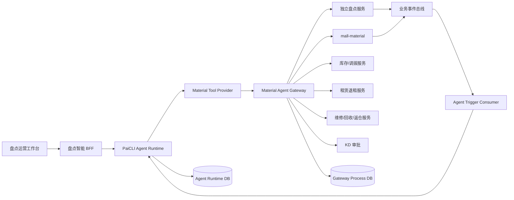
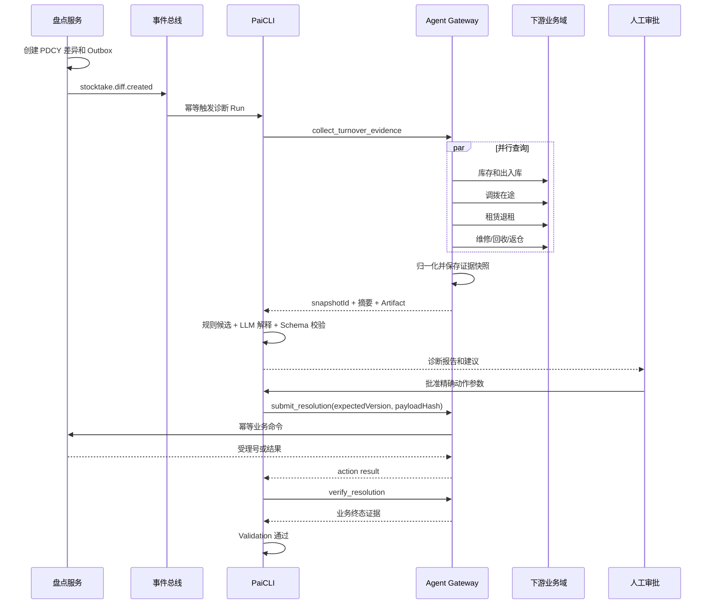

可以把它设计成“物资盘点智能处置平台”：盘点系统负责单据和库存事实，`mall-material` 负责物资生命周期与 SN 状态，PaiCLI Agent 负责跨系统取证、差异归因、处置建议、流程编排和审计。

关键不是做一个“能问库存的聊天机器人”，而是让 Agent 参与盘点前、盘点中、差异处理、审批执行、复盘沉淀的完整闭环。

# 一、先明确三个系统的职责边界

根据你给出的业务资料，当前实际边界是：

| 系统 | 权威职责 |
|---|---|
| 独立盘点服务 | 盘点计划、盘点单、盘点任务、复检任务、差异单、盘盈亏单、提交与审核状态 |
| `mall-material` | 物资配置、单号、循环物资 SN 生命周期、差异锁定/解锁、封签更换、审批回调、关联任务 |
| PaiCLI Agent | 查询编排、跨域取证、差异原因分析、处置建议、人工审批、受控调用业务接口、复盘与知识沉淀 |

必须坚持：

> Agent 不是库存和 SN 状态的权威来源，也不能直接操作数据库。
> Agent 只能调用盘点服务和 `mall-material` 暴露的受控业务接口。

因此，不能让 Agent 直接：

- 修改盘点单状态；
- 写库存数量；
- 修改 `CycleMaterialSNStatus`；
- 直接把 SN 从 `DIFF_LOCK` 改成 `NORMAL`；
- 绕过 KD 审批处理申诉；
- 将 PDCY 盘点差异错误地当成 RQCY 流转差异处理。

# 二、最适合 Agent 改造的业务方向

最有价值的是“盘点差异智能诊断与处置”，其次是盘点计划辅助、盘点过程监控和盘点复盘。

## 1. 盘点前：智能生成盘点范围和风险清单

传统盘点计划通常由运营人员按仓、站、门店、物资类型和周期人工选择。Agent 可以在发布计划前分析：

- 最近一次盘点时间；d
- 当前库存规模；
- 历史盘盈盘亏次数；
- 近30天调拨、退租、返仓、维修、回收次数；
- 长时间无流转库存；
- 账面库存为正但长期无业务记录的物资；
- 历史差异率较高的仓、站、门店；
- 供应商或业务主体的异常率；
- 循环物资长期处于异常、维修或借用状态的 SN；
- 近期发生过批量退租、返仓或调拨的主体。

Agent 输出的不是直接发布计划，而是：

```text
建议盘点主体：华东一号仓
建议盘点类型：月度盘点
建议重点物资：保温箱、冰板
风险原因：
1. 保温箱近30天调拨次数增长46%
2. 上次盘点差异率为3.2%
3. 87个循环物资SN超过14天无流转记录
4. 近期存在批量资产返仓业务
建议抽盘比例：30%
```

工作人员确认后，再由盘点服务创建正式盘点计划。

## 2. 盘点中：进度监控与异常提醒

Agent 可以持续读取盘点任务状态，识别：

- 已下发但长时间未开始；
- 盘点任务进度明显低于同类主体；
- 扫描数量突然大幅波动；
- 重复扫描同一 SN；
- 同一 SN 在多个门店被扫描；
- 已锁定 SN 仍产生占用、换签、调拨请求；
- 实盘数量超过合理库存区间；
- 任务接近超时；
- 已提交任务长时间未确认；
- 复检结果与初盘结果偏差过大。

Agent 只发送提醒或创建异常任务，不应该在盘点尚未提交时擅自修改结果。

# 三、周转物资盘点的 Agent 方案

周转物资是 SKU 数量维度，重点是解释：

> 为什么账面数量和实盘数量不一致？

## 1. Agent 所需数据

针对一条 PDCY 盘点差异，Agent 至少需要查询：

- 盘点单和盘点任务；
- 盘点范围和库存快照时间；
- SKU 账面库存；
- 初盘、复盘实盘数量；
- 入库、出库、调拨、领用流水；
- 调拨在途记录；
- 门店或站点未确认收货记录；
- 租赁、退租记录；
- 维修出库、维修返还记录；
- 回收、报废、资产返仓记录；
- 同期 RQCY 流转差异；
- 历史盘点差异；
- 操作人和操作时间；
- 申诉与审批记录。

这里必须明确区分：

- PDCY：盘点产生的盘盈盘亏差异；
- RQCY：调拨、收发过程中的多收少收差异。

Agent 可以使用 RQCY 作为 PDCY 的原因证据，但不能调用错误的差异处理接口。

## 2. 差异归因模型

Agent 可以按照确定性规则和模型分析结合的方式，对差异原因进行分类：

| 原因类型 | 典型证据 |
|---|---|
| 调拨在途 | 发出方已出库，接收方尚未确认 |
| 收货未入账 | 实物已到仓，系统入库单尚未完成 |
| 出库未完成 | 实物已发出，账面仍未扣减 |
| 退租未返仓 | 退租单完成但返仓单未确认 |
| 维修在途 | 物资已送修，盘点范围仍包含该物资 |
| 回收/报废未过账 | 实物已离场，业务单据未完成 |
| 重复入库 | 同一批次被重复登记 |
| 错仓错位 | 实物位于其他库位或门店 |
| 盘点录入错误 | 初盘和复检差异大，且无业务流水支持 |
| 真实盘亏 | 排除所有在途、单据和录入因素后仍缺少 |
| 真实盘盈 | 实物存在但无法找到合法入库记录 |

建议采用“规则先行、模型解释”的方式。

例如：

```text
差异：保温箱 SKU-A 账面120，实盘100，盘亏20

候选原因1：调拨在途，置信度0.91
证据：
- 调拨单DB20260728001发出20个
- 发出仓已完成出库
- 接收门店尚未确认收货
- 调拨发生在库存快照之后、实盘之前

候选原因2：盘点录入错误，置信度0.18
证据：
- 初盘和复盘均为100
- 不支持录入错误判断

建议：
暂不生成盘亏单，创建调拨异常核验任务；
24小时未确认后转人工复核。
```

## 3. 周转物资处置流程

推荐流程：

```text
差异单 PENDING
  -> Agent 获取证据快照
  -> 规则引擎生成候选原因
  -> 模型生成可读分析
  -> Agent 形成处置建议
  -> 业务人员确认
  -> 必要时发起复检/申诉/审批
  -> 盘点系统生成盘盈亏单
  -> 库存系统完成库存调整
  -> Agent 校验结果并生成复盘报告
```

不同建议对应不同权限：

| 建议 | 是否允许自动执行 |
|---|---|
| 补充证据、生成报告 | 可以 |
| 发送任务提醒 | 可以 |
| 创建复检任务草稿 | 可以自动创建草稿 |
| 提交复检任务 | 建议人工确认 |
| 发起差异申诉 | 必须人工确认 |
| 生成盘盈亏单 | 必须审批 |
| 调整正式库存 | 必须由盘点系统事务执行 |
| 自动完结差异 | 只能沿用已有超时规则，不由模型自行决定 |

# 四、循环物资盘点的 Agent 方案

循环物资按 SN 管理，风险高于周转物资，因为差异处理会直接改变单件资产状态。

Agent 最适合做：

- SN 生命周期追踪；
- 差异原因分析；
- 处置类型推荐；
- 证据完整性校验；
- 高风险操作审批；
- 锁定时间监控；
- 解锁结果复核。

## 1. SN 差异诊断

针对每个差异 SN，Agent 查询完整生命周期：

```text
SN基础信息
  -> 当前所属仓/站/门店
  -> 当前状态
  -> 最近入库/出库
  -> 调拨记录
  -> 骑手领用与归还
  -> 租赁与退租
  -> 维修维保
  -> 回收与报废
  -> 换签历史
  -> 盘点历史
  -> 图片或扫码证据
```

Agent 输出五种处理建议之一：

| 处理类型 | Agent 应检查的证据 |
|---|---|
| FIND 已找到 | 实物重新扫描、所属主体一致、无其他占用 |
| LOSS 站内丢失 | 最近位置在当前站点、无合法出库和调拨记录 |
| FAKE 骑手归还无实物 | 系统有归还记录，但站点无扫描、无后续流转 |
| REPLACE 封签脱落 | 实物存在、有旧码照片、有新 SN，SKU 属性一致 |
| SEALS_LOSE 封签丢失 | 实物身份无法可靠恢复，满足作废规则 |

## 2. SN 锁定设计

当前业务中，差异 SN 会进入：

```text
NORMAL / 其他状态
  -> DIFF_LOCK
  -> 差异处理
  -> NORMAL / WAREHOUSE_LOSS / WAREHOUSE_ABANDON / SN_REPLACE
```

Agent 不能直接修改状态，只能调用：

```text
创建差异
  -> mall-material 执行 SN 差异锁定
  -> Agent 分析
  -> 人工确认 solveType
  -> 盘点服务提交差异处理
  -> mall-material 根据 solveType 执行解锁和状态流转
```

Agent 必须在建议前检查：

- SN 是否仍处于 `DIFF_LOCK`；
- 差异单是否仍为 `WAIT`；
- 盘点任务是否仍处于差异处理阶段；
- 是否存在其他维修、报损、换签或占用任务；
- 当前操作者是否有对应仓、站、门店权限；
- 证据版本是否仍为最新。

## 3. REPLACE 封签更换的特殊处理

`REPLACE` 风险最高，因为涉及旧 SN 作废、新 SN 入库。

必须要求：

- 旧 SN；
- 新 SN；
- 旧码或实物图片；
- 新旧 SN 对应 SKU 一致；
- 新 SN 未被使用；
- 新 SN 未绑定其他主体；
- 当前差异单未处理；
- 旧 SN 仍处于 `DIFF_LOCK`；
- 操作人具备换签权限；
- 使用业务幂等键防止重复执行。

Agent 可以生成校验报告，但最终操作必须由 `mall-material` 在本地事务中完成：

```text
校验旧 SN 状态
  -> 校验新 SN 唯一性
  -> 旧 SN 作废/换签
  -> 新 SN 入库
  -> 保存扩展信息与图片
  -> 写操作流水
  -> 发布处理完成事件
```

不能让 Agent 分两次调用“旧码作废”和“新码入库”，否则中途失败会出现资产状态不一致。

# 五、完整 Agent 架构

```text
盘点运营人员
      |
      v
盘点智能工作台
      |
      v
PaiCLI Agent Runtime
  |-- 盘点计划 Agent
  |-- 差异诊断 Agent
  |-- SN 生命周期 Agent
  |-- 规则与制度 Agent
  |-- 风险复核 Agent
      |
      v
物资业务工具网关
  |-- 盘点服务 Adapter
  |-- mall-material Adapter
  |-- 调拨/库存 Adapter
  |-- 租赁退租 Adapter
  |-- 维修维保 Adapter
  |-- 回收返仓 Adapter
  |-- KD 审批 Adapter
      |
      v
各业务系统与数据库
```

建议使用 PaiCLI 的 Plan + Multi-Agent 能力：

```text
Leader：盘点差异处置 Agent
  |
  |-- 库存流水专家
  |-- 调拨在途专家
  |-- 租赁返仓专家
  |-- 维修回收专家
  |-- SN 生命周期专家
  `-- 风险复核专家
```

但不是每条差异都启动多个 Agent。先由确定性规则判断复杂度：

- 单一明显原因：单 Agent；
- 涉及多个业务链路：并行查询多个专家；
- 涉及盘亏、报废、换签、申诉：增加风险复核；
- 只有知识问答：RAG，不创建复杂 Plan。

# 六、如何接入物资系统

## 1. 建立防腐层，而不是让 Agent 直接调用内部 Thrift

建议在物资系统侧增加统一的“Agent 业务工具网关”。

它负责：

- 将 Agent 工具协议转换为内部 Thrift/HTTP；
- 聚合多个底层接口；
- 屏蔽历史系统差异；
- 校验操作者权限；
- 校验单据状态；
- 校验数据版本；
- 生成业务幂等键；
- 记录调用审计；
- 对敏感字段脱敏；
- 限制查询范围和返回条数；
- 将内部异常转换为稳定错误码。

例如，Agent 看到的工具应该是：

```text
get_stocktake_context
get_turnover_diff_evidence
get_sn_lifecycle
get_transfer_in_transit
get_rental_return_status
get_repair_recycle_status
create_recheck_draft
create_diff_appeal_draft
submit_diff_resolution
get_resolution_result
```

不要直接暴露：

```text
update_stock
update_sn_status
execute_sql
unlock_sn
close_diff
```

## 2. 查询接口与写接口分级

| 工具级别 | 示例 | 控制方式 |
|---|---|---|
| L0 知识查询 | 查询盘点规则、状态说明 | 自动执行 |
| L1 业务查询 | 查询盘点单、流水、SN 生命周期 | 自动执行，数据权限校验 |
| L2 草稿创建 | 创建复检、申诉、处理建议草稿 | 自动创建草稿 |
| L3 业务提交 | 提交复检、发起申诉 | 持久化 Approval |
| L4 资产变更 | 盘盈亏、丢失、作废、换签 | 强审批、业务系统二次校验 |
| L5 不开放 | 直接写库存表、直接修改 SN | 永远不提供给 Agent |

## 3. 工具请求协议

每次业务工具请求至少携带：

- `requestId`；
- `idempotencyKey`；
- `runId`；
- `toolCallId`；
- `operatorId`；
- `operatorRole`；
- `dataScope`；
- `bizType`；
- `docNo/taskNo/diffCode/snCode`；
- `expectedVersion`；
- `evidenceSnapshotId`；
- `reason`；
- `approvalId`；
- `traceId`。

其中：

- `idempotencyKey` 防止重试造成重复提交；
- `expectedVersion` 防止 Agent 使用旧状态处理新数据；
- `evidenceSnapshotId` 表明建议基于哪一版证据；
- `approvalId` 证明高风险动作已被批准；
- `operatorId` 表明动作归属于真实人员，而不是模糊的“AI 用户”。

# 七、数据同步与一致性设计

## 1. 查询使用实时 API，分析使用证据快照

盘点过程中库存仍可能变化。如果 Agent 一边分析，一边从不同系统读取最新数据，可能形成互相矛盾的结论。

因此，应生成一次诊断快照：

```text
snapshotId
盘点库存基准时间
查询时间
盘点单版本
差异单版本
SKU/SN 状态
相关业务单据
流水时间范围
证据摘要和哈希
```

Agent 的建议绑定 `snapshotId`。

执行前业务网关重新检查：

```text
当前版本 == expectedVersion
当前状态仍允许执行
关键事实没有变化
审批仍有效
```

不满足则拒绝执行并返回：

```text
EVIDENCE_STALE
DIFF_STATUS_CHANGED
SN_STATUS_CHANGED
APPROVAL_EXPIRED
PERMISSION_CHANGED
```

Agent 收到后重新取证，不能强行重放旧建议。

## 2. 不做跨系统大事务

盘点服务、`mall-material`、KD 审批和 Agent Runtime 不可能放入一个本地事务，应采用状态机 + 幂等 + 事件驱动的 Saga。

例如循环物资差异：

```text
盘点服务创建差异
  -> Outbox 发布 diff.created
  -> mall-material 幂等锁定 SN
  -> 发布 sn.diff_locked
  -> Agent 开始诊断
  -> 人工批准处置
  -> 盘点服务提交 resolution
  -> mall-material 幂等执行解锁/失效/换签
  -> 发布 diff.resolved
  -> 盘点服务完结任务
```

任何步骤失败都保持可恢复状态，不依赖一次调用把所有系统同时提交。

## 3. 建议的业务事件

- `stocktake.doc.created`
- `stocktake.doc.released`
- `stocktake.task.started`
- `stocktake.task.submitted`
- `stocktake.recheck.requested`
- `stocktake.diff.created`
- `stocktake.diff.appeal_started`
- `stocktake.diff.approved`
- `stocktake.diff.resolved`
- `cycle.sn.diff_locked`
- `cycle.sn.diff_unlocked`
- `cycle.sn.replaced`
- `stocktake.completed`

Agent 订阅事件后创建 Run；不要依赖定时扫描所有差异单作为唯一入口。定时扫描可以作为漏事件补偿。

# 八、数据库、并发和幂等问题

## 1. 同一差异只能有一个有效诊断

可以使用业务唯一键：

```text
bizType + diffCode + diffVersion
```

重复事件或重复点击只返回已有诊断 Run。

## 2. 同一差异的执行必须串行

查询和证据收集可以并行，但提交处置必须串行。业务系统应使用：

- 差异单版本号；
- 条件更新；
- 单据状态校验；
- 幂等记录；
- 唯一业务流水。

不能只用 JVM `synchronized`，因为盘点服务、Agent 和 `mall-material` 是不同进程。

## 3. SN 级并发控制

对于循环物资，建议以 `snCode` 为资源写集：

```text
resource_write_set = ["cycle-sn:{snCode}"]
```

同一个 SN 的以下操作互斥：

- 盘点差异解锁；
- 报损；
- 丢失；
- 作废；
- 换签；
- 调拨；
- 骑手占用；
- 维修任务。

Agent 的资源冲突检测只是提前阻塞；最终仍由 `mall-material` 的数据库事务和状态机保证一致性。

# 九、安全和权限设计

盘点业务覆盖仓、站、门店、供应商，多主体权限比普通聊天系统复杂。

需要同时校验：

- 用户身份；
- 用户角色；
- 用户可访问的仓、站、门店；
- 物资归属主体；
- 盘点单所属组织；
- 是否有复检、申诉、盘盈亏、换签权限；
- 是否允许查看供应商数据；
- 是否允许查看图片和责任人信息。

Agent 的系统 Prompt 不能代替后端权限。即使模型要求查询其他门店，业务网关仍必须拒绝。

审计应记录：

- 谁发起分析；
- Agent 查询了哪些单据；
- 使用了哪些证据；
- 模型给出什么建议；
- 谁批准；
- 最终提交了哪些参数；
- 业务系统返回什么结果；
- 是否发生重试或补偿。

# 十、Agent 输出结构

不要只让 Agent返回一段自然语言，建议输出结构化诊断报告：

```text
差异对象
盘点类型
账面值/实盘值
证据快照
候选原因列表
每个原因的置信度
支持证据
反对证据
推荐处置
备选处置
风险等级
是否需要复检
是否需要审批
待补充证据
允许调用的下一步工具
```

最终给操作人员展示：

> 推荐不直接盘亏。该差异与调拨单 DBxxx 数量完全一致，接收方尚未确认，建议先创建调拨核验任务。置信度 91%。若24小时内仍未确认，再发起复检。

# 十一、灰度落地方案

## 阶段一：离线历史回放

使用脱敏历史差异单评估：

- 原因分类准确率；
- 处置建议命中率；
- 证据引用正确率；
- PDCY/RQCY 混淆率；
- SN solveType 误判率；
- 幻觉和越权调用率。

这一阶段完全不连接写接口。

## 阶段二：只读诊断

Agent 读取真实盘点数据，只生成报告，不创建任务。

重点观察：

- 人工是否认可原因；
- 是否减少跨系统查询；
- 单条差异分析耗时；
- 数据权限是否正确。

## 阶段三：草稿模式

允许 Agent 创建：

- 复检草稿；
- 申诉草稿；
- 盘点说明；
- 差异处理建议；
- 审批材料摘要。

所有草稿由人工提交。

## 阶段四：审批后执行

开放少量受控写工具：

- 提交复检；
- 发起申诉；
- 确认 FIND；
- 创建核验任务。

LOSS、FAKE、REPLACE、SEALS_LOSE、盘盈亏库存调整仍保持强审批。

## 阶段五：有限自动化

只有满足以下条件的低风险动作才可以自动执行：

- 规则确定；
- 证据完整；
- 历史准确率达到门槛；
- 动作可撤销；
- 不直接形成财务或资产损失；
- 有完整审计和补偿机制。

# 十二、效果指标

业务指标：

- 单条盘点差异平均处理时间；
- 盘点任务整体完成时长；
- 人工跨系统查询次数；
- 复检任务数量；
- 无效复检率；
- 申诉通过率；
- 盘盈盘亏金额；
- 循环物资差异锁定平均时长；
- 资产找回率；
- 封签更换处理时间。

Agent 指标：

- 原因 Top-1/Top-3 命中率；
- 处置建议采纳率；
- 证据引用准确率；
- 高风险误执行数；
- 越权调用拦截数；
- 重复执行拦截数；
- 过期证据拒绝数；
- 平均 ToolCall 数；
- 单次分析 Token 和成本；
- Agent 与人工结论不一致率。

# 十三、建议选择的实习项目落地点

如果实习周期有限，推荐做：

> 基于 Agent 的物资盘点差异智能诊断与处置辅助。

第一版范围：

- 支持周转物资 PDCY 差异；
- 支持循环物资 SN 差异；
- 查询库存、调拨、租赁、维修、回收、返仓等证据；
- 输出结构化原因和处置建议；
- 创建复检/申诉草稿；
- 高风险操作保留人工审批；
- 不直接修改库存和 SN 状态。

这个范围既能体现 Agent，也能体现真实后端系统接入、跨域数据聚合、状态机、幂等、权限和数据一致性，比普通 RAG 问答更有项目价值。

# 十四、简历写法

如果目前只完成方案设计，不要写“落地实现”，可以写：

**项目：物资全生命周期管理平台——盘点智能化方案设计**

- 参与仓、站、门店及供应商多主体物资管理平台建设，梳理周转物资 SKU 数量盘点与循环物资 SN 级盘点全流程，覆盖计划下发、初盘复检、差异确认、盘盈盘亏、申诉审批及 SN 锁定/解锁。
- 针对盘点差异依赖库存、调拨、租赁退租、维修维保、回收和资产返仓等多系统人工排查的问题，设计 Agent 差异诊断方案，聚合跨系统业务流水，输出原因候选、证据链、置信度和处置建议。
- 设计 Agent 与现有物资系统的业务工具网关，通过防腐层适配盘点服务、`mall-material` 及审批系统，按只读查询、草稿创建、业务提交、资产变更划分工具风险等级，禁止 Agent 直接写库存和 SN 状态。
- 设计基于证据快照、业务版本号、幂等键和持久化审批的安全执行机制，解决长流程中数据变更、重复提交和高风险处置问题；循环物资以 SN 为资源粒度控制丢失、作废、换签、调拨等并发冲突。
- 规划“历史回放—只读诊断—草稿辅助—审批执行—有限自动化”的灰度路径，并设计原因命中率、建议采纳率、差异处理时长、SN 锁定时长和越权调用数等评估指标。

如果后续完成实际接入，可以改成：

**项目：物资全生命周期管理平台——Agent 盘点差异诊断与处置**

- 设计并接入物资盘点 Agent，覆盖周转物资 SKU 数量盘点和循环物资 SN 级盘点，通过受控工具聚合库存、调拨、租赁退租、维修、回收及返仓数据，生成可追溯的差异原因与处置建议。
- 建设 Agent 业务工具网关，统一适配独立盘点服务、`mall-material` 和审批系统，使用数据权限、状态校验、版本号、幂等键及持久化 Approval 控制复检、申诉、盘盈亏和 SN 换签等操作。
- 针对循环物资差异，设计 `DIFF_LOCK` 到找到、丢失、作废、换签等状态的受控处理链路，以 SN 资源写集阻止盘点处置与调拨、维修、报损并发执行。
- 基于持久化 Run、ToolCall 和事件状态实现跨系统长流程恢复；使用证据快照解决 Agent 分析期间库存与单据变化问题，执行前通过 `expectedVersion` 二次校验，拒绝过期建议。
- 建立历史差异回放和线上评估体系，持续评估归因准确率、证据正确率、人工采纳率、处理耗时和高风险误执行情况。

# 十五、面试项目介绍

> 我参与的是一个物资全生命周期管理平台，服务仓、站、门店、供应商等主体，覆盖库存、调拨、循环物资、租赁退租、维修、回收和资产返仓。盘点分成两套：周转物资按 SKU 数量盘点，循环物资按 SN 逐件盘点。传统差异处理需要人工跨多个系统查流水，所以我设计了一个盘点差异 Agent。
>
> Agent 不直接修改库存，而是通过工具网关查询盘点单、库存流水、调拨在途、租赁退租、维修和返仓记录，生成候选原因、证据链、置信度及处理建议。周转物资重点判断盘盈盘亏是否由在途或未过账单据造成；循环物资则追踪单个 SN 的生命周期，推荐 FIND、LOSS、FAKE、REPLACE 或 SEALS_LOSE。
>
> 接入上，盘点服务仍管理盘点单和差异单，`mall-material` 仍负责 SN 锁定、解锁和状态转换，Agent 只负责分析和编排。写操作必须先持久化 ToolCall 和审批，业务接口使用幂等键、单据版本和证据快照，执行前重新校验状态。跨系统不做大事务，而是使用状态机、Outbox 事件、幂等消费和补偿实现最终一致性。
>
> 这个方案体现的不只是大模型调用，还包括真实业务系统接入、领域边界、状态机、数据一致性、权限审批、跨系统恢复和 Agent 评测。

# 十六、高频面试问题

### 1. 为什么不让 Agent 直接修改库存？

库存和 SN 状态是核心资产数据，必须由原业务系统通过事务、状态机和权限校验修改。Agent 的输出存在不确定性，只能生成建议或调用受控业务命令，不能绕过业务规则直接写表。

### 2. 为什么需要证据快照？

Agent 查询多个系统需要时间，期间库存、调拨和差异状态可能变化。快照将建议绑定到确定版本，执行前再检查 `expectedVersion`；数据变化后拒绝旧建议并重新分析。

### 3. Agent 如何避免重复生成盘亏单？

ToolCall 使用业务幂等键，例如：

```text
PDCY:{diffCode}:{diffVersion}:CREATE_RESULT
```

盘点服务建立唯一约束。即使 Agent 超时重试，也返回第一次执行结果。

### 4. PDCY 和 RQCY 为什么不能混淆？

PDCY 是盘点产生的账实差异，RQCY 是调拨或收发产生的多收少收差异。两者状态机、责任主体和处理接口不同。Agent 可以将 RQCY 作为盘点差异证据，但不能使用 RQCY 接口处理 PDCY。

### 5. 多 Agent 是否会让系统更慢？

会，因此只有复杂差异才拆分。明显的单一原因由规则和单 Agent 处理；涉及调拨、租赁、维修、返仓多个链路时才并行派发专家。并发还受线程池、模型 RPM、项目预算和资源写集限制。

### 6. 为什么 SN 差异风险更高？

SKU 差异通常调整数量，而 SN 差异会改变具体资产的生命周期状态。特别是 REPLACE 会让旧码失效并生成新码，必须在 `mall-material` 的单个业务事务中完成。

### 7. 大模型判断错了怎么办？

模型只负责归因和解释。状态、数量、权限、是否允许执行由确定性规则判断；高风险动作需要人工审批。上线前通过历史差异回放测量误判率，线上记录人工采纳与修正结果。

### 8. 跨系统调用失败如何恢复？

每一步先持久化状态，再执行外部调用。请求使用幂等键，成功结果持久化后推进下一状态；超时后查询业务结果，而不是直接生成新参数重试。无法自动判断时转人工处理。

### 9. Agent 如何处理权限？

用户身份和数据范围随工具请求传递，业务网关根据仓、站、门店、供应商归属重新鉴权。Prompt 中的角色说明不是安全措施，最终权限必须由后端接口执行。

### 10. 这个方案最大的业务价值是什么？

不是完全替代盘点人员，而是把差异处理从“人工跨系统查数据、凭经验判断”，提升为“系统自动聚合证据、推荐原因和下一步动作、人工处理关键决策”，缩短差异闭环时间并减少错误盘盈盘亏。

---

# 十七、技术实现深化：从方案到可落地系统

这一部分重点回答面试官继续深挖的问题：Agent 部署在哪里，怎样接入已有物资系统，数据怎么取，状态怎么保存，接口如何设计，并发和事务怎么处理，模型判断错误如何兜底，以及服务失败后怎样恢复。

需要区分三类内容：

- **现有业务事实**：独立盘点服务管理盘点单、任务和差异单；`mall-material` 管理循环物资 SN 生命周期、差异锁定和解锁。
- **PaiCLI 已有能力**：持久化 Run、ToolCall、Approval、Event、Artifact、可恢复 Worker、Plan/Multi-Agent、模型限流和评测。
- **建议新增实现**：物资 Tool Provider、Material Agent Gateway、证据快照、业务绑定、诊断报告、动作请求、Event Inbox/Outbox 和业务反馈表。

如果只完成设计或原型，面试时应使用“设计、规划、完成原型验证”，不能把建议新增能力说成已经生产上线。

## 17.1 推荐部署拓扑



| 组件 | 负责 | 不负责 |
|---|---|---|
| 盘点智能 BFF | 登录态、页面聚合、SSE、人工确认 | 不执行资产状态变更 |
| PaiCLI Runtime | 推理、ToolCall、审批、恢复和审计 | 不保存权威库存和 SN 状态 |
| Material Tool Provider | 将 Agent 工具转换为稳定网关请求 | 不直接调用数据库 Mapper |
| Material Agent Gateway | 鉴权、防腐、聚合查询、版本校验、幂等和审计 | 不让模型决定底层接口 |
| 盘点服务 | 盘点单、任务、差异、盘盈亏和业务状态机 | 不承担模型推理 |
| `mall-material` | SN 锁定、解锁、作废、丢失、换签的本地事务 | 不承担跨域证据归因 |

增加 Gateway 而不是让 PaiCLI 直接调用内部 Thrift，原因是：

1. 内部 DTO 和接口会随业务演进，Gateway 提供稳定防腐层。
2. Agent 工具参数属于不可信输入，必须在业务边界重新鉴权和校验。
3. 一次诊断需要聚合多个下游，不能让模型自由拼装大量内部调用。
4. 资产写操作需要业务幂等、版本控制和审计，不能只依赖 Agent Runtime。
5. Gateway 可以独立限流、熔断和隔离，避免 Agent 流量冲击核心物资服务。

## 17.2 事件触发为主，主动查询为辅

盘点服务在创建差异的本地事务中同时写 Outbox：

```text
1. INSERT stocktake_diff
2. INSERT stocktake_outbox(event_id, event_type, aggregate_id, payload)
3. COMMIT
4. 异步发布 stocktake.diff.created
5. Agent Trigger Consumer 幂等创建诊断 Run
```

事件只携带定位信息，不复制完整敏感数据：

```json
{
  "eventId": "evt-20260728-001",
  "eventType": "stocktake.diff.created",
  "occurredAt": "2026-07-28T10:30:00+08:00",
  "bizType": "TURNOVER_STOCKTAKE",
  "diffCode": "PDCY202607280001",
  "diffVersion": 3,
  "docNo": "WZPD202607280001",
  "taskNo": "PDRW202607280001",
  "ownerType": "WAREHOUSE",
  "ownerId": "WH1001",
  "traceId": "trace-xxx"
}
```

消费者先插入 `event_inbox`，以 `event_id` 建唯一约束；重复消息直接返回成功。然后使用以下业务键创建或复用 Agent Run：

```text
TURNOVER_STOCKTAKE:PDCY202607280001:3:DIAGNOSE
```

用户主动点击“智能诊断”也必须走同一个幂等入口，避免事件触发和人工触发生成两套互相冲突的诊断。

如果 MVP 暂时没有消息队列，可以使用“增量轮询 + 水位线 + 回退窗口”：

```text
每 30 秒查询 updated_at > last_watermark - 5min
  -> 按 diffCode + version 去重
  -> 创建诊断任务
  -> 成功后推进 watermark
```

回退窗口防止分页、时钟偏差或处理失败造成漏单，Inbox 唯一键负责去重。这是过渡方案，稳定生产链路优先采用业务事务 Outbox。

## 17.3 PaiCLI 如何增加物资领域能力

PaiCLI 保持通用 Runtime，不把盘点状态机硬编码进 `RunProcessor`。新增物资 Tool Provider，并注册稳定工具目录：

| 工具 | 风险 | 输入重点 | 输出重点 |
|---|---|---|---|
| `material_get_diff_context` | 只读 | bizType、diffCode | 单据、任务和差异信息 |
| `material_collect_turnover_evidence` | 只读 | diffCode、时间窗口 | SKU 库存与跨域流水 |
| `material_collect_sn_evidence` | 只读 | diffCode、snCode | SN 生命周期和冲突任务 |
| `material_get_policy` | 只读/RAG | stocktakeType、solveType | 制度、规则和版本 |
| `material_create_recheck_draft` | 草稿 | diffCode、snapshotId | 复检草稿编号 |
| `material_create_appeal_draft` | 草稿 | diffCode、证据 | 申诉草稿编号 |
| `material_submit_resolution` | 高风险写 | 冻结后的精确参数 | 受理号和状态 |
| `material_query_action` | 只读 | actionRequestId | 最终执行结果 |

Tool Provider 的执行链路：

```text
接收已持久化 ToolCall
  -> 校验 Tool Schema
  -> 从 Run 上下文解析真实 operator 和 dataScope
  -> 生成短期 Delegation Token
  -> 调用 Material Agent Gateway
  -> 将稳定错误码转换为 ToolResult
  -> 大证据写 Artifact
  -> 返回摘要、snapshotId、evidenceHash 和 artifactId
```

`operatorId`、`approvalId`、`dataScope` 不能完全信任模型参数，应由 Server 根据登录用户、Session 和持久化 Approval 注入。模型只能填写业务理由和被允许的建议选项。

## 17.4 工具接口契约

以周转物资证据收集为例：

```json
{
  "requestId": "req-uuid",
  "runId": "run-uuid",
  "toolCallId": "tool-uuid",
  "idempotencyKey": "TURNOVER:PDCY001:V3:COLLECT",
  "operator": {
    "operatorId": "user-1001",
    "roles": ["STOCKTAKE_OPERATOR"],
    "scopeType": "WAREHOUSE",
    "scopeIds": ["WH1001"]
  },
  "business": {
    "bizType": "TURNOVER_STOCKTAKE",
    "docNo": "WZPD001",
    "taskNo": "PDRW001",
    "diffCode": "PDCY001",
    "expectedVersion": 3
  },
  "query": {
    "from": "2026-06-28T00:00:00+08:00",
    "to": "2026-07-28T23:59:59+08:00",
    "domains": ["INVENTORY", "TRANSFER", "RENTAL", "REPAIR", "RECYCLE", "RETURN_WAREHOUSE"]
  }
}
```

返回值是结构化事实，而不是底层系统返回的任意文本：

```json
{
  "success": true,
  "snapshotId": "snap-uuid",
  "snapshotVersion": 1,
  "consistencyStatus": "CONSISTENT",
  "businessVersion": 3,
  "baselineAt": "2026-07-28T09:00:00+08:00",
  "capturedAt": "2026-07-28T10:32:11+08:00",
  "facts": {
    "bookQuantity": 120,
    "countedQuantity": 100,
    "diffQuantity": -20
  },
  "evidenceSummary": {
    "transferInTransitQuantity": 20,
    "unpostedReceiptQuantity": 0,
    "repairInTransitQuantity": 0
  },
  "missingDomains": [],
  "evidenceHash": "sha256:...",
  "artifactId": "artifact-uuid"
}
```

稳定错误码和 Agent 行为：

| 错误码 | 含义 | Agent 行为 |
|---|---|---|
| `BIZ_TYPE_MISMATCH` | PDCY、RQCY、CY 类型不匹配 | 终止，禁止换接口猜测 |
| `NO_DATA_SCOPE` | 无数据权限 | 终止并写安全审计 |
| `VERSION_CONFLICT` | 单据版本变化 | 重新取证 |
| `SN_STATUS_CONFLICT` | SN 被其他业务处理 | 重新取证或人工 |
| `EVIDENCE_PARTIAL` | 部分下游不可用 | 只给参考建议，不执行 |
| `APPROVAL_REQUIRED` | 缺审批 | Run 转等待审批 |
| `APPROVAL_MISMATCH` | 参数哈希不一致 | 拒绝执行 |
| `DUPLICATE_REQUEST` | 已执行 | 复用原结果 |
| `DOWNSTREAM_TIMEOUT` | 下游超时 | 查询结果后再决定重试 |

## 17.5 证据聚合实现

证据收集不应让模型逐个调用所有系统。Gateway 中新增确定性的 `EvidenceAggregationService`：

```text
查询盘点差异与库存基准
  -> 根据物资类型生成 Query Plan
  -> 并行查询调拨、租赁、维修、回收、返仓
  -> 统一时间、数量单位、主体和业务编码
  -> 去重并建立 evidenceId
  -> 计算完整度与一致性状态
  -> 保存逻辑证据快照
  -> 返回结构化摘要和 Artifact
```

建议使用独立有界 I/O 线程池，不占用 Spring 公共线程池或 `ForkJoinPool.commonPool()`。以下只是待压测的配置起点：

```text
corePoolSize = 8
maxPoolSize = 32
queueCapacity = 200
perRequestTimeout = 2s
totalAggregationTimeout = 5s
```

每个下游设置独立 Bulkhead，例如调拨最多 10 并发、维修最多 5 并发。队列满时快速返回 `SYSTEM_BUSY`，不能无限积压。

避免 N+1，要求底层提供批量查询：

```text
batchGetSnLifecycle(snCodes <= 200)
batchGetInventoryFlows(ownerId, skuIds <= 100, timeRange)
batchGetTransferStatus(bizCodes <= 100)
```

跨系统无法获得数据库意义的全局快照，因此 `evidence_snapshot` 保存每个来源的 `sourceVersion`、`capturedAt`、查询范围、记录数和内容哈希。聚合结果分为：

- `CONSISTENT`：必要数据源全部成功；
- `PARTIAL`：非关键数据源失败，只提供参考；
- `STALE`：差异或 SN 版本改变，禁止执行；
- `CONFLICTED`：权威来源冲突，必须人工处理。

## 17.6 规则引擎与模型的分工

推荐三层决策：

```text
第一层：硬规则
  -> 类型、状态、权限、版本、数量守恒、动作是否合法

第二层：领域归因规则
  -> 调拨在途、未过账、维修在途、退租未返仓等候选原因

第三层：LLM
  -> 多证据综合、自然语言解释、补充调查建议
```

硬规则示例：

- `bizType=PDCY` 时禁止调用 RQCY 处理接口；
- CY 差异提交时 SN 必须仍为 `DIFF_LOCK`；
- `REPLACE` 必须有新 SN、图片和 SKU 一致性；
- `LOSS/FAKE/REPLACE/SEALS_LOSE` 必须人工审批；
- 快照不是 `CONSISTENT` 时禁止资产写操作；
- 当前版本不等于 `expectedVersion` 时拒绝执行。

领域规则输出标准候选：

```json
{
  "reasonCode": "TRANSFER_IN_TRANSIT",
  "ruleScore": 0.95,
  "supportingEvidenceIds": ["ev-1", "ev-2"],
  "counterEvidenceIds": [],
  "recommendedAction": "VERIFY_TRANSFER",
  "hardBlocked": false
}
```

最终置信度不能直接使用模型自报值，可以采用可解释公式：

```text
finalScore =
    0.45 * ruleScore
  + 0.25 * evidenceCompleteness
  + 0.20 * historicalPrecision(reasonCode)
  + 0.10 * modelConsistency
```

其中历史精度来自人工确认结果。没有历史数据时应降低自动化等级，而不是伪造精确置信度。

## 17.7 Prompt、结构化输出与服务端校验

System Prompt 只负责约束模型行为，不能代替后端安全控制。建议明确：

1. 只能引用输入中存在的 `evidenceId`；
2. 不得虚构单据、数量、SN 和人员；
3. PDCY、RQCY、CY 是三套不同差异体系；
4. 只能从允许的 `reasonCode` 和 `actionCode` 枚举中选择；
5. 缺少关键证据时返回 `NEED_MORE_EVIDENCE`；
6. 不得提出直接写数据库或直接修改 SN；
7. 高风险建议必须标记 `requiresHumanApproval=true`。

模型输出使用 JSON Schema：

```json
{
  "diagnosisStatus": "READY",
  "summary": "差异数量与一笔未完成调拨一致",
  "candidates": [
    {
      "reasonCode": "TRANSFER_IN_TRANSIT",
      "evidenceIds": ["ev-1", "ev-2"],
      "counterEvidenceIds": [],
      "recommendedAction": "VERIFY_TRANSFER"
    }
  ],
  "missingEvidence": [],
  "riskLevel": "MEDIUM",
  "requiresHumanApproval": false
}
```

Server 必须二次校验：

- 枚举是否在白名单；
- 引用的 `evidenceId` 是否真实存在；
- 数量是否和快照一致；
- `actionCode` 是否允许当前角色执行；
- 模型是否降低了规则计算的风险等级；
- 是否试图生成不存在的业务参数。

校验失败时不创建写 ToolCall，记录 `MODEL_OUTPUT_INVALID`。最多进行一次格式修复，再失败就转人工，避免无限重试和 Token 消耗。

## 17.8 建议新增数据模型

PaiCLI 已经保存 Run、ToolCall、Approval、Event 和 Artifact。物资业务侧仍建议保存业务索引，避免只能从对话文本恢复。

### `agent_business_binding`

| 字段 | 含义 |
|---|---|
| `run_id` | PaiCLI Run ID |
| `run_purpose` | DIAGNOSE / RESOLVE / VERIFY |
| `biz_type` | TURNOVER_STOCKTAKE / CYCLE_STOCKTAKE |
| `doc_no` / `task_no` | 盘点单和任务 |
| `diff_code` | 差异号 |
| `sn_code` | 可空，SN 级场景使用 |
| `business_version` | 绑定时版本 |
| `status` | ACTIVE / STALE / CLOSED |

唯一约束：

```text
UNIQUE(biz_type, diff_code, business_version, run_purpose)
```

### `evidence_snapshot`

保存业务键、库存基准时间、采集时间、来源版本、完整度、状态、摘要、Artifact ID、内容哈希和规则版本。

### `evidence_item`

保存来源系统、证据类型、业务单号、发生时间、结构化事实、内容哈希，以及它支持或反对哪个候选原因。

### `diagnosis_report`

保存：

- `run_id` 和 `snapshot_id`；
- 模型、Prompt、规则版本；
- 结构化报告；
- 风险等级；
- 是否需要审批；
- 人工最终原因和反馈；
- 创建、修订时间。

### `agent_action_request`

| 字段 | 作用 |
|---|---|
| `action_request_id` | 动作编号 |
| `idempotency_key` | 业务幂等键，唯一 |
| `diff_code` | 业务对象 |
| `action_code` | RECHECK / APPEAL / RESOLVE |
| `request_payload` | 冻结后的精确参数 |
| `payload_hash` | 审批绑定哈希 |
| `expected_version` | 乐观锁版本 |
| `snapshot_id` | 证据来源 |
| `approval_id` | 审批记录 |
| `status` | PREPARED / APPROVED / EXECUTING / SUCCEEDED / FAILED / UNKNOWN |
| `downstream_request_id` | 下游受理号 |
| `result_payload` | 执行结果 |

这些表不复制权威库存，只保存 Agent 过程索引、证据和执行契约。最终业务状态仍实时查询盘点服务和 `mall-material`。

## 17.9 Agent 诊断状态机

```text
NEW
  -> COLLECTING_EVIDENCE
  -> EVIDENCE_READY
  -> ANALYZING
  -> DIAGNOSED
       -> WAITING_HUMAN
       -> PREPARING_ACTION
  -> EXECUTING
  -> VERIFYING
  -> SUCCEEDED

任意非终态
  -> STALE
  -> FAILED
  -> CANCELED
  -> MANUAL_TAKEOVER
```

业务诊断状态和 PaiCLI Run 状态不是一回事：

| 业务状态 | PaiCLI Run 状态 |
|---|---|
| COLLECTING / ANALYZING | RUNNING / WAITING_MODEL / WAITING_TOOL |
| WAITING_HUMAN | WAITING_APPROVAL |
| EXECUTING / VERIFYING | WAITING_TOOL / QUEUED |
| SUCCEEDED | COMPLETED |
| FAILED / CANCELED | FAILED / CANCELED |

Run 的 `COMPLETED` 只表示当前 Agent 执行结束，不一定表示差异闭环。最终 Validation Gate 必须查询：

- 差异单达到目标状态；
- 盘盈亏单或 SN 状态符合预期；
- 业务流水已经生成；
- 审批人与操作者一致；
- 不存在遗留锁和 `UNKNOWN` 动作。

## 17.10 周转物资诊断时序



## 17.11 循环物资 REPLACE 的实现

REPLACE 不能拆成多个 Agent 写工具，应该暴露一个原子业务命令：

```text
replace_cycle_material_sn
```

审批前冻结精确参数：

```json
{
  "diffCode": "CY001",
  "oldSn": "SN-OLD",
  "newSn": "SN-NEW",
  "skuId": "SKU-001",
  "imageArtifactIds": ["img-001"],
  "expectedDiffVersion": 4,
  "expectedOldSnStatus": "DIFF_LOCK",
  "snapshotId": "snap-001",
  "reason": "封签脱落，实物及旧码照片已核验"
}
```

审批绑定：

```text
payloadHash = SHA-256(canonicalJson(requestPayload))
```

执行时 Gateway 重算哈希，确认与 Approval 完全一致，再调用 `mall-material`。`mall-material` 在一个本地事务中完成：

```text
1. 查询 oldSn/newSn 当前状态
2. 校验 oldSn=DIFF_LOCK
3. 校验 newSn 未使用且 SKU 匹配
4. 条件更新旧 SN 为 SN_REPLACE
5. 插入或启用新 SN 并完成入库
6. 保存图片、旧新码关系和操作流水
7. 写 Outbox 事件 cycle.sn.replaced
8. COMMIT
```

并发控制不能只依赖“先查后改”，更新必须携带旧状态和版本条件：

```sql
UPDATE cycle_material_sn
SET status = 'SN_REPLACE', version = version + 1
WHERE sn_code = :oldSn
  AND status = 'DIFF_LOCK'
  AND version = :expectedVersion;
```

影响行数不是 1 就回滚并返回 `SN_STATUS_CONFLICT`。新 SN 建唯一约束，防止两个请求同时占用。

## 17.12 事务、一致性和幂等

每个系统只维护本地事务：

| 系统 | 本地事务内容 |
|---|---|
| 盘点服务 | 差异状态、盘盈亏单、业务流水、Outbox |
| `mall-material` | SN 状态、换签关系、操作日志、Outbox |
| Agent Runtime | ToolCall、Approval、Run、Message、Event |
| Gateway | ActionRequest、幂等结果、调用审计 |

远程 HTTP/Thrift、模型推理和消息发送不能包含在数据库事务中。

三类幂等键：

```text
触发幂等：{eventType}:{eventId}
诊断幂等：{bizType}:{diffCode}:{diffVersion}:DIAGNOSE
动作幂等：{bizType}:{diffCode}:{diffVersion}:{actionCode}:{payloadHash}
```

Gateway 幂等状态：

```text
PROCESSING -> SUCCEEDED
           -> FAILED_RETRYABLE
           -> FAILED_FINAL
           -> UNKNOWN
```

如果写请求超时：

1. 不生成新参数重试；
2. 使用同一 `idempotencyKey` 查询 Gateway；
3. Gateway 根据 `downstreamRequestId` 查询下游；
4. 确认成功则回填 `SUCCEEDED`；
5. 确认未执行才允许重试；
6. 无法确认进入 `UNKNOWN` 并转人工。

因此不能宣称脱离业务系统配合的 exactly-once。这里实现的是至少一次投递、业务幂等和不确定状态对账。

Outbox/Inbox 事件必须包含：

- `eventId`；
- `aggregateId`；
- `aggregateVersion`；
- `occurredAt`；
- `eventType`。

消费者只接受更新版本。收到版本 5 但本地只有版本 3 时进入 `VERSION_GAP`，主动查询权威系统补齐，不能盲目应用乱序事件。

## 17.13 并发与线程池

### 同一差异

同一 `diffCode` 可以重试诊断，但同一版本只能有一个主诊断。数据库唯一约束负责防抢跑，不能只依赖 JVM `synchronized`。

### 同一 SN

PaiCLI Plan 可以声明：

```text
resource_write_set = ["cycle-sn:SN001"]
```

它用于调度前避免两个 Agent 同时处理同一 SN，但最终一致性仍由 `mall-material` 的版本号、状态条件和唯一约束保证。

### 大批量差异

不能为每条差异无限创建线程或模型请求。建议：

- 全局最大诊断并发；
- 仓、站、门店级并发配额；
- 高风险动作使用独立低并发队列；
- 相同 SKU/SN 批量取证；
- 模型 RPM 和 Token 预算；
- 数据库写操作保持短事务；
- 按业务主体做公平调度。

示例配置只能作为压测起点：

```text
全局诊断并发：20
单仓诊断并发：4
高风险写动作并发：2
单批 SKU：100
单批 SN：200
```

真正落地后应根据下游容量、连接池、模型配额和 P95 延迟调整，不能把建议配置写成已验证生产指标。

## 17.14 权限与审批

BFF 不应把用户 Cookie 原样传给所有下游。PaiCLI 为单次 ToolCall 申请短期 Delegation Token：

```text
sub = operatorId
aud = material-agent-gateway
runId = 当前 Run
toolCallId = 当前 ToolCall
scopes = [stocktake:read, diff:draft]
dataScope = [WAREHOUSE:WH1001]
exp = 当前时间 + 5分钟
```

Gateway 执行三层校验：

1. 身份认证：签名、过期时间和 audience；
2. 功能权限：查询、复检、申诉、换签等权限；
3. 数据权限：差异所属仓、站、门店或供应商是否在 scope 中。

资产写操作还要检查：

- Approval 已批准且未过期；
- 审批人具备对应权限；
- 审批与执行是否满足职责分离；
- `payloadHash` 完全一致；
- 当前业务状态和版本仍允许执行。

Prompt 中写“只能查看华东仓”不构成权限控制，真正的拦截必须发生在 Gateway 和业务服务。

## 17.15 下游稳定性与降级

| 故障 | 处理 |
|---|---|
| 非关键证据服务超时 | 快照标记 PARTIAL，只给参考建议 |
| 盘点服务不可用 | 不形成诊断终态，持久化重试 |
| SN 状态查询失败 | 循环物资诊断直接阻塞 |
| 模型超时 | 保留规则候选，稍后重试或转人工 |
| 模型返回非法 JSON | 一次修复，仍失败则人工 |
| Approval 超时 | 动作过期，不自动执行 |
| 写接口响应超时 | 查询幂等结果，禁止更换参数重试 |
| 事件丢失 | 定时对账扫描补偿 |
| 事件重复 | Inbox 唯一键去重 |
| 事件乱序 | aggregateVersion 校验 |
| PaiCLI 重启 | 从 Run、ToolCall、Approval 恢复 |
| Gateway 重启 | 从 ActionRequest 和幂等表恢复 |

重试按错误分类：

- 查询超时、限流和部分 5xx：有限重试、指数退避；
- 创建草稿：使用同一幂等键重试；
- 资产写：先查询结果，再决定是否使用同一幂等键重试；
- 权限、参数、状态冲突等业务错误：永不自动重试。

## 17.16 缓存

适合缓存：

- 盘点类型和 solveType；
- 物资分类；
- SOP 和制度；
- 仓、站、门店基础信息；
- 低频变化的权限映射短缓存。

执行时不能依赖缓存的事实：

- 差异单当前状态；
- SN 当前状态；
- 库存数量；
- Approval 状态；
- `expectedVersion`；
- 新 SN 是否已被占用。

这些关键事实必须实时查询权威服务。性能问题通过批量查询、索引和读写隔离解决，不能牺牲资产状态正确性。

## 17.17 可观测性

每次诊断传播以下关联字段：

```text
traceId
runId
toolCallId
eventId
docNo
taskNo
diffCode
snCode（脱敏或哈希）
actionRequestId
```

日志不打印完整图片、人员敏感信息和大段证据正文。

建议指标：

```text
stock_agent_diagnosis_total{bizType,status}
stock_agent_evidence_duration_seconds{domain}
stock_agent_evidence_partial_total{domain}
stock_agent_reason_selected_total{reasonCode}
stock_agent_recommendation_accepted_total{actionCode}
stock_agent_action_total{actionCode,status}
stock_agent_version_conflict_total
stock_agent_idempotency_reuse_total
stock_agent_manual_takeover_total{reason}
stock_agent_sn_lock_duration_seconds
stock_agent_model_invalid_output_total
```

慢任务排查顺序：

1. Run 是否长时间排队；
2. 哪个证据下游耗时高；
3. 模型是否限流、重试或熔断；
4. 是否等待 Approval；
5. 写接口是否处于 UNKNOWN 对账；
6. Validation 是否因版本或业务终态不一致失败。

## 17.18 容量与压测

不能只压聊天接口 QPS，要压真实业务故障模型：

```text
场景A：一个仓同时产生 1000 条 SKU 差异
场景B：500 个 SN 同时进入 DIFF_LOCK
场景C：调拨服务延迟从 100ms 升到 3s
场景D：消息重复投递 3 次并随机乱序
场景E：资产写成功但响应丢失
场景F：ToolCall 执行后 PaiCLI 崩溃
场景G：审批期间差异版本发生变化
```

重点验证：

- 是否重复创建诊断；
- 是否重复执行资产动作；
- 线程池和连接池是否耗尽；
- 是否拖慢核心盘点服务；
- PARTIAL/UNKNOWN 是否正确降级；
- 重启后能否恢复同一个 ToolCall；
- 高风险动作是否始终绑定审批；
- 事件积压时是否保持同仓公平性。

可先定义目标：

- 只读诊断 P95 小于 10 秒；
- 资产写不因 Agent 重试重复执行；
- 关键证据缺失时自动执行率为 0；
- 高风险无审批执行数为 0；
- 重复事件不产生重复 Run；
- 服务重启后待处理任务可以恢复。

只有完成真实压测后，才能把目标改写成简历数字。

## 17.19 测试体系

### 单元测试

- PDCY、RQCY、CY 类型路由；
- 原因规则和数量守恒；
- 风险等级不能被模型降低；
- evidenceId 引用校验；
- payload canonicalization 和哈希；
- 数据权限 scope；
- 错误码到 Agent 行为映射。

### Contract Test

Tool Provider 和 Gateway 使用固定契约样例，验证字段、枚举、版本兼容和错误码。内部 Thrift DTO 变化不能直接破坏 Agent Tool Schema。

### Store 与并发测试

- 相同幂等键并发请求只执行一次；
- 相同 diff/version 只创建一个主诊断；
- SN 版本冲突时条件更新失败；
- Outbox 与业务状态同事务；
- Inbox 重复事件不重复推进；
- ActionRequest 可从 PROCESSING 恢复。

### 集成测试

覆盖完整路径：

```text
差异创建
  -> 证据收集
  -> 诊断
  -> 审批
  -> 执行
  -> 业务终态验证
```

### Agent Evaluation

使用脱敏历史差异构建数据集：

- 输入是当时可见证据；
- Label 是最终人工原因和动作；
- 同一 Case 多 Trial 检查稳定性；
- 比较模型、Prompt、规则版本；
- 高风险错误设置硬失败；
- 证据引用错误权重大于文案差异。

评测不能只比较最终文字相似度，还要检查原因码、动作码、证据引用、越权工具、Token 和耗时。

## 17.20 灰度和回滚

建议按主体、物资类型和动作设置 Feature Flag：

```text
stock-agent.enabled
stock-agent.owner-whitelist
stock-agent.turnover-diagnosis-enabled
stock-agent.cycle-diagnosis-enabled
stock-agent.draft-action-enabled
stock-agent.write-action-enabled
stock-agent.allowed-action-codes
stock-agent.shadow-mode
```

回滚只关闭 Agent 入口和写动作，不改变盘点服务原有流程。Agent 是增强层，故障时业务人员仍能按原流程处理差异。

Shadow 模式：

1. Agent 读取真实差异；
2. 生成结果但不影响业务；
3. 待人工处理完成后离线比较；
4. 评估准确率和风险；
5. 达标后逐仓开放只读建议。

## 17.21 当前 PaiCLI Lite 的改造与边界

原型可以直接复用：

- `RunProcessor` 执行诊断主循环；
- `ToolProvider` 注册物资工具；
- `SqliteRuntimeStore` 保存 Run、ToolCall、Approval 和 Event；
- Plan/Multi-Agent 拆解复杂差异；
- Artifact 保存大证据；
- Evaluation 回放历史案例；
- SSE 展示进度。

生产接入必须明确 Lite 边界：

- SQLite 单写者，只适合原型和受控并发；
- 模型限流、Worker 协调是进程内的；
- Docker 是单机隔离；
- 当前不是多租户、跨节点执行平台。

面向多个仓、站、门店上线时，应保持状态机和 ToolCall 契约，逐步升级：

```text
SQLite -> PostgreSQL
本地 Worker -> Outbox + 持久化队列
进程内限流 -> Redis 或网关分布式限流
本地 Artifact -> 对象存储
单机日志 -> OpenTelemetry + 集中日志
本地 Sandbox -> 远程隔离执行
```

# 十八、面试官深挖问题

## Q11：证据收集为什么放 Gateway，而不是让 Agent 一个工具一个工具查？

模型驱动的调用次数和顺序不稳定，容易产生 N+1、超时和遗漏。Gateway 使用确定性 Query Plan、批量接口、并行聚合和统一超时；Agent 只负责分析策略。这样更容易限流、压测和保证证据完整度。

## Q12：跨系统证据快照真的一致吗？

不是数据库意义的全局一致快照，而是带来源版本、采集时间和哈希的逻辑快照。执行前仍检查权威系统的 `expectedVersion` 和状态；关键事实变化后报告转为 STALE 并重新取证。

## Q13：PaiCLI 已有 ToolCall，为什么 Gateway 还要保存 ActionRequest？

ToolCall 表达 Agent 侧命令和恢复状态；ActionRequest 表达业务侧幂等、审批哈希、下游受理号和结果对账。Gateway 不能依赖读取 Agent 数据库判断资产动作是否执行。

## Q14：如何防止审批后模型更换参数？

审批前冻结 canonical JSON 并计算 `payloadHash`，Approval 绑定 ToolCall 和哈希。执行时 Gateway 重算哈希；diffCode、solveType、oldSn/newSn、图片或版本任何变化都会拒绝执行。

## Q15：为什么不用分布式事务？

参与方包括盘点、物资、审批、Agent 和多个业务域。长事务会锁住核心库存，并把模型延迟引入数据库。方案使用本地事务、Outbox、幂等消费和终态对账；不可确认的动作进入 UNKNOWN 和人工接管。

## Q16：模型服务故障会不会阻塞盘点？

不会。Agent 是增强层，原盘点流程仍保留。模型不可用时使用规则候选或转人工，不能阻塞原始盘点提交和差异处理；Feature Flag 可以整体关闭 Agent。

## Q17：如何防止一个仓的大量差异打垮系统？

事件先进入持久化队列；调度采用全局、单仓和高风险动作三级并发限制；证据查询使用有界线程池、批量接口和下游 Bulkhead；模型有 RPM/Token 预算；核心业务连接池与 Agent 流量隔离。

## Q18：为什么执行前不能依赖缓存的 SN 状态？

SN 状态决定丢失、作废、换签和解锁是否合法。使用过期缓存可能破坏资产状态。缓存可用于展示和初步诊断，执行前必须实时读取并进行条件更新。

## Q19：规则和模型冲突时听谁的？

硬规则永远优先。规则判断 SN 不是 `DIFF_LOCK` 时，模型再确信 REPLACE 也不能执行。领域归因与模型解释冲突时，同时展示支持和反对证据并转人工。

## Q20：如何证明 Agent 带来业务价值？

使用 Shadow 和逐仓灰度，对比人工处理时间、跨系统查询次数、原因命中率、建议采纳率、无效复检率、SN 锁定时长和高风险错误。只让文案更智能而没有改善正确率和闭环效率，不应扩大自动化。

## Q21：写接口成功但响应丢失怎么办？

保留原 ToolCall 和幂等键，先查询 Gateway 的 ActionRequest，再根据下游受理号查询业务终态。确认成功则补写结果，确认未执行才重试，无法确认转 UNKNOWN，不能重新生成参数。

## Q22：盘点期间仍发生出入库怎么办？

盘点服务需要定义库存基准时间和冻结策略。完全冻结时，基准后流水不进入盘点；软冻结时，确定性代码将基准前库存和基准后流水分开，计算调整后理论数量。模型只解释结果，不负责数量计算。

## Q23：为什么不是所有差异都使用 Multi-Agent？

Multi-Agent 会增加延迟、成本和证据合并复杂度。单一调拨在途由规则直接判断；只有涉及多个业务域、证据冲突或高风险处置时才拆专家任务。是否拆分由后端复杂度规则决定。

## Q24：如何证明这是后端项目，不是 Prompt 项目？

重点讲四条技术主线：

1. Gateway 和 Tool Provider 接入盘点、库存、SN、审批等真实系统；
2. 状态机、Outbox/Inbox、幂等键、版本号和结果对账保证长流程一致性；
3. 权限、Approval 参数哈希、资源冲突和风险分级控制资产副作用；
4. 有界线程池、批量接口、限流、熔断、监控和历史回放保证可运行、可验证。

# 十九、技术实现版简历写法

如果目前完成的是技术方案和原型：

**物资全生命周期管理平台｜盘点差异智能诊断方案**

- 面向仓、站、门店和供应商多主体场景，梳理周转物资 SKU 数量盘点和循环物资 SN 级盘点状态机，设计覆盖差异取证、原因归因、复检申诉、盘盈亏及 SN 锁定/解锁的 Agent 辅助闭环。
- 设计 PaiCLI Tool Provider + Material Agent Gateway 两层接入架构，统一适配独立盘点服务、`mall-material`、调拨、租赁、维修、回收和审批系统，通过稳定 Tool Schema、防腐层及批量聚合接口隔离内部 Thrift 变化。
- 设计基于 Outbox/Inbox、业务幂等键、ActionRequest、证据快照和 `expectedVersion` 的跨系统一致性方案，处理重复消息、调用超时、状态变化和执行结果不确定问题，避免 Agent 直接写库存或 SN 状态。
- 针对循环物资 REPLACE 等高风险动作，设计精确参数冻结、Approval `payloadHash` 校验、SN 资源写集和业务侧条件更新，防止审批后参数变化及换签、调拨、维修并发冲突。
- 规划有界 I/O 线程池、批量查询、Bulkhead、模型限流、Shadow 模式和逐仓灰度，并通过历史案例回放评估原因命中、证据引用、建议采纳和高风险误执行。

如果已经完成真实接入和测试，再将动词调整为“实现、接入、验证”，并补充真实数据：

- 历史回放样本量；
- Top-1/Top-3 原因命中率；
- 人工处理时长下降比例；
- 建议采纳率；
- SN 平均锁定时长变化；
- 峰值差异任务量；
- 重复事件、并发动作和崩溃恢复验证结果。

没有真实数据时，宁可写“完成幂等、版本冲突和恢复路径设计/回归”，也不要编造 QPS、准确率和降本比例。

# 二十、三分钟技术面试介绍

> 我参与的是物资全生命周期管理平台，覆盖仓、站、门店、供应商，业务包括库存、调拨、租赁退租、维修、回收和资产返仓。盘点分为按 SKU 数量管理的周转物资盘点，以及按单件 SN 管理的循环物资盘点。原有差异处理需要人工跨多个系统查询流水，因此我进一步设计了基于 PaiCLI 的盘点差异诊断 Agent。
>
> 技术接入上，我没有让 Agent 直接调用内部 Thrift，而是设计 Material Tool Provider 和 Agent Gateway。PaiCLI 负责持久化 Run、ToolCall、Approval 和执行恢复；Gateway 负责用户和数据权限、批量证据聚合、版本校验、业务幂等和下游审计。差异创建后通过 Outbox 事件触发诊断，Inbox 对 eventId 去重，同一 diffCode 和 version 通过唯一业务键只创建一个主 Run。
>
> 诊断阶段，Gateway 使用独立有界 I/O 线程池并行查询库存、调拨、租赁、维修和返仓，生成带采集时间、来源版本和哈希的逻辑证据快照。确定性规则负责类型、状态、数量、权限和风险判断，模型只做多证据归因和解释；输出还要经过 JSON Schema、证据引用和动作白名单校验。
>
> 写操作采用各系统本地事务加 Saga，不做跨系统大事务。ToolCall 和 Approval 持久化精确参数，审批绑定 payloadHash；业务请求携带 idempotencyKey、expectedVersion 和 snapshotId。特别是循环物资换签，Agent 只提交一个原子业务命令，由 `mall-material` 在本地事务里完成旧 SN 作废、新 SN 入库、关系和流水写入，状态条件更新失败就整体回滚。
>
> 稳定性上，查询使用批量接口、线程池隔离、Bulkhead、超时和熔断；写接口超时后先按幂等键查询结果，不能更换参数重试。系统支持 Shadow 模式和逐仓灰度，Agent 故障时原盘点流程仍可人工执行。这个项目重点不是 Prompt，而是把大模型接入真实库存系统后，怎样处理状态机、权限、幂等、并发和跨系统一致性。
